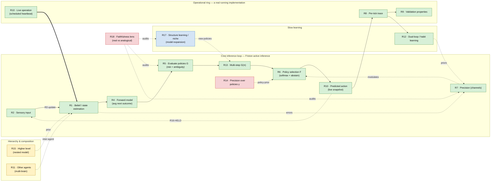

# Mission: The AIF criteria wiring diagram — R1–R18 on a brain (M-aif-wiring)

**Date:** 2026-06-24
**Status:** **IDENTIFY** (new mission; successor home for the R14–R18 gaps surfaced by the now-closed M-wm-policies). *Name provisional — Joe may rename.*
**Owner:** Joe + claude-6
**Repos:** futon2 (`docs/futon-aif-completeness.md` — the R1–R18 contract; `src/futon2/aif/*` — the apparatus), futon3c (`src/futon3c/portfolio/*` — the sibling AIF surface; the live R17 instance)
**Cross-ref:** [[M-wm-policies]] (CLOSED 2026-06-24 — created R13, surfaced R14–R18; its closure punted their next-phases to "their own homes"; this is that home) · [[M-aif2]] · [[E-aif2-partB]] (the triangulation that surfaced R14–R18) · the **AIF∩morphogenesis deep-research** report (`futon3c/holes/excursions/deep-research-AIF-morphogenesis.md` — the canonical-component source; **first-pass**, ~10/25 claims verified before the run was killed) · [[E-prove-salingaros-cascade-scorer]] (the R18 proof) · [[E-deep-research-hardening]] (why the component list isn't yet authoritative) · reference image `~/Downloads/brain.jpeg` (Friston's active-inference-on-a-brain)

---

## 1. IDENTIFY

### Motivation

Two things converge into one mission:

1. **R14–R18 have no home.** M-wm-policies (closed 2026-06-24) drove the completeness contract R12→R18 and surfaced **R14** (precision-over-policies γ), **R15** (hierarchical/temporal depth), **R16** (closed action–perception loop), **R17** (structure learning / niche construction), **R18** (faithfulness of the quantities) as first-class *tracked-open* gaps. Its closure explicitly left their next-phases needing "their own homes."

2. **The long-wanted artifact.** Joe has wanted a Friston-style **network-diagram-on-a-brain** (cf. `~/Downloads/brain.jpeg`) showing how the R-numbered criteria actually **fit together into a wiring diagram**, and how they **relate to Friston's models**. The reference figure carries ~8 functional nodes; we have **18 R-criteria** plus the canonical-component list — so a *bigger* brain map with *more* nodes and connections.

These are not two missions. **The wiring diagram is the organizing device for closing R14–R18.** Laying R1–R18 onto Friston's process graph exposes the dependency structure the 2026-06-24 readiness pass already started finding — R14 needs R16's realized-outcome feed; R18 is a property of *every* node, not a node; R15 makes the map itself *nested*; R16 *is* the loop-closure arrow, currently held open. The map tells us what to build and in what order.

### The dual deliverable

- **(A) The wiring diagram** — R1–R18 ↔ Friston functional components ↔ brain regions; a "bigger brain" that *honestly* accommodates the criteria that don't fit the classic 8-node loop.
- **(B) Closing the open criteria** — drive R14–R18 from tracked-open toward satisfied, in the order (A)'s dependency edges dictate.

(A) is not decoration — it is the map (B) navigates by.

### First-pass node mapping (PROVISIONAL — a seed, not the answer)

The Friston reference (`brain.jpeg`) carries 8 functional nodes: *Sensory input* (occipital), *State estimation under plausible policies* (hippocampus), *Evaluation of policies* — **G** (ventral PFC), *Policy selection* — **F**, *Precision* — γ (striatum / VTA-SN), *Predicted action* (motor cortex), *Bayesian model average of next outcome* (PFC), *Habit learning* (cerebellum / parietal).

| R# | criterion | status | Friston node / element it lands on |
|----|-----------|--------|------------------------------------|
| R1 | explicit belief state | ✓ | State estimation (hippocampus) |
| R2 | observation channel schema | ✓ | Sensory input (occipital) |
| R3 | predictive-coding belief update | ✓ (4/14 ch) | the Sensory→State-estimation update arrow |
| R4 | predictive forward model | ✓ | Bayesian model average of next outcome (PFC) |
| R5 | EFE (risk + ambiguity) | ✓ | Evaluation of policies — **G** (ventral PFC) |
| R6 | softmax action selection + abstain | ✓ | Policy selection — **F** |
| R7 | adaptive precision (over channels) | ✓ | Precision (γ) — *but sensory/channel precision* |
| R8 | per-tick trace | ✓ | **no Friston node** — operational ring (the log/tape) |
| R9 | named validation properties | ✓ | **no Friston node** — operational ring (self-check) |
| R10 | live operation (on schedule) | ✓ (cron pending) | **no Friston node** — operational ring (the heartbeat) |
| R11 | hierarchical / multi-agent | N/A here | **multiple brains** — inter-brain edges, not a node |
| R12 | dual-loop hyperparameter inference | ✓ | Habit learning (cerebellum / parietal) |
| R13 | multi-step `G(π)` (policy adequacy) | ✓ | deepens Evaluation+Selection from single-step → policy |
| **R14** | **precision over policies (γ)** | **absent** | **Precision node, policy-precision role** — γ in Friston's figure *exists there*; we lack it |
| **R15** | **hierarchical / temporal depth** | **partial** | **the nesting axis** — diagram goes hierarchical (deep temporal) |
| **R16** | **closed action–perception loop** | **partial** | **the Predicted-action → Sensory-input arrow** — currently *held open* |
| **R17** | **structure learning / niche** | **on sibling surface** | **the diagram rewriting itself** (morphogenesis) — new nodes/edges |
| **R18** | **faithfulness (meta)** | **absent as criterion** | **a coloring over every node** (real vs analogical), not a node |

**What this already shows (and the mission must verify / redraw):** "more nodes and connections" resolves into a *specific shape* — a **core Friston loop** (R1–R7, R12–R14), an **operational ring** off the classic brain (R8/R9/R10: trace, validation, liveness — what makes it a *real running implementation*, which Friston's figure has no slot for), a **multi-brain layer** (R11), a **nesting axis** (R15), a **held loop-closure arrow** (R16), a **self-rewriting capability** (R17), and a **faithfulness coloring** (R18).

### Readiness to implement R14–R18 (carried from the 2026-06-24 code assessment)

| | verdict | blocker |
|---|---------|---------|
| R18 faithfulness | **ready now** | bounded: `:grounding {:real\|:analogical}` metadata on each named quantity + a failing-test; the grounding audit already did it informally |
| R17 structure learning | **ready now** | port the proven futon3c `:acquire-patterns` (real EIG + ΔF accept) into a `futon2.aif` criterion; add morphogenesis-event emission + the ΔF∧ΔG conjunction gate |
| R14 precision-over-policies | ready, **has a prerequisite** | no realized-policy-outcome history channel exists; the γ feed depends on R16 (real outcomes) or an explicitly-labeled sim proxy |
| R16 closed loop | buildable, **mission-sized + your go** | first time the WM *writes* to substrate (supervised/consent-gated); new `executor` ns + observe-consequence + belief-update |
| R15 hierarchy | **design first** | no nesting hook; a genuine ≥2-level generative model with cross-level belief propagation is a design effort (what *are* the two levels?) |

Recommended order: **R18 → R17** (ripe + mutually reinforcing — R18 keeps R17's ΔF/EIG honest), then R14 once it has an outcome feed, then the gated R16 and the design-first R15.

### Open questions (honest unknowns for IDENTIFY)

- **Rendering R15 and R18 together.** R15 wants the map *nested*; R18 wants every node *colored* real/analogical. What single representation carries both without becoming unreadable?
- **New node shapes for what Friston's figure omits.** R8/R9/R10 (runs / logs / validates), R11 (one-of-many), R17 (rewrites itself) have no canonical brain slot. Do they sit *on* the brain, or in a surrounding apparatus frame around it?
- **Authoritativeness.** Which R maps to which Friston term — and whether an **R19+** is missing — rests on the **first-pass** AIF∩morphogenesis component list (~10/25 verified before the run died; see [[E-deep-research-hardening]]). The diagram must mark first-pass vs verified mappings; a full adversarial research round (E-aif2-partB §4) hardens it.
- **Tooling + "no fabricated structure."** Whatever draws it (Graphviz / SVG-over-the-brain-image / a live futon surface), the wiring must reflect **real code edges** — which namespace actually calls which — not an idealized textbook loop. The M-wm-policies regulator lesson ("don't fabricate dynamics") applies to diagrams too: a wiring diagram that shows connections the code doesn't have is fiction.

### Provisional exits

- **E1** — a first wiring diagram (R1–R18 ↔ Friston ↔ brain regions) Joe recognizes as "the bigger brain," with the non-loop criteria (R8–R11, R15–R18) honestly placed.
- **E2** — the diagram's dependency edges ratified as the implementation order for R14–R18.
- **E3** — the ripe pair (R18, then R17) landed and recorded against the diagram.
- **E4** *(gated)* — R16 supervised loop-closure + R14 γ, once the diagram and Joe's scope-go are in.
- Mission-close stays Joe's call (per QA discipline).

---

## 2. Wiring diagram (v0.1 — Mermaid topology)

**Reading guide.** Node colour = implementation status: **green = satisfied**, **yellow = partial**, **red = open/absent (R14, R18)**, **blue = present on the futon3c sibling surface, not yet a futon2 criterion (R17)**. Solid arrows = the live inference cycle; dotted arrows = modulation / slow feedback / cross-level; the **dashed `R16-HELD` arrow** from action back to sensory input is the loop-closure deliberately *not* wired (propose-only / consent gate). This is the **conceptual** topology (criteria ↔ Friston); per §1's no-fabrication note it still needs reconciling against *real code call-edges* before it can claim to be the wiring of the implementation rather than of the theory.

**What v0.1 makes visible:** the green **core loop** is recognisably Friston's figure; the red **γ node (R14) already has its Friston home** (the Precision node) — a missing *wire*, not a missing *concept*; **R16** is the one *open arrow* (close the loop); and the **operational ring** (R8/R9/R10) plus **R11/R15/R17/R18** sit *outside* the classic 8-node loop — exactly why "a bigger brain" was needed.

> **Superseded by the SVG-in-HTML explainer (§3).** Joe's steer (2026-06-24): the artifact should itself *teach AIF* — for wired criteria, explain *how* it's wired; for gaps, highlight + explain *what you'd gain if it were wired*. Mermaid can't carry per-node explanation; the Mermaid above stays as the topology skeleton.

## 3. Explainer (v0.2 — SVG-in-HTML, the teaching artifact)

**File:** `futon2/holes/aif-wiring-explainer.html` — self-contained (inline SVG + click panel, no deps; open in any browser). Verified rendering via headless Chrome 2026-06-24.

Click any node → a panel teaches **(1) what that piece of Active Inference does** (plain language), then **(2a) how it's wired in the WM** (green, with the namespace) *or* **(2b) the gap + what you'd gain if it were wired** (the payoff framing). Status colour: green wired · amber partial · **red dashed gap (R14/R16/R18)** · blue sibling-surface (R17).

- **v0.1** — Friston loop as a clickable ring.
- **v0.2 (2026-06-24)** — **anatomical**: core nodes sit on their Friston brain regions with *separate* purple region labels (R2→occipital · R1→hippocampus · R4→dorsal PFC · R5→ventral PFC · R6→basal ganglia · R7→VTA/SN · R10→motor cortex · R12→cerebellum); R16 is the action→world→senses arc; the non-anatomical criteria (R8/R9/R10-sched/R11/R15/R17/R18) sit in an "implementation apparatus & wider system" frame *outside* the brain. The panel names each node's region.

**Open for v0.2** (Joe to steer): the per-node *how-it's-wired* text is at the **contract's** fidelity, not yet reconciled against real code call-edges (the §1 no-fabrication bar); deepen each explanation; and the three redraw decisions from §2 (split γ vs channel precision · R18 as a per-node overlay not a node · R15 as a true nested sub-loop) now apply to the SVG.

**Redraw decisions for v0.2** (eyeball v0.1 first): split γ-precision from channel-precision into distinct nodes? Promote R18 from a lens-node to a genuine per-node colour overlay (its true form)? Render R15 as a real nested subgraph containing a *second copy* of the core loop (the upper level parameterising the lower)?
