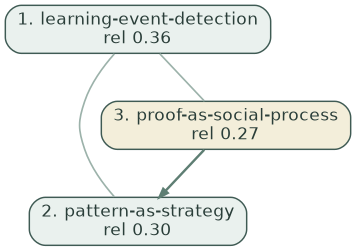
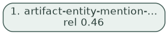
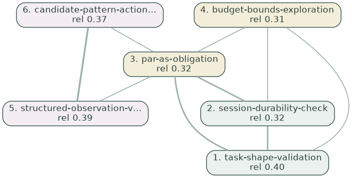
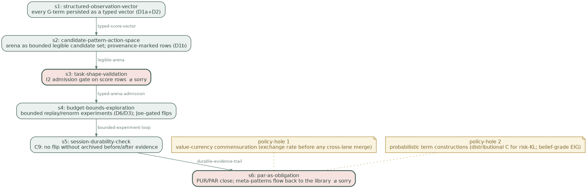

## The argument, in plain language

Every hour the War Machine chooses its next action by comparing numbers. This exhibit
shows three real pattern cascades — the structures the system is supposed to be
choosing between — and **every number the stack currently knows how to attach to
them**. Three facts become visible. First, cascades are valued in one currency
(Alexander wholeness and a free-energy score F) by the lane that builds them, and in a
different currency (the 8-term blend "G") by the arena that ranks actions — and the
two currencies never meet: every cascade enters the arena at a constant placeholder
0.0 and has never won a tick (0 of 674). Second, the placeholder is load-bearing:
deleting apparently-inert blend terms would silently hand wins to the unscored rows.
Third, the blend's own epistemic terms have measured zero influence on any decision.
The gaps in the tables below are not missing data — they are the finding. "EFE" is
currently a word used across four senses; the mission's work is to make each surface
earn, or honestly relabel, its sense.

**The four senses** — (i) the canonical quantity, risk + ambiguity in nats;
(ii) the design tradition (pragmatic/epistemic decomposition as a generative shape);
(iii) the deployed 8-term blend `G-total`; (iv) the per-step cost field g(s) of the
futon6 diagrams (the integrand, not the path quantity).

*Method: each cascade below is (re)constructed by the production constructor
(phylogeny-greedy, coverage-saturated, budget 6) from the production ψ recipe
(want = mission title, have = status line). Arena facts come from the 674-tick
census of `data/wm-trace/` (2026-05-18 → 2026-07-03). Solid green edges = descent;
plain edges = co-application (weight = thickness); dashed = greedy pick order where
the phylogeny is silent. The "conditions on" column makes each valuation's
situation-slice explicit — value is fit-to-situation, never form alone (mission
§9.7): the atomic lane eats the live observation vector, the cascade lane eats a
prose scrap, and two of the six native components consume no situation at all.*

\newpage
## Cascade 1: `M-bayesian-structure-learning`

*production (in the WM arena since 2026-06; 146 ticks).*

ψ = `bayesian structure learning — want: Bayesian structure learning — formalising what we mean by it. have: SUPERSEDED-AS-MISSION → recast toward Campaign-bayesian-structure-learning (Joe 2026-06-08; see §7b). Idea-of-record; NOT WM-pickable (a Campaign across math / `

{width=88%}

| valuation (its own currency) | value | conditions on (§9.7) | provenance |
|---|---|---|---|
| T-intensity (Σ relevance) | 0.934 | ψ — the 160-char have→want scrap | constructor, real |
| H-coherence | 0.848 | nothing — intrinsic to the pattern set | constructor, real |
| **Wholeness T·H** (Alexander life) | **0.792** | mixed: situated T × intrinsic H | constructor, real |
| accuracy (ψ-coverage) | 0.717 | ψ | constructor, real |
| complexity (−log prior mass) | 2.033 | corpus base-rates — unsituated | constructor, real |
| **F = accuracy − 0.25·complexity** | **0.209** | mixed: situated − unsituated | constructor, real |
| blend G-total (sense iii) | **not computed** — arena rows carry placeholder 0.0 | (would: live observation vector) | `war_machine.clj:3797` `(or dG 0.0)` |
| rollout ΔG(π) | **abstained** — mission outside the v2 move-set | v2 move-set + capability overlay — not the tick's observation | cascade-lane seam 2 |
| canonical core G = risk + ambiguity (sense i) | **not defined for cascades** | (would: live observation vector) | `compute-efe` |

**Selection consequence (real tick 2026-07-03T09:03):** this cascade sat in the arena at
0.0 and lost to `:address-sorry sorry/pudding-g1-arrow-witness-binding` (blend G-total -4.496; its canonical core 0.241).
It has never won in 146 appearances. Under the blend it loses on a
placeholder; under wholeness/F it isn't even ranked against actions; under the
canonical core it has no score at all. **Three currencies, no exchange rate.**

*Production cross-check: persisted arena wholeness 4.141 vs 0.792 recomputed here (ψ recipe and library evolve; both are real runs).*

\newpage
## Cascade 2: `M-canon-fingerprint-store`

*production (in the WM arena since 2026-06; 147 ticks).*

ψ = `canon fingerprint store — want: Canon fingerprint store — Billey-Tenner instantiation for symbol grounding. have: DERIVE → INSTANTIATE — decisions resolved + holes articulated (Joe 2026-06-08): scope bindings (§2.1) + frequency-ordered MAP-REDUCE (§3.1) + SQLite; F1 schema `

{width=88%}

| valuation (its own currency) | value | conditions on (§9.7) | provenance |
|---|---|---|---|
| T-intensity (Σ relevance) | 0.464 | ψ — the 160-char have→want scrap | constructor, real |
| H-coherence | 1.000 | nothing — intrinsic to the pattern set | constructor, real |
| **Wholeness T·H** (Alexander life) | **0.464** | mixed: situated T × intrinsic H | constructor, real |
| accuracy (ψ-coverage) | 0.139 | ψ | constructor, real |
| complexity (−log prior mass) | 1.043 | corpus base-rates — unsituated | constructor, real |
| **F = accuracy − 0.25·complexity** | **-0.122** | mixed: situated − unsituated | constructor, real |
| blend G-total (sense iii) | **not computed** — arena rows carry placeholder 0.0 | (would: live observation vector) | `war_machine.clj:3797` `(or dG 0.0)` |
| rollout ΔG(π) | **abstained** — mission outside the v2 move-set | v2 move-set + capability overlay — not the tick's observation | cascade-lane seam 2 |
| canonical core G = risk + ambiguity (sense i) | **not defined for cascades** | (would: live observation vector) | `compute-efe` |

**Selection consequence (real tick 2026-07-03T09:03):** this cascade sat in the arena at
0.0 and lost to `:address-sorry sorry/pudding-g1-arrow-witness-binding` (blend G-total -4.496; its canonical core 0.241).
It has never won in 147 appearances. Under the blend it loses on a
placeholder; under wholeness/F it isn't even ranked against actions; under the
canonical core it has no score at all. **Three currencies, no exchange rate.**

*Production cross-check: persisted arena wholeness 2.842 vs 0.464 recomputed here (ψ recipe and library evolve; both are real runs).*

\newpage
## Cascade 3: `M-evaluate-policies`

*FRESH — constructed for this exhibit; has never entered the arena.*

ψ = `evaluate policies — want: Evaluate policies honestly — make R5's score what it says it is. have: HEAD + IDENTIFY complete 2026-07-03 (operator gates passed in-session);`

{width=88%}

| valuation (its own currency) | value | conditions on (§9.7) | provenance |
|---|---|---|---|
| T-intensity (Σ relevance) | 4.840 | ψ — the 160-char have→want scrap | constructor, real |
| H-coherence | 0.895 | nothing — intrinsic to the pattern set | constructor, real |
| **Wholeness T·H** (Alexander life) | **4.330** | mixed: situated T × intrinsic H | constructor, real |
| accuracy (ψ-coverage) | 6.242 | ψ | constructor, real |
| complexity (−log prior mass) | 5.524 | corpus base-rates — unsituated | constructor, real |
| **F = accuracy − 0.25·complexity** | **4.861** | mixed: situated − unsituated | constructor, real |
| blend G-total (sense iii) | **not computed** — arena rows carry placeholder 0.0 | (would: live observation vector) | `war_machine.clj:3797` `(or dG 0.0)` |
| rollout ΔG(π) | **abstained** — mission outside the v2 move-set | v2 move-set + capability overlay — not the tick's observation | cascade-lane seam 2 |
| canonical core G = risk + ambiguity (sense i) | **not defined for cascades** | (would: live observation vector) | `compute-efe` |

**Selection consequence:** none — this cascade exists only in this exhibit.
If it entered the arena tomorrow it would be a 0.0 placeholder like the others,
regardless of its F or wholeness shown above.

\newpage
## The fold test — does the best-of-class cascade CONSTRUCT?

A cascade is only a *policy* if it folds into a construction: a wiring of concrete
steps with typed holes for what it cannot ground (`futon2.aif.fold`:
`fold : (cascade, circumstance) → {:wiring :delta-g :policy-holes}`). We ran the
**LLM-turn fold (impl #2)** over Cascade 3 — the recorded agent turn is
`fold-turn.edn`; the shared coverage→rollout evaluation gives **ΔG = −0.750**
(coverage 6/8 = 0.75). The act-gate's two legs are now both real for
this cascade: ΔF > 0 (F = 4.861, page 5) ∧ ΔG < 0 — the conjunction the production
arena has never once evaluated (every arena ΔG abstained).

{width=92%}

**DarkTower structural check:** the wiring renders to CLean
(`m-evaluate-policies.clean.edn`) and compiles against the DarkTower Lean theory —
**PASS — 0 errors, core lean, --mode standalone (structural soundness: boxes compose, spine is a valid BV.seq, discharge polarities valid)**. That certifies *structure, not semantics*: the boxes
compose, the spine is a valid `BV.seq`, the two in-box sorries are well-typed
obligations — a soundness floor that rules out hallucinated wiring, nothing more.

**The complementary sorries** (what the fold honestly could not ground):

| where | typed hole |
|---|---|
| box s3 (task-shape-validation) | sorry/queryAnswer/parse: gate enforced in the production judge path, not only census-asserted |
| box s6 (par-as-obligation) | sorry/sorryProof/payoff: the three meta-patterns written into futon3/library (DOCUMENT) |
| policy-hole 1 | **value-currency commensuration (exchange rate before any cross-lane merge)** — no pattern in the cascade — nor, we believe, in the library — grounds cross-lane unit exchange; the fold independently surfaces the gap the mission named candidate pattern currency-before-merge |
| policy-hole 2 | **probabilistic term constructions (distributional C for risk-KL; belief-grade EIG)** — the cascade covers evaluation-loop hygiene, not generative-model repair; D5a/D5b stay grounded by belly-W1 + the portfolio template |

Read against the mission: the fold *independently re-derives the mission's own
gap list*. Its six boxes are the DERIVE stages (typed scores, provenance-marked
arena, admission gate, bounded experiments, durable evidence, PAR close); its
policy-holes are D3's commensuration question and D5's probabilistic builds —
the two places DERIVE also marked as the real work. A best-of-class cascade does
fold; what it cannot reach is exactly what the library cannot yet say.

\newpage
## The formal reconciliation (D8) — standard notation vs what we compute

*Canonical formulations per the R18 audit's reference frame (discrete-state-space
AIF; Friston et al., Da Costa 2020), the same forms the badges were judged against
(`E-r18-faithfulness-audit.md`, futon2 `dcbe021`).*

**Variational free energy** (perception; the cascade lane's F is this, sign-flipped):
$$F \;=\; \mathbb{E}_{Q(s)}\!\left[\ln Q(s) - \ln P(o,s)\right] \;=\; \underbrace{D_{KL}\!\left[Q(s)\,\|\,P(s)\right]}_{\text{complexity}} \;-\; \underbrace{\mathbb{E}_{Q(s)}\!\left[\ln P(o\mid s)\right]}_{\text{accuracy}}$$

**Expected free energy** (policy evaluation; sense (i) of the four):
$$G(\pi) = \sum_{\tau} G(\pi,\tau), \qquad
G(\pi,\tau) \;=\; \underbrace{D_{KL}\!\left[Q(o_\tau\mid\pi)\,\|\,C\right]}_{\text{risk}} \;+\; \underbrace{\mathbb{E}_{Q(s_\tau\mid\pi)}\!\left[H\!\left[P(o_\tau\mid s_\tau)\right]\right]}_{\text{ambiguity}}$$

equivalently $G = -\underbrace{\mathbb{E}_{Q(o\mid\pi)}\!\left[D_{KL}[Q(s\mid o,\pi)\,\|\,Q(s\mid\pi)]\right]}_{\text{epistemic value (EIG)}} - \underbrace{\mathbb{E}_{Q(o\mid\pi)}\!\left[\ln C(o)\right]}_{\text{pragmatic value}}$;
Gaussian ambiguity $H[P(o\mid s)] = \tfrac{1}{2}\ln(2\pi e\,\sigma^2)$.

**Policy selection:** $P(\pi) = \sigma\!\big(\ln E(\pi) - \gamma\, G(\pi)\big)$ —
softmax over a **given finite menu** $\Pi$, under habit prior $E$ and precision $\gamma = 1/\beta$.

### Term-by-term: canonical object vs computed object

| ours (badge) | canonical object | what the code computes | relation |
|---|---|---|---|
| G-risk (analogical) | $D_{KL}[Q(o\mid\pi)\,\|\,C]$ | $\sum_{ch} w_{ch}\,\mathrm{hinge}(\hat\mu_{ch})\cdot u\,-\,\mathrm{intr.}$ | L1 hinge on a point estimate; agrees near the zero-set, no distribution/log/tails |
| G-ambiguity (principled-approx) | $\mathbb{E}_{Q(s\mid\pi)}[H[P(o\mid s)]]$ | $\sum_{ch}\sigma^2_{ch}$ | monotone Gaussian-entropy proxy; one repair ($\tfrac12\ln 2\pi e\sigma^2$) from canonical; measured influence 0% |
| G-info (analogical) | $\mathbb{E}_{Q(o\mid\pi)}[D_{KL}[Q(s\mid o,\pi)\|Q(s\mid\pi)]]$ | $\sum_{ch}\max(0,1-\sigma^2_{ch}) = N - \sum\sigma^2$ | affine complement of ambiguity, not an information gain; measured influence 0% |
| G-survival (analogical) | — (no canonical G-term: set-points live **inside** $C$) | second hinge over 4 channels $\times\,1.2\,\times u$ | a fragment of risk under a $C$ the code doesn't have; flips 47.9% |
| G-structural-pressure (analogical) | — (closest seat: the habit/prior term $\ln E(\pi)$) | injected scalar $\times\,0.35$ inside $G$ | exogenous weight projected into the wrong slot; flips 44.5% |
| G-graph-pragmatic (analogical) | pragmatic value $-\mathbb{E}_Q[\ln C(o)]$; feasibility = the menu $\Pi_{feasible}$ | $1000\cdot[\lnot applicable] + 3\cdot holes - 20\cdot ascent$ | a domain restriction smuggled in as a value; stripped from traces |
| G-gap (analogical) | expected uncertainty reduction (EIG fragment) | $6.0 \times$ gap-score lookup | scaled lookup, no expectation; stripped from traces |
| G-goal-outcome (analogical, R19) | fragment of $D_{KL}[Q(o\mid\pi)\|C]$ | weighted deterministic flip ($p=1$) | belongs inside distributional risk once D5a exists |
| G-total (analogical) | $G(\pi)$ — one functional, nats | $\sum$ 9 incommensurate terms, hand weights | multi-objective blend with an EFE-shaped core |
| $\gamma$, softmax (principled-approx) | $P(\pi)=\sigma(-\gamma G)$, $\gamma$ from $\mathbb{E}[G]$ | faithful softmax; $\gamma$ learns from realized performance; $\tau$-spread layer non-canonical | the honest corner (R14) |
| cascade F (principled-approx) | $-F$ (ELBO): $\mathbb{E}_Q[\ln P(o\mid s)] - D_{KL}[Q\|P]$ | $\mathrm{accuracy} - 0.25\cdot\mathrm{complexity}$ | right shape, fitted $\lambda$, not nats; never enters $G$ |
| fold $\Delta G$ | rollout $G(\pi)$ of a discharge policy | $\gamma^0\cdot(-\mathrm{coverage})$ | path-integral in shape; coverage is not in nats |

### The one-paragraph technical statement

**The blend is a flattened generative model.** Terms that canonically live in three
different slots — preferences $C$ (survival, goal-outcome), the habit prior $E(\pi)$
(structural-pressure), and the feasible menu $\Pi$ (the 1000-mask) — have been
projected into a single sum alongside the two genuine $G$-summands (risk, ambiguity)
and two would-be-epistemic proxies (info, gap). The measured behaviour follows: the
epistemic pole is inert, and the flattened $C$/$E$/$\Pi$ terms do the steering
(flip-rates 47.9/44.5/35.9%), compensating for a weak explicit $C$. The selection
machinery itself ($\sigma(-\gamma G)$, $\gamma$-calibration) is the faithful part —
applied to a *generated menu*, whose generator (the cascade constructor) plays
$E(\pi)$'s role unacknowledged. **The repair path in canonical terms:** (i) build a
real preference density $C$ and compute risk as a KL (D5a) — survival and
goal-outcome fold into it; (ii) real EIG over beliefs replaces info/gap (D5b);
(iii) ambiguity in nats (D5c); (iv) move the mask into $\Pi_{feasible}$ and
structural-pressure into $\ln E(\pi)$; (v) declare the selection semantics (sampled
menu, not extremum) and the conditioning (mission §9.6–9.7). Endpoint: $G$ in nats
$=$ risk $+$ ambiguity $(-\,\mathrm{EIG})$, everything else living where the theory
puts it — the state of affairs that would earn back the sentence "EFE-scored."

\newpage
## Cross-cascade comparison — do the currencies even agree with each other?

| cascade | size | wholeness T·H | F = acc − λ·cplx | blend G | core G |
|---|---|---|---|---|---|
| 1. M-bayesian-structure-learning | 3 | 0.792 | 0.209 | 0.0 (placeholder) | — |
| 2. M-canon-fingerprint-store | 1 | 0.464 | -0.122 | 0.0 (placeholder) | — |
| 3. M-evaluate-policies | 14 | 4.330 | 4.861 | 0.0 (placeholder) | — |

Ranking by wholeness: 3 > 1 > 2. Ranking by F: 3 > 1 > 2. The two native currencies **agree** on this sample — the disagreement that matters is between both of them and the arena's constant.

## What this argues for (the DERIVE design, §8)

1. **Observability before semantics** (D1/D2): persist the stripped terms, mark the
   placeholders, expose the canonical core per candidate — so this exhibit's empty
   cells become measured cells.
2. **No term deletions before cascade-row handling** (IHTB-2): the 0.0 constant is
   load-bearing; "cleanup" would hand wins to unscored rows.
3. **The exchange-rate problem is the mission** (D3): hand-set weights already fail
   *within* one currency (ambiguity: 0% influence); adding cascades' F to the same
   sum without commensuration would repeat the mistake at larger scale.
4. **Scoring cascades for real is M-G-over-cascades** (C10): ΔG abstains because the
   rollout move-set doesn't cover these missions — a coverage gap, not a wiring bug.

*Generated by `futon2/scripts/exhibit_cascade_argue.py`; constructor and ψ recipe are
the production code paths; census artifacts in `holes/labs/M-evaluate-policies/`.*