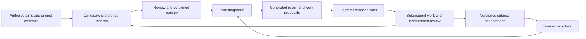

# E-C-realization: DERIVE and ARGUE — 2026-09-09

**Status:** Joe recognises the historical and current-work pilots as DERIVE;
this document consolidates that solution shape and supplies the requested
ARGUE. ARGUE acceptance and VERIFY remain subsequent steps. No implementation
is authorised by this turn.

## Operator direction, verbatim

> Okay, well I think from the point of view of a pilot, and then sort of a second pilot looking at the current paper, Encurrent work in progress. I think what we have effectively done from a mission lifecycle standpoint is the derive step, and that should be noted in our excursion document. In other words, we've derived the shape a solution should take, and I think we need to write down what that looks like. And that doesn't leave aside an UpgradePath. Indeed, the UpgradePath... for adding more preferences or different types of preferences. For example, including... Aspects of serendipity that might be useful to include if we haven't already, or finding new ways to break down the model across different. Levels. All of that can come into the design because... As you said, there's a direction of improvement within each preference, and there's also a direction of improvement in terms of our model of the preferences. But none of that should get in the way of writing down something that we can actually implement and calculate with. But at this point, we don't need to go off and build it. At this point, I think we need to write down... The shape of the solution using the derived life cycle. Following which? We should also do the Argue life cycle step where we look in the Futon3 pattern library. And find some design patterns that characterize The derived solution. And write those down. In the form of an argument for that derivation. And for the model that we're planning to build.

“Encurrent” is retained as transcribed; context refers to current work in
progress. This ruling recognises the pilots' solution shape. It does not
choose numerical masses, approve every proposed field below, or enable a fold.

## DERIVE: the implementable first version

### Purpose and boundary

Build a versioned registry of preferences and a reproducible diagnostic over
current work. Recover preferences from authored aims and witnessed historical
achievements; state what would satisfy each; observe the present work; expose
deficits, unknowns, and defensible directions of improvement. Its first domain
is building the Futon system and working on the two 2026 papers. The historical
and paper pilots are the initial records, not an exhaustive preference census.

The implementation target is the diagnostic component of C. It can compute
local satisfaction and symbolic risk differences now. It does not impersonate
a predictive controller: policy-conditioned observations, joint preferences,
numerical trade-offs, and the checkpoint/channel observation bridge remain
explicit interfaces with admission conditions below. The §1b obligation in
E-C-realization remains open for the production model.

Evidence for this scope is recorded in MAP-C-realization-2026-09-09.md,
SESSION-C-local-achievement-2026-09-09.md,
SESSION-C-family-and-lifecycle-2026-09-09.md, and
SESSION-C-current-paper-diagnostic-2026-09-09.md, beside this file. In particular,
the flight counterfactual holds numerical error fixed while removing warrant;
the feedback probe holds divergence fixed while denying delivery. Satisfaction
needs a declared observation contract, not just an existing convenient score.

### Entities, identities and ownership

Use the existing local JSON registry and Python diagnostic as the first
implementation substrate. Preserve the saved pilots. Extend their format with
explicit versions and adapter boundaries rather than introduce another store.
The future implementation belongs under the existing excursion run directory;
no new global preference authority or WM ledger is created by this design.

| Entity | Required fields and origin |
|---|---|
| SourceRef | repo, revision or immutable artifact digest, path, locator, verbatim excerpt, author when known; captured from the source. |
| PreferenceSpec | stable id, version, subject scope, outcome type/domain, desired ordering or distribution constraints, source refs, criterion version, review status; mined candidate then reviewed. |
| CriterionSpec | id/version, input schema, explicit satisfaction rule or named human judgment, domain limitations, positive/negative witnesses; authored and reviewable. |
| Assessment | id, spec and criterion versions, subject revision, evidence refs, adapter version, observed value, status, adjudicator; computed or explicitly judged. |
| Comparison | ids of two assessments/scenarios, per-coordinate relation, assumptions, excluded coordinates, formula and inputs, overall partial-order result; derived. |
| WorkProposal | id, triggering assessment, intended changed coordinates, unmeasured consequences, lifecycle obligations, reviewer role and discharge criterion; proposed, not an execution receipt. |
| ModelRevision | parent revision, added/retired/replaced specs or relations, rationale, replay differences, review; authored candidate until accepted. |
| Relation | typed endpoints with versions, source and review: contributes-to, requires, refines, supersedes, assessed-by; authored claims, never inferred solely from similarity. |

Versions are immutable. Reusing an id with a new meaning requires a new version
and a supersedes relation. An assessment pins both the object being assessed
and the model that assessed it. Every assessment has exactly one status:
observed, unknown, inadmissible, or not-applicable. Only observed has a value
inside the outcome domain. Unknown names missing evidence and a discharge
condition; inadmissible names failed warrant; not-applicable names an unmet
scope condition. A diagnostic adapter failure is an error, not a negative
outcome. Existing pilot nulls migrate to unknown with their stated reason.

An author or miner proposes records; the designated reviewer records acceptance
or rejection with reasons. The runner consumes a supplied registry snapshot;
it cannot change preferences. Candidate-mode diagnostics are labelled as such;
accepted-mode refuses unaccepted specs. Independent review of evidence does
not silently confer Joe's authority over preference strength or priority.

### Relations and intermediate preferences

Outcome preferences and process preferences use the same schema. A process
spec adds mission id, lifecycle phase, occurrence id, and the transition whose
criterion it assesses. For example, VERIFY may require a semantic negative
probe to be examined; DOCUMENT may require a reproducible, findable account.
The criterion comes from the lifecycle exit or a scoped mission requirement.
An assessment reports the actual evidence for it. Counting phases or assigning
phase numbers does not establish effective progress.

Repeated VERIFY→DERIVE transitions create new occurrences. For this version,
C_tau is a family indexed by declared process occurrences, not a discounted
sum over ticks. A future policy model must supply an explicit mapping from
predicted times to these occurrences before consuming this family as C_tau.
A completed intermediate condition does not prove the mission will succeed.

A contributes-to link records a proposed how/why connection; it entails no
parent satisfaction. A requires link constrains applicability only. A refines
link needs an authored mapping before readings can be transported between
levels. The first version traverses these links to explain proposals, with a
visited set to terminate cycles, and does no logical closure of satisfaction.
A future AND/OR production rule needs explicit premises, conclusion, rule
provenance and a test of the claimed sufficiency. Passing child tests alone
cannot mint that rule.

### Calculation contract

For an admitted soft-binary entry, the supported family is
C_i=(p_i,1-p_i), with 1/2<p_i<1 and satisfied first. No particular p_i is chosen.
For observed binary state x in {0,1}, Q=delta_x and

    R_i(x;p_i) = -x log(p_i) - (1-x) log(1-p_i).
    R_i(0;p_i)-R_i(1;p_i) = log(p_i/(1-p_i)) > 0.

Return the symbolic expression, parameter domain, and sign; do not fabricate
a scalar. Boolean truth here means satisfaction of the narrow criterion, not
benefit to the whole project. Broad preferences without an adequate criterion
remain unknown. Reports separate findings about the model (such as an
inadequate feedback carrier) from findings about its subject (actual feedback).

Comparison algorithm: align identical spec versions and subject scope;
otherwise return incompatible. Exclude and list unobserved coordinates. If a
scenario changes their assumed status/value, return unresolved-measurement.
Over the remaining observed coordinates return unchanged, improves, worsens,
or tradeoff-unranked according to the signs. Report the compared coordinate
set alongside the result. Unknown consequences of real actions prevent a
claim of overall policy dominance, even if a stipulated local scenario improves.

**Licensed:** per-entry preference direction, observed satisfaction, symbolic
local KL differences, coordinatewise comparison under declared assumptions.
**Unlicensed:** ranking p_i against p_j, aggregating to G, resolving trade-offs,
predicting action success, or treating the soft family as hard constraints.
The p=1 endpoint is outside this family. A future hard-support type must
preserve zeros and explicitly return infinite risk/refusal, never clamp them.

IF qualitative evidence supplies an ordering, HOWEVER it supplies no strength,
THEN compute the signs that hold throughout the permitted family, BECAUSE
that is the comparison the evidence licenses without arbitrary weights.

### Data flow and interfaces

This is a design sketch, not a validated futon5 exotype diagram. At VERIFY,
the cross-repo evidence ports and producer/reviewer boundaries require the
lifecycle's wiring check. No live wiring is changed here.

Specify three pure operations for the implementation:

- assess(registry_snapshot, subject_snapshot, evidence_bundle) -> assessments;
- compare(assessments_before, assessments_after, scenario_assumptions) -> comparisons;
- report(registry_snapshot, assessments, comparisons) -> JSON and readable view.

Adapters receive pinned files and explicit annotations; no network discovery,
subprocess dispatch, or writes to source repositories occur inside assessment.
Capture is a separate operation. Reuse existing witness readers/verifiers via
named adapters where their contracts match; retain their limitations.
The CLI accepts explicit registry, subject/evidence, and optional scenario
paths, producing deterministic JSON on stdout and drift/error diagnostics on
stderr. Persist outputs only to a caller-supplied new run path; no overwrite of
older receipts. Exit 0 means diagnostic completed, including negative or
unknown readings; invalid input, unsupported type, or changed pin exits nonzero.

The readable report shows the pinned revision, preference, evidence/status,
calculation, applicable lifecycle obligation, and proposed next work. It must
show the measured scope beside an improvement result. A current-tree comparison
is labelled drift, not silently incorporated into a historical assessment.
The typed snapshot is authoritative; the view is generated from it.

### Invariants and initial verification cases

1. Every calculated coordinate resolves to a versioned spec, criterion and
   evidence bundle; removing a pin or changing its content rejects assessment.
2. Unknown, inadmissible and not-applicable never become observed false/true.
3. Semantic denial is distinguishable from satisfaction, or the adapter reports
   its inadequacy. Replay the feedback pair as a mandatory negative case.
4. An unwarranted numeric measurement remains inadmissible even if its number
   equals the warranted one. Preserve the flight counterfactual.
5. No aggregate scalar or preference strength is inferred from symbolic p_i.
   Opposing coordinate changes remain tradeoff-unranked.
6. Registry changes create new versions; mixed-version comparisons refuse
   without an explicit reviewed transport rule.
7. A child criterion, proposal or self-review cannot certify a parent outcome.
8. Identical inputs replay identical diagnostic output. A scenario receipt
   stays marked hypothetical; it cannot be consumed as a run outcome.

These are specified VERIFY obligations, not new tests run in this turn.
The legacy pilots already demonstrate instances of 1–5 and 8, not complete
coverage of this proposed implementation. No current production behavior is
replaced; preservation commitments are the pilot witnesses, refusal semantics,
explicit zeros, source provenance and separation of scenario from observation.

### Upgrade path: improve the model as well as its subject

| Extension | Admission condition | What remains usable before admission |
|---|---|---|
| More preferences | Source, scoped criterion, outcome type, known limitations, review and versioned entry | Existing entries and reports; no full-history survey required. |
| Ordinal, categorical or continuous outcomes | Type-specific normalization/risk/comparison contract and counterexamples; unsupported types refuse scoring | Soft-binary comparisons. |
| Selected numeric masses | Verbatim basis and Joe's ruling; numerical kernel validates normalization/support | Symbolic sign calculation. |
| Cross-level or joint model | Authored observation mapping and dependency/composition assumptions, checked against witnesses | Explainable contribution links, without upward inference or double-counting. |
| Serendipity | Capture unexpected findings, original expectation, relevance to a current aim, retained negative knowledge and subsequent review; define usefulness criterion before assigning preference mass | Discovery records as candidates, including unanticipated outcomes, without a novelty bonus. |
| Preference-model improvement | Versioned proposal identifies an actual inability to distinguish, explain, or predict; compare old/new models on preserved and new witnesses; review complexity and lost distinctions | Old-model reproducibility; no reward for merely adding entries. |
| Predictive C/C_tau | Validated Q over each declared outcome domain, time/occurrence mapping and uncertainty marginalization; record checkpoints and channels or justify their mapping | Retrospective diagnosis. |
| Live selection and aggregation | Explicit joint/factorization and trade-off rules, producer/caller contract, designed run and acceptance | Local work proposals for operator selection. |

For the predictive extension, even the binary formula is explicit:
if Q(satisfied|policy)=q is justified, local risk is
q log(q/p)+(1-q)log((1-q)/(1-p)), with zero Q terms interpreted by limits.
Obtaining q is a separate model obligation, not a rename of a current reading.
For disposition outcomes the required calculation is a marginal over compatible
observations, sum_o Q(o|policy)P(d|o), before disposition risk; a kernel at a
channel mean is not generally this marginal. This design preserves that seam.

IF current work exposes a missing distinction, HOWEVER expanding the model can
change old verdicts, THEN propose a versioned extension with replay differences,
BECAUSE improvement of the preference model must itself be inspectable.
The run may mine such proposals; promotion is reviewed, not automatic.

## ARGUE: pattern survey and design rationale

Searched the Futon3 library by preference, provenance, satisfaction/proxy,
model, recursive closure, extension, and serendipity; read the following
patterns as arguments, not as blanket claims of implementation maturity.
Paths below are relative to `futon3/library/`. Exact source digests accompany
this document in DERIVE-ARGUE-C-pattern-sources-2026-09-09.json.

| Pattern and source mechanism | Application and limit |
|---|---|
| measurement/warrant-travels-with-the-number — “Attach the warrant to the number where it is stored” | Assessment includes rule version, evidence and exclusions; directly continuous with the first-flights pilot. Also applies to symbolic results. |
| pattern-mining/probe-the-claimed-property-not-the-acceptance-proxy — retain explicit unknown/skipped outcomes and probe the promised property | Separates semantic satisfaction from text presence; requires feedback negative witness. Source is review-approved technique, explicitly not assayed as a mathematics pattern. |
| war-room/wr-8-typed-files-are-sources-of-truth — typed argument source, regenerated prose | Registry controls reports; revision drift is visible. Reuse the source/view principle, not the source pattern's particular sixteen-file layout. |
| war-room/wr-10-next-move-surface-is-recursive-closure — derive next work from the canonical self-model | Every proposal points back to its diagnostic and future work yields new evidence/candidates. Its fully ranked live EFE recommendation exceeds this first version; no scalar recommendation is claimed. |
| cascades/edges-earn-permanence — use receipts followed by judged review | New how/why relations retain provenance and review. Recurrence alone cannot promote a relation or prove sufficiency. |
| agent/student-dispatch — structured findings include “what surprised” and new dead ends | Supports an open-ended discovery record for serendipity. It supplies neither a probability nor a utility measure, and selects no agent dispatch in this sitting. |
| mission-coherence/logic-model-before-code — conforming trace plus an adversarial trace per invariant | Shapes the next VERIFY step before building the harness. Its operational loading advice is not permission to alter the live JVM; workspace policy governs execution. |

The first three patterns force concrete design decisions: warrant fields are
mandatory, unobserved states are typed separately, and reports are derived.
The next three explain the controlled recursion and upgrade path. The last
places structural checking before implementation, as Joe requested.

Alternatives considered: enrichment/extend-not-rewrite supports preserving
existing tested decisions, but its “80%” and ingestion details are specific to
its original case; no such percentage is claimed here. snatch/widen-the-cascade-
only-on-evidence supports bounded growth but its marginal-gain stopping rule
cannot be imported without a gain measure. aif/structure-learning-by-model-
reduction distinguishes changing structure from tuning parameters; its
Dirichlet-count BMR and threshold are not a model-selection rule for this
registry. ukrns/separate-evidence-gaps-from-implementation-decisions is an early
sketch supporting the distinction between missing observations and owned
choices; it supplies no empirical assurance. These limits prevent pattern
selection from smuggling in unsupported computational choices.

### PSR-1: warrant and semantic assessment

- Pattern chosen: measurement/warrant-travels-with-the-number; pattern-mining/probe-the-claimed-property-not-the-acceptance-proxy.
- Candidates: treating the existing numeric scorer or text-presence test as the satisfaction criterion.
- Rationale: both historical counterfactuals refute that shortcut; the design stores the warrant and names the actual criterion.
- Confidence: high for the local design consequence; applicability of each future adapter remains a separate check.

### PSR-2: registry, views and recursion

- Pattern chosen: war-room/wr-8-typed-files-are-sources-of-truth; war-room/wr-10-next-move-surface-is-recursive-closure; cascades/edges-earn-permanence.
- Candidates: a maintained prose-only list; automatic expansion of all how/why links.
- Rationale: pinned structured records allow replay and deliberate extensions; reviewed links preserve meaning while work supplies new evidence.
- Confidence: high for provenance and derived views; full live ranking is explicitly outside this selection's claimed use.

### PSR-3: upgrade and pre-build verification

- Pattern chosen: agent/student-dispatch (discovery record only); mission-coherence/logic-model-before-code (next verification design).
- Candidates: binary pass/fail-only mining; building the harness to discover whether the invariants can coexist.
- Rationale: record useful surprises without assigning a novelty reward, and examine adversarial traces before implementation.
- Confidence: moderate for the serendipity adaptation, high for the order of verification; no completed execution is claimed.

### PUR: application in this design document

- Pattern: measurement/warrant-travels-with-the-number; pattern-mining/probe-the-claimed-property-not-the-acceptance-proxy; war-room/wr-8-typed-files-are-sources-of-truth.
- Actions taken: specified immutable assessment inputs, explicit non-observed states, semantic negative witnesses and generated reports; pinned the surveyed pattern sources.
- Outcome: design requirements written; runtime conformance remains untested.
- Evidence: DERIVE entities, calculation contract, data flow and invariants above.

### Coherence, trade-offs and rationale

@why war-room/wr-8-typed-files-are-sources-of-truth
@why war-room/wr-10-next-move-surface-is-recursive-closure

These are applications of recorded rulings, not new declarations in library
files. E-C-realization's founding Items 18c–18d and Joe's verbatim instruction
above establish interactive derivation and the present stop before building.

The AIF commitment is a preference distribution over declared outcomes,
separate from beliefs about which outcomes an action produces. The proposed
family preserves that distinction. It deliberately yields fewer rankings than
a fully numeric G, because the papers and historical cases support distinctions
more strongly than they support exchange rates between those distinctions.
The gain is a diagnostic whose conclusions can be checked today; the cost is
operator judgment at trade-offs and no autonomous policy selection yet.

Generalisation requires replacing domain-specific criteria and observation
adapters, not merely renaming the five entries. A new level needs a justified
mapping; an independent reader or useful external result needs an actual
observation. The schema carries those obligations without assuming them solved.

### Plain-language argument

We already have records showing what mattered and examples that distinguish
achieving it from merely appearing to do so. We can turn those distinctions
into a small set of explicit checks, show the evidence beside each result, and
identify work that would improve a particular result. Work can also reveal
that a check or a preference is missing, so the same process can propose a
better model and preserve the reasons for changing it. We do not need every
possible preference before starting, but we do need to say what each current
check establishes and what it leaves unknown.

ARGUE is written for consideration; this document does not self-certify its
acceptance, structural verification, production integration or effectiveness.
