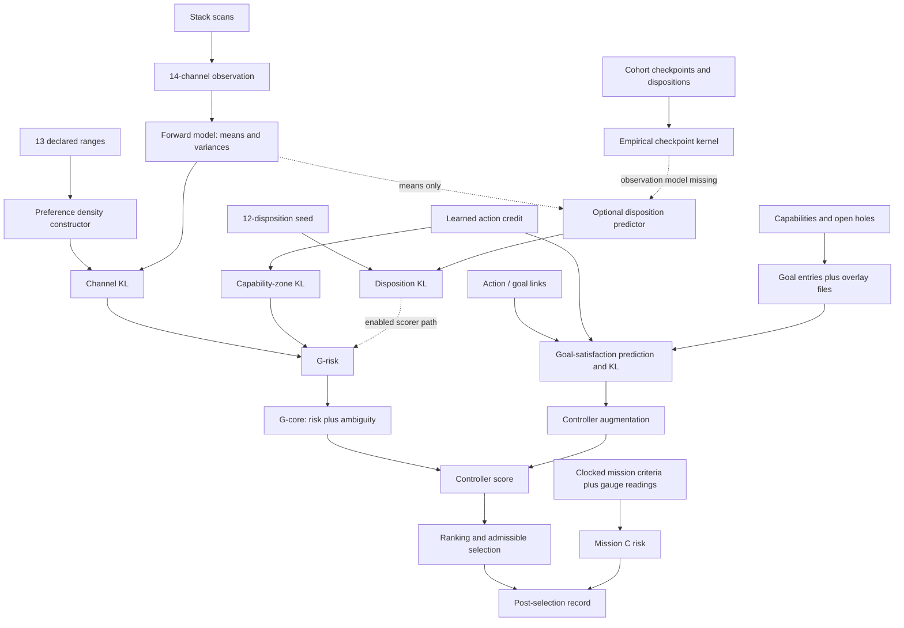

# E-C-realization: MAP of existing preference calculations

2026-09-09, codex-12 with Joe. Phase: MAP, first survey for interactive review.
Owner: [E-C-realization](../../E-C-realization.md). This records existing code,
data and disconnected interfaces; it does not select a design or change C.
Source checkout inspected at futon2 `adf0b246e2d676ce1552fe709f3186476f7f7731`.
Other agents are working in the shared checkouts; source references below name
the files and definitions inspected, not a fresh qualification of the JVM.

## Joe's direction (verbatim, emacs-repl)

> Okay, I'd like to get to work on this excursion. So let's think about where things are at with the c vector. And if we're going to follow something like the Mission Life Cycle. And we've identified that there's a gap, at least as far as I can tell, we've got the gap is that we have many different. Definitions of C, but they don't necessarily all connect up with each other. And they don't necessarily match the criteria that the AIF theory puts in place. And from what I remember, there was a further gap, which is that in order for C to actually work, we need a moderately complex Bayesian calculation. Apart from C itself. So as I last understood it, that was the gap. And if we were to pass then to the map phase of the mission life cycle. We'd assemble all the various partial calculations as well as all the places where those calculations are used and where those calculations are supplied with information so that we get a complete picture. Of what we could possibly assemble as an implementation of C. So I'd like you to get started working on that, please.

Interpretation for this survey: map definitions, input producers, calculations,
consumers, and missing connections. No new weights or implementation authorized
by this interpretation. The lifecycle's MAP instruction is “Survey what exists.
Don't design yet — just look.” See
[mission lifecycle](../../../../futon4/holes/mission-lifecycle.md), §2.

## Survey questions and findings

| Question | Finding |
|---|---|
| Q1. What is currently called C? | Channel targets; capability-zone target; corpus goal-satisfaction entries and overlays; mission-criterion factors; terminal disposition masses; proposed serendipity region; formal time/problem-indexed families. These have different outcome spaces. |
| Q2. Where do values come from? | Static declarations, corpus status and default weights, learned action credit, overlay files, authored mission criteria and gauges, a fixed disposition seed, and operator-ruling excerpts. They do not share a single revision/provenance mechanism. |
| Q3. What predicts the quantities scored? | Channel forward model; separate goal-link/action-credit predictor; mission status-quo readings; experimental channel-to-disposition functions; empirical checkpoint-to-disposition table. |
| Q4. What actually consumes them? | Channel and capability risk enter `G-risk`; goal risk enters controller augmentation; mission C is post-selection readback; disposition risk has an opt-in scorer but no inputs from the production options builder. |
| Q5. What is the Bayesian calculation still owed? | A justified prediction over terminal dispositions on the same observation domain as the model, including how uncertainty is propagated. The fitted checkpoint table and scorer's channel means do not provide this connection. |
| Q6. What connects the layers and times? | Shared distribution utilities and additive score sites exist. A formal ladder exists. A common implemented observation model, time-indexed preference evaluation, and semantic accounting for overlapping outcomes do not follow from those additions. |

## 1. Inventory: declarations, inputs, calculations, consumers

Paths beginning `src/`, `scripts/`, `checks/` are relative to futon2.
“Connected” describes source call paths, not measured current process state.

| Component / outcome space | Preference input and calculation | Prediction / measurement input | Consumer and present status |
|---|---|---|---|
| **Channel C / C_int**: 13 named scalar channels | `preferences.clj:9` declares healthy ranges; `current-C:60` returns them; `c-distribution:235` normalizes each range with exponential tails. Default temperature 0.1; KL channel weights default to one. | `observation/observe` projects scan data into 14 channels; `forward-model/predict` supplies channel means and variances. `:depositing-signal` has no range among the 13. | `efe/compute-efe:688` computes weighted per-channel KL in KL mode, sums into `G-risk` and `G-core`. `free_energy.clj` also reads ranges for current-state gap diagnostics. Production resolves risk mode in `war_machine.clj`. |
| **Capability-zone-load**: binary outcome for a `:learn-action-class` target | `preferences/capability-zone-evidence:140` derives target mass from log-normalized accumulated Beta evidence, `alpha+beta-2`, relative to other classes. | Same Beta record supplies predictive mean `alpha/(alpha+beta)` and Bernoulli variance. Records are held by `intrinsic-values`. Zero evidence makes this component inactive. | `efe.clj:671` scores Bernoulli KL against that target for learn-action candidates, then adds it to `G-risk`. The preference stack calls this learned-from-operator. Whether evidence volume expresses the intended preference is distinct from whether the arithmetic runs. |
| **Live goal-outcomes**: each capability attested / hole closed / condition satisfied | `c_vector/entries-from-corpus:131` reads unmet capabilities and clean open sorries. Capability weights are 0.6 for held and 0.4 otherwise; the entry constructor defaults to 0.3 with `:default-unoriented` basis. `kl-risk-of:668` uses a Bernoulli preference for condition-satisfied. | `goal-outcome-evaluation:563` finds outcomes advanced by action target, explicit `:advances-outcomes`, graph `:produces`, and cached discharged-by links. An advanced goal gets `q-sat = credit-satisfy-prob(action)`; otherwise zero. | `efe.clj:756` reads supplied entries or `current-c-vector`; the mean weighted goal KL becomes `G-goal-outcome`. It enters `:augmentation-terms :goal-outcome` and `controller-score`, outside `G-core`. Production defaults to KL; library default is hinge. |
| **C-vector overlays**: mess, incompleteness, 應-voice conditions | `futon6/scripts/c_vector.bb` produces `c-entries.mess.edn`, `c-entries.incomplete.edn`, `c-entries.yingvoice.edn`. `c_vector/read-overlay-channels:231` reads them from `C_VECTOR_OVERLAY_DIR` or `futon6/data/c-vector`, attaching file digests. | Same goal-satisfaction predictor after merging with stated entries. Numeric conditions also become binary condition-satisfied outcomes in the current KL evaluator. | `refresh!` folds them into cached entries; same goal-risk consumer. File snapshots have a different update path from live corpus queries. Missing/unreadable overlays are omitted by existing code. |
| **Mission C / C_mis**: completion-criterion observables for the clocked mission | `mission_c/read-criteria:377` reads ingest EDN or Markdown. Declared gauges bind prose to observable keys; `c-mis:422` builds factors with the shared constructor. Defaults: `{:becomes 1}` and uniform weights over measurable criteria; complete explicit weight overrides allowed. | `mission_gauges/reading:346` supplies artifact-derived observables, merged with the current channel observation for readback. `risk-mis:558` uses current values, the same for each candidate in the mission; it has no policy-conditioned mission predictor. | `war_machine/mission-c-readback:2115`, attached around line 6662 **after selection**. `FUTON_WM_MISSION_C=1` enables recording, not influence on selection; clock focus supplies the mission. Missing measurements and refused outcome interpretations are typed absences. |
| **Ruled outcome C**: twelve cohort dispositions | `ruled_outcome_c/seeded-c:45`: grounded-change 1/2; agent-unavailable, build-failed, incomplete, no-selection each 1/8; seven named zeros. Source explicitly traces these numbers to an illustrative D1 seed; the authority trail must retain that distinction. | `disposition-risk` accepts a caller-supplied function from the predicted channel map to a complete disposition distribution. The empirical fitter supplies a different object/domain; see §3. | `efe.clj:701` calls it only when `:ruled-outcome-c-enabled?`; weighted result enters `G-risk`. Fold declaration is true. `war_machine.clj:6330` and its two option wrappers supply neither enable flag, seed nor kernel. Thus declared/implemented fold is distinct from production activation. |
| **C_ser**: pre-goal interestingness / occasions | `C537-serendipity-shapes-C.md:55`; `F10RuledCarrier.lean` names an empty occasion region. | No valued outcome vocabulary or predictive distribution supplied by this region. | `ruled_outcome_c/fold-declaration` marks it not folded. No numerical contribution established by this survey. |
| **C_tau / problem preferences / facets** | Cascade apex and A–D clusters are pinned qualitative candidates. Solvability, monetary benefit, societal benefit are named problem axes. `PreferenceLadderDraft.lean` contains a time-indexed family, disposition bridge, and outcome facets. | No implemented cluster-to-observation mapping or problem-axis prediction shown by these declarations. Cluster C's human-feedback carrier remains explicitly missing. | Formal/proposal surfaces, not numerical source for the current scorer. `Holes.lean`'s canonical `C` remains a `sorry` with the excursion-owned deferral. |

This inventory covers the excursion's strategic/mission scoring paths. It is
not a census of every ant simulation or experimental agent named AIF in the
workspace. A nearby naming collision is `aif2/preference.clj`: its inferred
quantity is exploration/info-weight, not a target distribution over outcomes.
Similarly, the habit prior E and selection precision are adjacent inputs to
policy choice, not further C distributions.

## 2. Connections that exist in source

The dashed disposition scorer path exists but production does not supply its
inputs. The other dashed connection is an actual missing model, not a missing
function call. Ambiguity and the other controller terms are shown only at their
composition boundary; this is a C map, not a full G audit.

**Sources feeding observations.** `observation.clj:41` enumerates raw fields:
loop-health and support/attack reports, mission-triage health, graph commit
percentages, active/total repos, sorry and coupling counts, tick counts,
depositing frames, annotation health. `war_machine/judge:5940` calls `observe`
and builds `wm-state:6262`. Metadata distinguishes missing input from observed
zero, while the numeric projection still has zero defaults. The scorer uses
that numeric projection; the missingness envelope is not a disposition model.

**Goal cache supply.** `c_vector/derive-stated:181` queries the substrate via
`substrate/entities-by-type`. `refresh!:248` also loads overlays and the durable
join. Refresh callers include `full_loop_runner.clj:2516`,
`scripts/wm_scheduled_run.clj:97`, `scripts/promote_c_entries.bb:94`, and
`futon3c/src/futon3c/clock/turn_trigger.clj:110`.
`futon3c/src/futon3c/wm/scheduler.clj:325` calls the debounced
`ensure-belly-fresh!`. Thus “no caller” is not true of this mechanism globally;
which entrypoint supplied a particular run still requires its run evidence.

**Credit supply.** `intrinsic_values.clj` rehydrates update records from the
substrate (`code/v05/wm-hyperparameter-update`) into an atom; `credit-for:69`
returns the stored intrinsic-value, or its prior value. `credit-satisfy-prob`
uses that value as goal-satisfaction probability. This is an existing modeling
choice to inspect, not empirical proof that action follow-through equals
completion of each linked goal.

**Selection and records.** `efe/rank-actions:963` sorts controller-score;
`war_machine.clj:6437` filters executable candidates and the subsequent policy
boundary selects. A change in a risk number therefore does not by itself prove
a change in enacted action. `efe` returns risk components and goal-evaluation
inputs; `trace.clj` carries mission readback when enabled. Existing cohort
records used by the disposition fitter do not contain the channel observations
needed to connect that fitter to this path.

## 3. The Bayesian calculation: distinguish three objects

Use x for the channel observation, h for the checkpoint summary, and d for a
terminal disposition. Calling both x and h “o” conceals the missing connection.

1. **Preference C(d)** says which dispositions are wanted. It is supplied by
   the seed, and changed through rulings, not learned by the outcome fitter.
2. **Prediction Q(x | policy)** says what the candidate is expected to produce.
   The forward model emits per-channel means and variances. At horizons above
   one, `efe.clj:630` uses the final mean but first-step variance. This is not
   an evaluation of a C_tau risk at every intermediate step.
3. **Conditional K(d | x)** would connect those channel predictions to endings.
   Given such a model, the proposed calculation is

   `Q(d | policy) = integral K(d | x) Q(dx | policy)`

   followed by `KL(Q(d | policy) || C(d))`. On a finite observation space the
   integral is the sum in `PreferenceLadderDraft/dispositionPredictiveMass`.

Two separate missing connections are visible:

- `checks/disposition_kernel/observation-summary:20` extracts **h**, an ordered
  checkpoint trajectory. `fit-kernel:36` groups closed attempts by h and emits
  a data table K(d | h), with all twelve outcome keys and explicit zeros. It
  does not emit a channel-to-disposition function. The ledger's three closed
  attempts supply one h and grounded-change only. Extending that one row to all
  possible channel states would require a declared model assumption; it is not
  learned by grouping those records.
- `disposition_risk/predict-dispositions:59` calls a supplied function once on
  `next-mean`. It neither passes channel variances nor integrates over Q.
  In general, K(d | E[x]) is not E[K(d | x)]. The current interface would need
  an explicit interpretation/justification even after the domains match.

The familiar `ln 2` is correct **conditional on predicting grounded-change with
probability one** against seed mass 1/2. It does not demonstrate a learned
channel-conditioned bridge or production operation. A constant conditional
also makes mean-only evaluation and integration agree, masking the second gap.

The existing goal-satisfaction path is a separate partial prediction:
action/goal linkage plus action credit produces a Bernoulli Q for each goal.
It does not currently predict the twelve terminal dispositions, and it does
not supply mission-criterion observables. These are possible materials for
later design, not already interchangeable implementations of the bridge.

## 4. Theoretical checks to carry into design

The primary reference already named by E-C-vector-live is Da Costa et al.,
[Active inference on discrete state-spaces: a synthesis](https://arxiv.org/html/2001.07203),
§§3, 6–7 and Appendix C. It separates predicted outcomes from prior preferences
and evaluates policies using expected free energy, including risk and ambiguity.
The following are this survey's checks on the implementation, not claims that
the reference endorses this stack's particular models or defaults:

| Check | What the current map establishes |
|---|---|
| Same outcome space for Q and C | Channel lane and per-goal Bernoulli lane provide local matches. Checkpoint h versus channel x does not. Mission criteria need explicit measurement bindings. |
| Normalized distributions and a stated support | Shared constructors and disposition validators exist. A weighted sum of component KLs does not alone establish one normalized joint C over all components. Dependence, weights, and normalization need an account. |
| Preserve uncertainty through the predictive calculation | Channel KL uses variance; disposition API consumes only means. Mission risk uses status quo. Goal Q uses scalar action credit and deterministic linkage. |
| Time and policy scope | Repeated-action rollout exists; current C risk is not summed across a ruled family of intermediate and terminal times. Cluster bands are qualitative pins. |
| Distinguish risk from adjacent incentives | Corpus goal KL is in controller augmentation; other incentives coexist there. Habit E and epistemic weights must not be relabeled C merely because they affect selection. |
| Exact zeros / refusals | Disposition KL refuses positive Q at zero C and gives zero-Q terms zero contribution. By contrast `preferences/kl:555` clamps Bernoulli Q and C to `[1e-9,1-1e-9]`. Existing numerical behavior therefore differs across components; the no-smoothing rule cannot be claimed globally on this evidence. |
| Meaning of mission risk | Binary point-mass risk is discrete KL. Continuous mission range risk is shifted surprisal, `gap/T`, as its own docstring states; it is not finite KL from a Dirac measure to a continuous density. |

These findings are reasons to specify/test the connection before enabling it.
This MAP pass does not repair them by coercion, smoothing, or changing a gate.

## 5. Existing evidence and proposal surfaces

- `test/futon2/aif/preferences_cdist_test.clj`: density normalization and KL
  checks, outcome-interpretation and point-mass cases.
- `test/futon2/aif/c_vector_test.clj`: corpus derivation, refresh and goal risk.
- `test/futon2/aif/mission_c_test.clj`: criteria, shared constructor, typed
  absence, weights and risk; mission gauges have their own producer module.
- `test/checks/disposition_kernel_test.clj`: empirical checkpoint table.
- `test/futon2/aif/disposition_risk_test.clj`: opt-in selection discrimination,
  seed absence, support and removable layer. Its kernel uses a planted
  mission-health threshold of 0.52; it is not the record-fitted kernel.
- `preference_discovery.clj`: explicit numeric claim comparison plus
  `extract-landscape` with verbatim excerpt checks. Inputs are
  `preference-landscape.edn` and the seed; output is a decision sheet. Qualitative
  passages remain questions. It does not infer a numerical scale from prose.
- `F10RuledCarrier.lean`, `FoldCWitness.lean`, `PreferenceLadderDraft.lean`,
  and `Holes.lean`: carrier/fold/law declarations and witness machinery.
  They do not supply the missing empirical observation model.
- `futon3/checks/derive_q_snatch.clj` and `ablate_g_snatch.clj`: separate finite
  example with declared counterpart priors, policy playouts, derived outcome
  distributions, preference scoring and information calculations. Useful
  worked material, not a fitted WM checkpoint/channel bridge.
- `runs/U88-cascade-live/`: apex, four qualitative bands, 19 members, and 176
  mission arrows all marked `:close-hole`. No band weight is assigned by this
  map; graph delta-g is a model output whose preference authority is unresolved.

Tests above were inspected, not rerun. The briefing explicitly says the built
entry state is reviewed; no rebuild is needed for this documentation survey.

## 6. Ready versus missing

| Ready (existing material; no new code to inspect/use as material) | Missing (not supplied by that material) |
|---|---|
| Distribution constructors, local KL implementations, support validators | Consistent exact-zero policy across components; joint/factored composition account |
| Channel observations and action-conditioned forward model | Justified channel-to-disposition observation model and uncertainty propagation |
| Three closed cohort records and an empirical conditional table | Records relating channel observations, attempt context and reviewed dispositions |
| Goal entries, overlay ingestion, action links and learned credit | Justification/calibration of linked-goal completion probabilities and relation to terminal outcomes |
| Mission criterion reader, gauges and typed readback | Mission-specific policy predictions and an authorized pre-selection consumer |
| Opt-in disposition scorer, seed and fold declaration | Production input provision after the model is designed; run evidence and acceptance |
| Formal preference ladder and pinned Cascade bands | Numerical/provenance specification, time mapping, human-feedback carrier and problem coordinates |
| Provenance-preserving preference comparison | Rulings that settle actual quantitative disagreements; comparison is not a preference generator |

## 7. Surprises and limits to retain

- The charter's `:folded? false` is stale for ruled-outcome C; C592 and current
  source say true, while the production caller still omits its inputs.
- `c_vector.clj`'s header describes predictive risk as future work, but the
  implementation below contains it. Its `refresh!` retains the previous cache
  when the newly derived stated entry set is empty—even though that can also
  mean all stated goals are satisfied. Its signature tracks ids and satisfaction
  states, not every preference-relevant field (e.g. held status affecting
  weight), overlay bytes or relation-only changes. Freshness requires closer
  examination before reusing this as a complete revision mechanism.
- Earlier prose says numeric goal ranges remain hinge-scored in KL mode;
  current `kl-risk-of` represents every open entry as binary satisfaction.
- Source-level defaults and historical declarations are not measurements of
  the running process. No service was queried, live-loaded or restarted here.
- No band weight, carrier choice, cohort design, fold enablement, registry
  decision or worklist row is changed. This document is the first map for Joe
  to examine, not a claim that the excursion has passed MAP acceptance.

Validation for this artifact: source/caller inspection and Markdown whitespace
check. No executable code changed.
