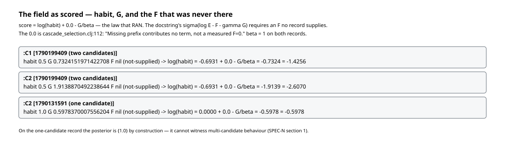
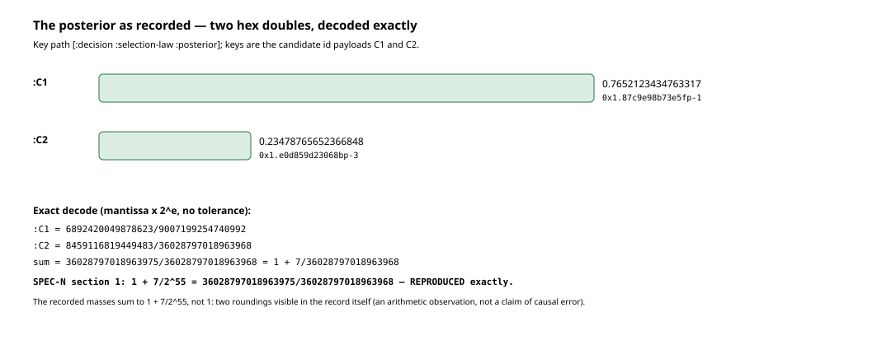
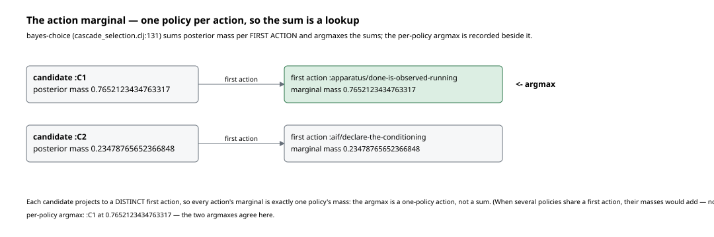

# Walkthrough 02: the selection law as it actually ran

Same form as walkthrough 01: every figure is generated from a record by a
script in this directory, every figure file name carries the record's short
sha256, and no conclusion is decided for the reader. Regenerate with

```
cd futon2 && clojure -M -i holes/labs/wm-contract/walkthroughs/generate_figures_02.clj \
            -e "(generate-figures-02/generate!)"
```

Records: the tick of 2026-09-23 with **two** candidates
(`data/wm-runs/tick-run-record-2026-09-23-1790199409.edn`, sha `7b3c56df`)
and the tick of the same day with **one**
(`data/wm-runs/tick-run-record-2026-09-23-1790131591.edn`, sha `7314951f`).
Subject: `selection-posterior` and `bayes-choice` in
`src/futon2/aif/cascade_selection.clj`. `PROOF-2-F-discovery-2026-09-24.md`
and `proof2/packets/SPEC-N.md` are cited for what they establish; their
arguments are not repeated here.

---

## 1. The field as scored — the law that ran, not the law in the docstring

The docstring of `selection-posterior` (`cascade_selection.clj:54-74`)
gives each finite candidate `habit · exp(−F − G/β)`. The code one branch
deeper (`:109-113`) is what actually executes:

```clojure
 scores (mapv (fn [c]
                (+ (math/log (double (:habit c)))
                   ;; Missing prefix contributes no term, not a measured F=0.
                   (if (= :not-supplied (:f-status c)) 0.0 (- (double (:f c))))
                   (- (/ (double (:g c)) (double beta)))))
              finite)
```

On both records, every candidate's row reads `:f nil, :f-status
:not-supplied` (F-discovery establishes this for *every* recorded click).
So the term that entered the score is the literal `0.0` at
`cascade_selection.clj:112` — a declared missing prefix, not a measured
F = 0 — and the law that ran is

**score(π) = log habit(π) + 0.0 − G(π)/β**, β = 1 on both records.



On the two-candidate record: C1 habit 0.5, G 0.7324151971422708 → score
−1.4256; C2 habit 0.5, G 1.9138870492238644 → score −2.6070. The habits are
equal, so on this click the choice was made entirely by G — 1.18 nats of
risk is the whole story. On the one-candidate record the score barely
matters: the posterior is {1.0} by construction, and SPEC-N §1 notes it
cannot witness multi-candidate numerical behaviour.

## 2. The posterior as recorded — decoded exactly

`[:decision :selection-law :posterior]` on the two-candidate record holds
two doubles, keyed by the candidate id payloads:

- C1: `0.7652123434763317` = `0x1.87c9e98b73e5fp-1`
- C2: `0.23478765652366848` = `0x1.e0d859d23068bp-3`

The generator decodes both to exact rationals (mantissa × 2^e, no
tolerance) and sums them. SPEC-N §1 states the sum is `1 + 7/2^55`, not 1.
**Reproduced, exactly:**

```
sum = 36028797018963975/36028797018963968 = 1 + 7/36028797018963968
SPEC-N section 1: 1 + 7/2^55 — REPRODUCED exactly.
```



Two roundings are visible in the record itself: the ideal masses (real
arithmetic) sum to 1; the decoded recorded masses (rational arithmetic on
what was actually written) do not. SPEC-N §1 already flagged this as an
arithmetic observation, not a Lean witness and not a claim of causal error;
this walkthrough adds only that the figure is reproducible from the record
by the committed script.

## 3. The action marginal — one policy per action, so the sum is a lookup

`bayes-choice` (`cascade_selection.clj:131`) does not argmax policies. It
maps each candidate to its **current first action** and sums posterior mass
per action — "the action marginal, NOT the per-policy argmax" (its
docstring, `:135-137`) — then argmaxes the sums. On this record the mapping
is:

- C1 → first action `:apparatus/done-is-observed-running`, mass 0.7652123434763317
- C2 → first action `:aif/declare-the-conditioning`, mass 0.23478765652366848

Each candidate projects to a *distinct* first action, so every action's
marginal is exactly one policy's mass: the argmax is a **one-policy
action**, and it agrees with the recorded per-policy argmax (C1 at the
same mass). The summing case — several policies sharing one first action,
their masses adding — is the case the action marginal exists for; it is
**not shown on any record** here.



## 4. What the F-ABS receipt would have said

F-ABS (strategy row 27, `PROOF-2-STRATEGY-draft-2026-09-24.md:126,133`)
proposes recording the *actual reduced law* when F is absent, as typed
evidence, vetoing nothing. Had that receipt existed on these records, it
would have read — hypothetical, no record was backfilled:

```clojure
{:law-applied :habit-minus-gamma-g          ;; not :sigma-log-E-minus-F-minus-gamma-G
 :beta 1
 :candidates
 [{:id :C1 :f-consumed :not-supplied :f-term-recorded 0.0}
  {:id :C2 :f-consumed :not-supplied :f-term-recorded 0.0}]
 :note "0.0 is a declared missing prefix (cascade_selection.clj:112),
        not a measured F=0; selection proceeded without veto."}
```

The distinction the receipt would protect is already visible in the code:
the docstring's law needs an F that no record supplies, and the `0.0` that
stands in is *declared*, per the code's own comment. Today that fact lives
only in prose discoveries; F-ABS would put it on the record, per click, as
data.

## 5. A narrative case: from two candidates to one action

One reader's walk through tick 1790199409, every number with its key path.

The target is the same restoration ticket as walkthrough 01
(`T-repair-occ-444fb018…`). Two candidates survive admission
(`[:decision :selection-certificate :candidates]`): **C1**, whose first
limb is `:apparatus/done-is-observed-running` (the direct "observe the
obstruction cleared" route), and **C2**, whose first limb is
`:aif/declare-the-conditioning` (the four-step restore route of
walkthrough 01). Both rows carry habit 0.5 — the habit prior does not
separate them — and both carry `:f nil, :f-status :not-supplied`, so F
plays no part.

Selection temperature is β = 1 (`[:decision :selection-law :beta]`,
`:gamma 1.0`). The law that runs is `log(0.5) + 0.0 − G`:

- C1: −0.6931 − 0.7324 = **−1.4256**
- C2: −0.6931 − 1.9139 = **−2.6070**

Log-sum-exp normalises: C1 takes 0.7652123434763317, C2 takes
0.23478765652366848 (`[:decision :selection-law :posterior]`). G is the
only term that differs — the machine preferred the direct route by 1.18
nats of risk, on a click where F was absent by declaration and habit was
split evenly.

`bayes-choice` then asks a different question: not "which policy?" but
"which *action* has the most mass behind it?" Each candidate's first
action is distinct, so the marginal is a lookup:
`:apparatus/done-is-observed-running` wins with C1's mass, the per-policy
argmax agrees, and the ticket-queue receipt (`[:decision :selection-law
:ticket-queue]`) records the declared stratum the choice was made inside.
The selected action is C1 — recorded at `[:decision :selection-law
:per-policy-argmax :action :id]`.

What the record does not say: whether C1 was *right*. It says precisely
what was scored (habit, G, an absent F), what the arithmetic produced (two
doubles whose sum overshoots 1 by 7/2^55), and what was enacted. The
open question the F-discovery leaves standing is visible in the figure of
section 1: every recorded click has run the reduced law, so no record can
yet say what a click with F supplied would have chosen.

---

*Generator: `generate_figures_02.clj` (this directory). Records read,
never written; no clicks, no JVM loads, nothing under `data/` touched.
Figures: fig1 (the scored field on both records), fig2 (the recorded
posterior decoded exactly), fig3 (the action marginal).*
