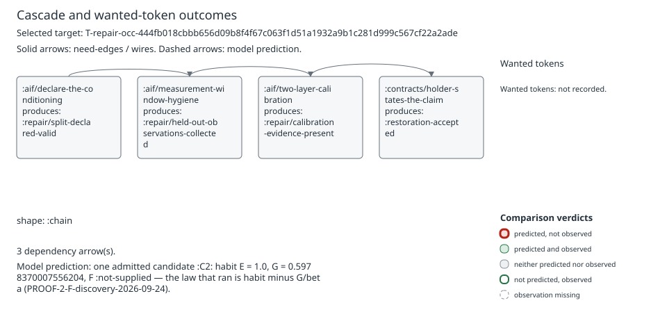
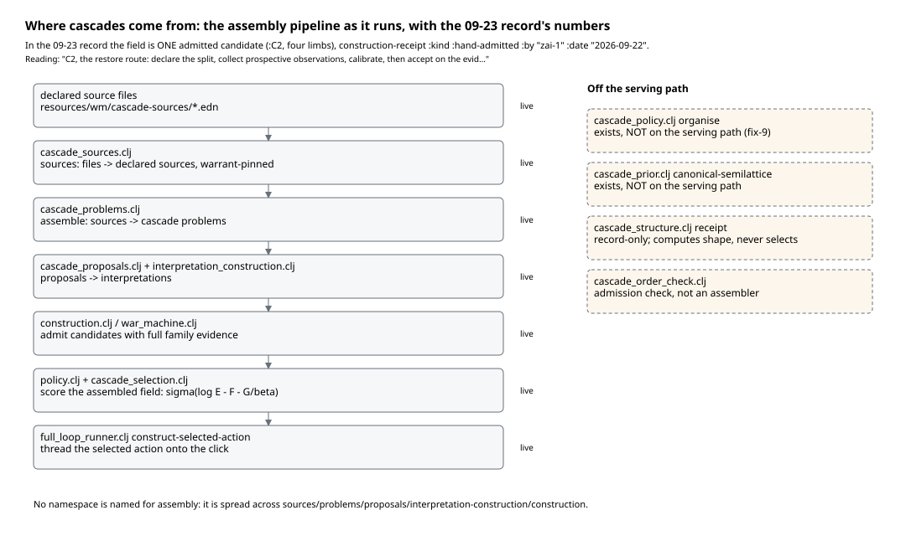
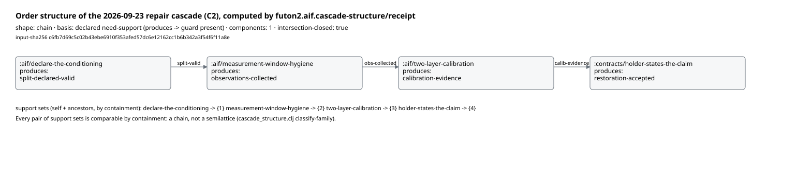
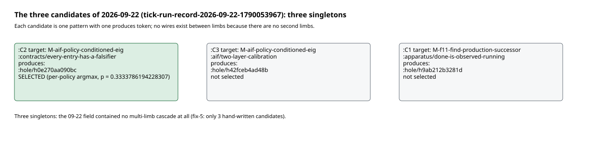
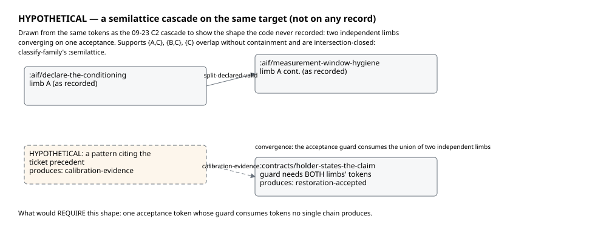
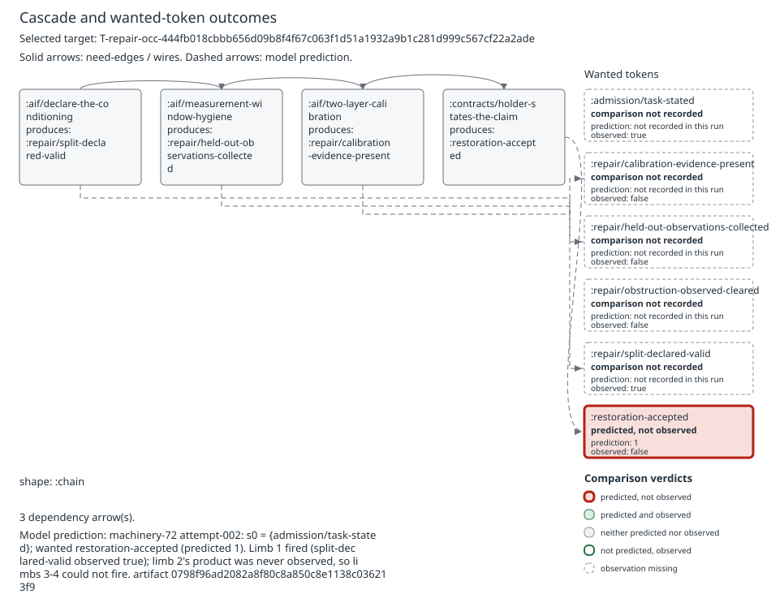

# Walkthrough 1: cascades — what they are, where they are assembled, how they are drawn

A reader's tour of the cascade component of the War Machine, on real records.
Every figure here is generated from a record by
`generate_figures.clj` in this directory; regenerate all of them with

```
cd futon2 && clojure -M -i holes/labs/wm-contract/walkthroughs/generate_figures.clj \
            -e "(generate-figures/generate!)"
```

and every figure file name carries the short sha256 of the record it was
drawn from. Records used: the tick run records of 2026-09-23
(`data/wm-runs/tick-run-record-2026-09-23-1790131591.edn`, sha `7314951f`)
and 2026-09-22 (`…-2026-09-22-1790053967.edn`, sha `1fa0972e`), and the
machinery-72 attempt-002 token comparison
(`data/wm-full-loop-machinery-72/wm-contract-machinery-72-v1/attempt-002/retained/token-outcome.edn`,
sha `bbab2463`). Code is quoted by file:line at the revision of this writing.

---

## 1. What a cascade is in the code

A cascade is a **precedence list of interpreted patterns**. Each pattern
carries: a guard (tokens that must be present, tokens that must be absent),
a transition (tokens it produces), and an interpretation θ ∈ [0,1] — the
probability its THEN succeeds. The Lean definition the code transcribes is
`InterpretedPattern` in `mathlib4/DarkTower/WarMachine/CascadeTransition.lean:22-28`:

```
structure InterpretedPattern (V : Type*) ... where
  consumes : Finset V
  produces : Finset V
  forbids : Finset V
  theta : ℝ
```

The guard holds at a state `s` iff `consumes ⊆ s`, `forbids` is disjoint
from `s`, and the pattern's own `produces` is not already established
(`CascadeTransition.lean:32-35`; the Clojure twin is
`cascade_model_manifest.clj:122-126`, `guard-holds?`). One pattern's kernel
moves `s` to `s ∪ produces` with probability θ and stays with 1 − θ
(`patternKernel`, `CascadeTransition.lean:39-40`;
`cascade_model_manifest.clj:293`). The cascade's kernel is **the kernel of
the first enabled pattern in the list, or the identity when none is
enabled** (`firstEnabled`, `CascadeTransition.lean:69-71`;
`first-enabled` at `cascade_model_manifest.clj:327`, `cascade-kernel` at
`:354-360`). Guards are re-evaluated at every step: a pattern whose work is
done stops winning precedence.

One real example, printed from the 09-23 record
(`[:decision :selection-law :per-policy-argmax :action :precedence 0]`):

```clojure
{:id :aif/declare-the-conditioning
 :guard {:status :interpreted :operator :and
         :clauses [{:present #{["T-repair-occ-444fb018…" :admission/task-stated]}
                    :absent  #{["T-repair-occ-444fb018…" :repair/split-declared-valid]}}]}
 :produces #{["T-repair-occ-444fb018…" :repair/split-declared-valid]}}
```

Read it as Moran read a 1971 pattern: IF the ticket is stated AND the
split is not yet declared valid, THEN declare it. The guard is a token-level
interpretation of the pattern's prose IF/HOWEVER clauses
(`cascade_model_manifest.clj:16-17`, `guard-interpretation`: "a token-level
interpretation, not natural-language truth"), and the produces set is the
tokens of its THEN.

The whole 09-23 cascade, drawn from the record by
`narrative_figures/cascade-svg` (the same renderer the fix-14 narrative
pages use), with the machine's own shape receipt underneath:



## 2. Where cascades come from

Nobody writes `cascade.clj` and says "assemble here". Assembly is a
pipeline spread across five namespaces, and the 09-23 record lets us watch
one item flow through all of it:



The stages, with what the record shows per stage:

- **Declared source files → sources** (`cascade_sources.clj`). The
  candidate's patterns come from the declared pattern library, pinned by
  warrant so a source edit stales what depends on it.
- **Sources → problems** (`cascade_problems.clj`, `assemble`).
- **Proposals and interpretations** (`cascade_proposals.clj`,
  `interpretation_construction.clj`) — the token-level guards above are
  compiled here.
- **Candidates** (`construction.clj`, admitted inside
  `war_machine.clj`). The 09-23 field is exactly **one admitted candidate**,
  `:C2`, whose `:construction-receipt` says `{:kind :hand-admitted, :by
  "zai-1", :date "2026-09-22"}` with the reading "C2, the restore route:
  declare the split, collect prospective observations, calibrate, then
  accept on the evidence. Reaches :restoration-accepted in 4 steps…".
  Machine construction of candidates exists as fixes 5a/5b/5c
  (`FIXLIST-narrative-trace-2026-09-21.md:230-246`) — 5a is merged, 5b
  deferred, 5c in progress; the recorded candidates on both days are
  hand-admitted.
- **The scorer's field** (`policy.clj` + `cascade_selection.clj`), then
  `full_loop_runner.clj:1332` `construct-selected-action` threads the
  selected action onto the click.

Off the serving path, by the record and the code: the organiser
(`cascade_policy.clj` `organise`) and the canonical semilattice
(`cascade_prior.clj` `canonical-semilattice`) exist but ran nowhere on these
clicks — fix-9 said so in prose and nothing since contradicts it. There is
also an *older* cascade assembly lane: `cascade_lane.clj:404-454` shells
out to a Python constructor (`cascade_serve.py`) and stands *before*
selection (`war_machine.clj:5047-5051`) — but every recorded tick passes
`:include-advisory-lanes? false`, so it built nothing on any record
(`C474-cascade-order-discovery.md` §1: "No recorded run built a cascade at
all"). Two assembly paths exist; the one that ran on our records is the
hand-admitted pipeline above.
`cascade_structure.clj` `receipt` IS on the path
(`full_loop_runner.clj:1353`) but is record-only: it computes shape, it
never selects. The ticket queue (`ticket_queue.clj`) orders *which target*
is eligible; it supplies no candidates and is not part of assembly.

## 3. What `cascade-selection` does and does not do

`selection-posterior` (`cascade_selection.clj:54`) takes an
already-assembled field `{:beta β :candidates [{:id :habit :f :g} …]}` and
returns `{id probability}`: each finite candidate gets
`habit · exp(−F − G/β)`, normalised, infinite-G candidates get exactly 0.
`bayes-choice` (`cascade_selection.clj:131`) then sums that posterior over
candidates *by their current first action* and returns the argmax — "the
action marginal, NOT the per-policy argmax" (its own docstring, `:135-137`).
Nothing in the namespace reads a source file, compiles a guard, or pairs a
proposal with an interpretation. It assembles nothing.

One recorded caveat: on the 09-23 click the sole candidate's row is
`{:habit 1.0, :g 0.5978370007556204, :f nil, :f-status :not-supplied}`, and
per `PROOF-2-F-discovery-2026-09-24.md` F is absent on every recorded
click. So the law that ran is habit minus γG, not the full σ(log E − F −
γG).

**Joe's naming question, answered from this evidence.** "Selection" is not
a misnomer for what `cascade-selection.clj` does — it scores and selects,
precisely. The misnomer is the *absence of a name* for what the other five
namespaces do together: there is no `cascade-assembly` namespace; assembly
is what happens between `cascade_sources` and `construction`. If a rename
is wanted, the honest pair is: keep `cascade-selection` as is, and name the
assembly seam when it is next touched — e.g. a `cascade_assembly.clj`
facade over sources → problems → proposals/interpretations → candidates,
so that "the Cascade Assembly" Joe expects is a place, not a diffusion.
Recommendation only; nothing renamed here.

## 4. The order structure of a real cascade

For the 09-23 repair cascade, the wires are computable from the record
itself: pattern P enables pattern Q when P's produces intersects Q's guard
presents. `cascade_structure.clj:59` `receipt` does exactly this and
classifies the support-set family (`classify-family`, `:21`: `:chain` when
every pair is comparable by containment, `:semilattice` only when two sets
overlap without one containing the other *and* the family is closed under
intersection). Running the machine's own receipt on the recorded action
gives:



Four limbs, each guard consuming exactly the previous limb's token:
declare-the-conditioning → `split-declared-valid` →
measurement-window-hygiene → `observations-collected` →
two-layer-calibration → `calibration-evidence` → holder-states-the-claim →
`restoration-accepted`. Support sets nest by containment: **shape
`:chain`**, one component, intersection-closed.

The 09-22 field is poorer still: three singletons, no wires at all, and
the posterior near-uniform over them (the selected one at p ≈ 0.3334):



What does the machine *record* for shape? Until fix-9's fix landed,
`construct-selected-action` wrote the literal `:semilattice []`
(`FIXLIST…:150-153`: "Cascades are 1–3-pattern ordered lists; the recorded
one has one box and no wires. In Alexander's terms that is a chain, not a
semilattice."). At this revision it records `(cascade-structure/receipt
action)` under `:cascade-structure` (`full_loop_runner.clj:1353`) — so the
record now *says* `:chain` where the wiring *is* a chain. The literal is
gone; the shape is still, on every record we have, a chain or a singleton.

## 5. The semilattice question, laid out without deciding it

**What the reference says a cascade is.** Moran, reading Alexander's MSC
pattern language in 1971 (`futon5a/essays/moran-1971-agent-cascades/reading-moran-1971.md`),
extracts three things: a pattern is a *production* (condition → action →
because); the cascade diagram is "a picture of the control structure of a
knowledge base" — edges are dependencies of context, one pattern's action
creating or destroying another's precondition; and the structure is "a
partial order — and pointedly a semilattice rather than a tree, Alexander
practicing in 1968 what he had argued in *A City Is Not a Tree*: patterns
have multiple parents, contexts overlap, and the overlaps are where the
design intelligence lives." Moran's own punchline is the one that matters
here: "The diagram documents the dependency structure but does not solve
the control problem" — at any moment several patterns' conditions may
hold, and *the human is the conflict-resolution strategy*.

**What our implementation is.** The precedence list *is* a conflict
resolution strategy: `first-enabled` walks the list and fires the first
guard that holds (`cascade_model_manifest.clj:327`). Where Alexander's
cascade leaves the order open and lets context overlap, ours total-orders
it in advance. What the list buys: deterministic kernel row composition
(`cascade-kernel` is just the first enabled pattern's kernel,
`:354-360`), a direct Lean transcription (`firstEnabled`,
`CascadeTransition.lean:69-71`), and a record a reader can replay limb by
limb. What it costs: two patterns that could both contribute to one
acceptance must be serialised into an arbitrary order, and the
intersection of their contributions — Moran's "where the design
intelligence lives" — has nowhere to be recorded.

**The look Joe has in mind.** The exemplar diagrams are the three
graphviz `.dot` cascades under `holes/labs/M-evaluate-policies/exhibit/`
(`cascade-1-M-bayesian-structure-learning.dot`,
`cascade-2-M-canon-fingerprint-store.dot`,
`cascade-3-M-evaluate-policies.dot`): undirected overlap graphs where a
pattern has several parents — `budget-bounds-exploration` wires into three
others in cascade-3 — with edge widths for relevance. That is Moran's
"multiple parents, contexts overlap" drawn as a picture, and it is
visibly not a precedence list. (The order-theoretic disposition of this
question for the order registry is `C474-cascade-order-discovery.md`
(discovery) and `C475-cascade-order-disposition.md` (disposition); the
present walkthrough stays on the records.)

**What a semilattice cascade would look like on the 09-23 target.**
Hypothetical, drawn from the same tokens:



Two independent limbs converging on one acceptance whose guard consumes
the union of both limbs' tokens. Its support family {{A,C}, {B,C}, {C}}
overlaps without containment and is intersection-closed — that is
`classify-family`'s `:semilattice`. **This shape is not shown on any
record.**

**What would require it, versus merely permit it.** Merely permitted: any
target whose limbs happen to branch — the code can *record* a semilattice
(`classify-family` will say the word) but nothing in selection or the
kernel *uses* the shape. Required: the day an acceptance token's guard
consumes tokens no single chain produces — two limbs independently
earned, both consumed by one acceptance — a precedence list can still
*fire* both limbs (the second's guard holds after the first fires), but it
cannot *say* that they are independent, and the ordering between them is
fiction. The open questions, as questions: is the repair-cascade family we
actually run ever of that shape? Does θ compose correctly over parallel
limbs the way it does over `first-enabled`? And is the semilattice wanted
as an execution order, or only as the honest record of one?

## 6. A narrative case: machinery-72, attempt-002

One click, told as the story of its cascade, every number with its key
path.

The ticket is `T-repair-occ-444fb018…` — a restoration obligation. The
selected action (`002-selection.edn` `:token-outcome-prediction :action`)
is cascade `:C2`, the four-limb chain of section 4, and the frozen
prediction at dispatch is:

- initial belief s₀ = `{["T-repair-occ-444fb018…" :admission/task-stated] 1}`
  (`:initial-belief`) — the ticket is stated, nothing else is true yet;
- wanted `["T-repair-occ-444fb018…" :restoration-accepted]`, predicted 1
  (`:wanted`);
- horizon 4 — exactly the chain's length (`:horizon`).

At s₀, limb 1's guard holds: `task-stated` is present,
`split-declared-valid` is absent. It is the only limb that can fire. The
author works, the build closes on commit `0798f96a…`, and the token
comparison (`retained/token-outcome.edn` `:measurements`) then reads the
world back:



- `split-declared-valid` — **observed true**. Limb 1 fired and its token
  exists at `0798f96a`.
- `held-out-observations-collected` — **observed false**. Limb 2
  (measurement-window-hygiene) became *enabled* the moment limb 1's token
  landed, but its product never arrived; with its guard's own produces
  absent it remained fireable and un-fired.
- `calibration-evidence-present`, `restoration-accepted` — false. Limbs 3
  and 4 were never enabled: limb 3's guard needs limb 2's token, limb 4's
  needs limb 3's. First-enabled semantics means the chain cannot skip; it
  stops where it stops.

The wanted token is recorded **predicted, not observed** — the red box in
the figure. The attempt is not the cascade failing; it is the cascade
telling the truth about how far it got: one limb of four, with the exact
next token named (`held-out-observations-collected`) as the work the next
click would have to land. And indeed the machinery-76 family continued
this same ticket. That is what a cascade is *for*, on the record: not a
semilattice's lattice of overlapping contexts, but a sequence of named,
checkable debts.

---

*Generator: `generate_figures.clj` (this directory). Records read, never
written. Figures: fig1 (the 09-23 cascade via `narrative_figures/cascade-svg`),
fig2 (pipeline), fig3 (order structure via `cascade-structure/receipt`),
fig4 (09-22 singletons), fig5 (hypothetical semilattice, marked), fig6
(machinery-72 narrative case via `cascade-svg`).*
