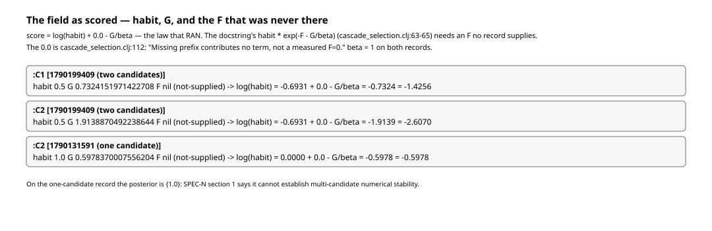
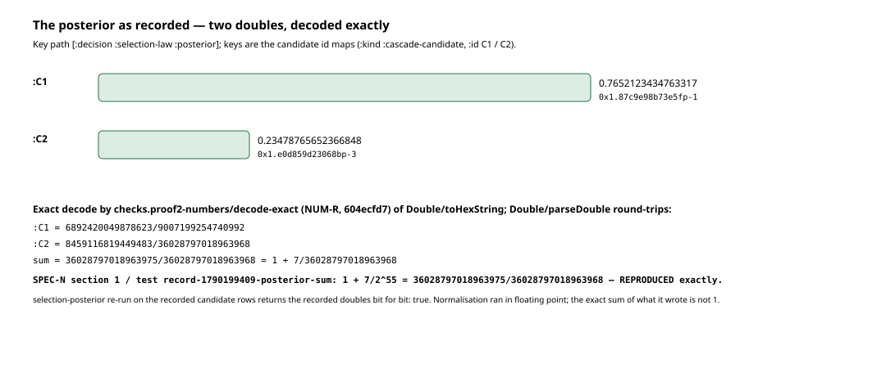
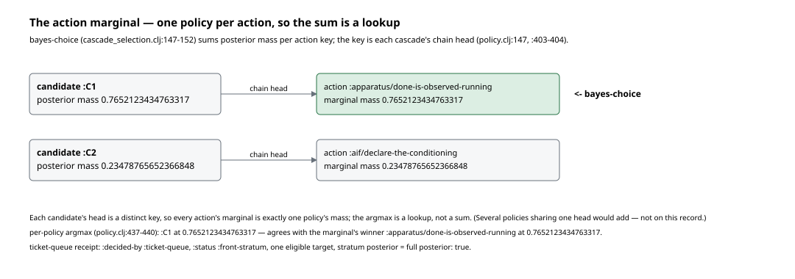
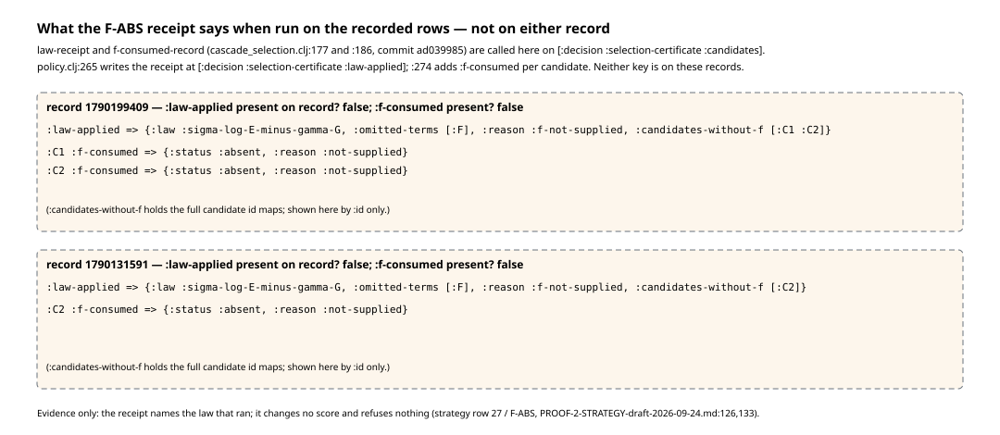
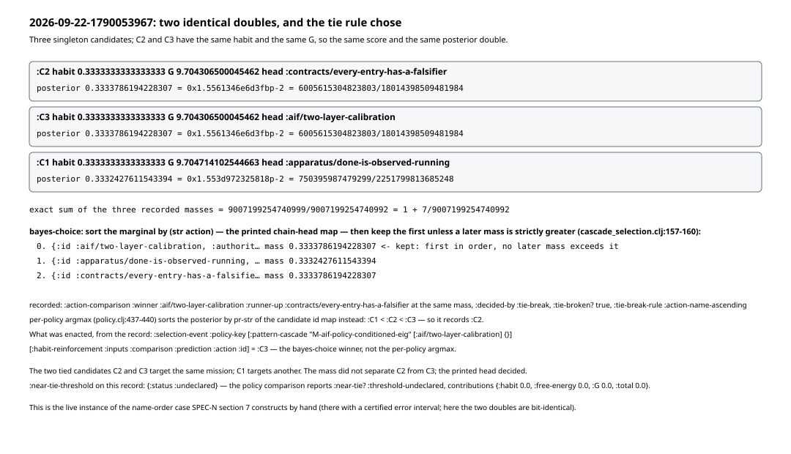

# Walkthrough 02: the selection law as it actually ran

Same form as walkthrough 01: every figure is generated from a record by a
script in this directory, every figure file name carries the record's short
sha256, and nothing is decided for the reader. Regenerate with

```
cd futon2 && clojure -M -i holes/labs/wm-contract/walkthroughs/generate_figures_02.clj \
            -e "(generate-figures-02/generate!)"
```

Records: the tick of 2026-09-23 with **two** candidates
(`data/wm-runs/tick-run-record-2026-09-23-1790199409.edn`, sha `7b3c56df`),
the tick of the same day with **one**
(`data/wm-runs/tick-run-record-2026-09-23-1790131591.edn`, sha `7314951f`),
and, for section 6, the tick of 2026-09-22 with **three**
(`data/wm-runs/tick-run-record-2026-09-22-1790053967.edn`, sha `1fa0972e`).
Subject: `selection-posterior`, `bayes-choice` and `law-receipt` in
`src/futon2/aif/cascade_selection.clj`, and the caller that assembles their
inputs, `select-action-cascades` in `src/futon2/aif/policy.clj`. Line numbers
are at futon2 `ef5b2307` (cascade_selection.clj last touched by `c4aa4f98`).
`PROOF-2-F-discovery-2026-09-24.md` and `proof2/packets/SPEC-N.md` are cited
for what they establish; their arguments are not repeated here.

Where a figure shows what the code computes on a record — the exact decode,
the receipt, the Bayes choice — the generator calls that code
(`checks.proof2-numbers`, `futon2.aif.cascade-selection`) in its own fresh
process on the rows the record already holds. No record is written.

---

## 1. The field as scored — the law that ran, not the law in the docstring

The docstring of `selection-posterior` (`cascade_selection.clj:55-72`)
gives each finite candidate `habit · exp(−F − G/β)` (line 65). The code that
executes is `:109-113`:

```clojure
(let [scores (mapv (fn [c]
                     (+ (math/log (double (:habit c)))
                        ;; Missing prefix contributes no term, not a measured F=0.
                        (if (= :not-supplied (:f-status c)) 0.0 (- (double (:f c))))
                        (- (/ (double (:g c)) (double beta)))))
                   finite)
```

On both records every candidate row at
`[:decision :selection-certificate :candidates i]` reads `:f nil,
:f-status :not-supplied` (checked directly on both records;
`PROOF-2-F-discovery-2026-09-24.md`'s verdict is that no run record under
`data/wm-runs/` carries a candidate with a numeric F and `:f-status
:attached` or `:computed`). So the term that entered the score is the literal
`0.0` at `cascade_selection.clj:112` — the comment on line 111 says what it
is: a missing prefix contributing no term, not a measured F = 0 — and the law
that ran is

**score(π) = log habit(π) + 0.0 − G(π)/β**, with β recorded as the integer `1`
(`[:decision :selection-law :beta]`, `:beta-status :declared`, `:gamma 1.0`).



On the two-candidate record: C1 habit 0.5, G 0.7324151971422708 → score
−1.4256; C2 habit 0.5, G 1.9138870492238644 → score −2.6070. The habits are
equal, so the choice on this click was made by G alone: the record's own
`:policy-comparison :contributions` says `{:habit 0.0, :free-energy 0.0, :G
1.1814718520815937}` and `:decided-by :G`. On the one-candidate record
(habit 1.0, G 0.5978370007556204) the posterior is `{1.0}`; SPEC-N §1 notes
that record cannot establish multi-candidate numerical stability.

## 2. The posterior as recorded — decoded exactly

`[:decision :selection-law :posterior]` on the two-candidate record holds two
plain doubles, keyed by the candidate id maps (`{:kind :cascade-candidate,
:id :C1, …}`):

- C1: `0.7652123434763317` = `0x1.87c9e98b73e5fp-1`
- C2: `0.23478765652366848` = `0x1.e0d859d23068bp-3`

The generator takes `Double/toHexString` of each, checks that
`Double/parseDouble` of the hex gives the same double back, and hands the hex
to `checks.proof2-numbers/decode-exact` (commit `604ecfd7`, NUM-R) for the
exact dyadic rational:

```
C1 = 6892420049878623/9007199254740992
C2 = 8459116819449483/36028797018963968
sum = 36028797018963975/36028797018963968 = 1 + 7/36028797018963968
```

That is `1 + 7/2^55`, not 1 — the value SPEC-N §1 reports and
`test/checks/proof2_numbers_test.clj` pins as
`record-1790199409-posterior-sum`. Reproduced exactly by the generator.



One more thing the figure states: running `selection-posterior` on the
recorded candidate rows, in a fresh process, returns a map equal to the
recorded posterior bit for bit. The normalisation ran in floating point
(`log-sum-exp` at `:47`, then `exp` per score at `:116`); what it wrote is
two nearest doubles whose exact sum overshoots 1. SPEC-N §1 flags this as an
arithmetic observation, not a claim of causal error.

## 3. The action marginal — one policy per action, so the sum is a lookup

`bayes-choice` (`cascade_selection.clj:131`) does not argmax policies. Its
docstring (`:134-139`) says it takes `action-of`, a map from candidate id to
"its current action", and returns "the argmax over actions of Σ_{π :
action-of(π) = a} Q(π) — the action marginal, NOT the per-policy argmax".
The body: sum mass per action key (`:147-152`), sort the keys by their
printed form (`:157`), keep the first entry unless a later one is strictly
greater (`:158-160`).

The caller decides what "current action" means. `policy.clj:403-404` builds
`action-of` as `{candidate-id → cascade-first-action}`, and
`cascade-first-action` (`policy.clj:147-160`) is the **chain head**: the
first declared pattern, `precedence 0`. Its own docstring says this is "not
necessarily the step that would be enacted now"; that step is recorded
alongside under `:enacted-steps` (on 1790199409:
`{:apparatus/done-is-observed-running :apparatus/evidence-to-disposition-once,
:aif/declare-the-conditioning :contracts/holder-states-the-claim}` — the
scored belief already contains the token each head produces, so the enactable step is
further down each chain). The marginal's keys are the head pattern maps
themselves, not their ids.

On 1790199409 the mapping is:

- C1 → head `:apparatus/done-is-observed-running`, mass 0.7652123434763317
- C2 → head `:aif/declare-the-conditioning`, mass 0.23478765652366848

The two heads are distinct keys, so each action's marginal is exactly one
policy's mass: the argmax is a lookup, and the summing case the marginal
exists for — several policies sharing a head, their masses adding — does not
occur on this record. The per-policy argmax (`policy.clj:437-440`, recorded
at `[:decision :selection-law :per-policy-argmax]`) is C1 at the same mass;
the two agree. The ticket-queue receipt (`[:decision :selection-law
:ticket-queue]`) says `:decided-by :ticket-queue`, `:status :front-stratum`,
one eligible target; its `:stratum-posterior` equals the full posterior, so
the stratum choice and the unrestricted choice are the same call on the same
map.



## 4. What the F-ABS receipt would have said

Strategy row 27 / F-ABS (`PROOF-2-STRATEGY-draft-2026-09-24.md:126`, with
line 133: "F-ABS does not veto selection") asks the machine to record the
reduced law when F is absent. That code exists at HEAD:
`f-consumed-record` (`cascade_selection.clj:177`) and `law-receipt` (`:186`),
landed by `ad039985` on 2026-09-24, and `policy.clj:265` writes the receipt at
`[:decision :selection-certificate :law-applied]` with `:274` attaching
`:f-consumed` to each candidate. The two records predate it: walking every
map in each record finds neither key.

Calling those two functions on the candidate rows the records hold gives,
for both records:

```clojure
:law-applied {:law :sigma-log-E-minus-gamma-G
              :omitted-terms [:F]
              :reason :f-not-supplied
              :candidates-without-f [<C1 id map> <C2 id map>]}   ; [<C2 id map>] on 1790131591
;; per candidate
:f-consumed {:status :absent :reason :not-supplied}
```



The arithmetic is unchanged by the receipt (the namespace's comment at
`:163-175` says so, and gives the engineering reason: F is absent on every
recorded click, so a refusal would halt selection everywhere). Nothing was
backfilled: the figure is what the code returns on the rows, and the records
still say nothing at `:law-applied`.

## 5. A narrative case: from two candidates to one action

One reader's walk through tick 1790199409, every number with its key path.

The target is the same restoration ticket as walkthrough 01
(`T-repair-occ-444fb018…`). Two candidates are admitted
(`[:decision :selection-certificate :candidates]`), both hand-admitted, each
with a `:construction-receipt :reading` in its id map. **C1** is "the verify
route: observe the condition (cleared branch), then accept on the dated
observation" — two limbs, head `:apparatus/done-is-observed-running`.
**C2** is "the restore route" of walkthrough 01 — four limbs, head
`:aif/declare-the-conditioning`. Both rows carry habit 0.5
(`:habit-status :attached`), and both carry `:f nil, :f-status
:not-supplied, :reason :no-admitted-policy-prefix`, so F contributes
nothing.

β = 1 (`[:decision :selection-law :beta]`, `:tau-source :carry-beta`). The
law that runs is `log(0.5) + 0.0 − G`:

- C1: −0.6931 − 0.7324 = **−1.4256**
- C2: −0.6931 − 1.9139 = **−2.6070**

Log-sum-exp normalises: C1 takes 0.7652123434763317, C2 takes
0.23478765652366848 (`[:decision :selection-law :posterior]`). G is the only
term that differs — 1.18 nats of risk between the two routes, on a click
where F was absent by declaration and the habit prior was split evenly.

`bayes-choice` then asks a different question: not "which policy?" but "which
head has the most mass behind it?" The two heads are distinct, so the
marginal is a lookup: `:apparatus/done-is-observed-running` at C1's mass.
The per-policy argmax says C1 too. What the record says was enacted:
`[:selection-event :policy-key]` is `[:pattern-cascade "T-repair-occ-…"
[:apparatus/done-is-observed-running :apparatus/evidence-to-disposition-once]
{}]` — C1's two limbs — and `[:d-task-enactment :verification
:declared-action :id]` and `[:habit-reinforcement :inputs :comparison
:prediction :action :id]` are both `:C1`.

What the record does not say: whether C1 was right. It says what was scored
(habit, G, an absent F), what the arithmetic produced (two doubles whose
exact sum is 1 + 7/2^55), and what was enacted. The question the
F-discovery leaves standing is visible in figure 1: every recorded click ran
the reduced law, so no record yet shows what a click with F supplied would
choose.

## 6. The 09-22 record: two identical doubles, and what the tie rule did

Record `2026-09-22-1790053967` (sha `1fa0972e`) has three singleton
candidates and this posterior:

```
C2  0.3333786194228307 = 0x1.5561346e6d3fbp-2 = 6005615304823803/18014398509481984
C3  0.3333786194228307 = 0x1.5561346e6d3fbp-2 = 6005615304823803/18014398509481984
C1  0.3332427611543394 = 0x1.553d972325818p-2 =  750395987479299/2251799813685248
```

C2 and C3 target the same mission (`M-aif-policy-conditioned-eig`), have the
same habit (`0.3333333333333333`) and the same G (`9.704306500045462`); C1
targets `M-f11-find-production-successor` with G `9.704714102544663`. Equal
inputs give equal scores and the same double — not a near tie, an exact one.
(The exact sum here is `1 + 7/2^53`; again not 1.)

Three distinct heads, so the marginal has three entries, two at the identical
double. `bayes-choice` sorts by `(str action)` — the printed head map — and
keeps the first unless a later mass is strictly greater (`:157-160`). The two
tied maps print as `{:id :aif/two-layer-calibration, …}` and `{:id
:contracts/every-entry-has-a-falsifier, …}`; they differ first at `a` vs `c`,
so `:aif/two-layer-calibration` — C3's head — sorts first, and C2's equal
mass never replaces it. The record says exactly this: `:action-comparison
:winner` is `:aif/two-layer-calibration`, `:runner-up` is
`:contracts/every-entry-has-a-falsifier` at the same mass, `:decided-by
:tie-break`, `:tie-broken? true`, `:tie-break-rule :action-name-ascending`.



The per-policy argmax on the same record is **C2**. `policy.clj:437-440`
sorts the posterior by `pr-str` of the candidate id map — `{:kind
:cascade-candidate, :id :C2, …}` before `…:C3…` — and applies the same
strict-greater rule, so its tie falls the other way. Both argmaxes are on the
record, each with its own tie rule named (`:policy-comparison
:tie-break-rule :policy-printed-identity-ascending`), and they disagree. The
one that was enacted is the `bayes-choice` winner: `[:selection-event
:policy-key]` is `[:pattern-cascade "M-aif-policy-conditioned-eig"
[:aif/two-layer-calibration] {}]` and `[:habit-reinforcement :inputs
:comparison :prediction :action :id]` is `:C3`. (Walkthrough 01's figure 4
labels C2 "SELECTED (per-policy argmax)"; that is the recorded per-policy
argmax, and the candidate the record shows enacted is C3.)

Two things worth being precise about, because the record makes them visible:

- The rule's "name" is the printed form of the whole head pattern map. On
  this record both tied maps print `:id` first, so the comparison is decided
  by the pattern id. On 1790199409 C1's head map printed `:theta-source`
  first (a hash map with more than eight keys), so the same rule would have
  compared a different key there; no tie arose, so it did not matter.
- `:near-tie-threshold` is `{:status :undeclared}` on every record here, so
  `:policy-comparison :near-tie?` reads `:threshold-undeclared` and
  `:contributions` are all `0.0`. The record names the tie; nothing in it
  measures how near.

This is the live instance of the case SPEC-N §7 builds by hand ("calling the
overlapping intervals a tie and applying name order"); SPEC-N's construction
needs a certified error interval to make two distinct scores indistinguishable,
whereas here the two doubles are bit-identical because the inputs were. Its
argument is not repeated here.

---

## Verification

What was checked, against the draft preserved at
`proof2/partial/walkthrough-02-kimi-4/`:

- **Records.** Extracted `[:decision :selection-law]` and
  `[:decision :selection-certificate :candidates]` from all three records in
  a fresh process: habits, G, `:f nil`/`:f-status :not-supplied`, β, γ,
  posterior doubles and their hex, `:action-marginal`, `:per-policy-argmax`,
  `:action-comparison`, `:policy-comparison`, `:ticket-queue`,
  `:enacted-steps`, `:tie-broken?`, `:selection-event :policy-key`,
  `:d-task-enactment :verification :declared-action`,
  `:habit-reinforcement … :prediction :action`. Walked each record for
  `:law-applied` / `:f-consumed` (absent).
- **Arithmetic.** Decoded the posteriors with `checks.proof2-numbers/decode-exact`
  after a `Double/parseDouble` round-trip; sum on 1790199409 is
  `1 + 7/36028797018963968` (matches SPEC-N §1 and the test pin). Re-ran
  `selection-posterior` on the recorded rows for all three records: equal to
  the recorded posteriors bitwise. Re-ran `bayes-choice` with `action-of`
  built as `policy.clj:403-404` builds it: matches `:action-comparison
  :winner` on all three. Re-ran `law-receipt` and `f-consumed-record` on the
  rows for the figure.
- **Code.** Line numbers re-read at `ef5b2307`: docstring 55-72, scores
  109-113, the `0.0` at 112, `bayes-choice` 131, its docstring 134-139,
  tie sort 157, strict-greater reduce 158-160, `f-consumed-record` 177,
  `law-receipt` 186; `policy.clj` 147 (`cascade-first-action`), 265/274
  (receipt placement), 403-404 (`action-of`), 437-440 (per-policy argmax).
  Strategy row 27 at `PROOF-2-STRATEGY-draft-2026-09-24.md:126,133`.
- **Figures.** Generator run twice; the five SVGs are byte-identical between
  runs. `clj-kondo --lint` clean; `check-parens.el` batch OK.

Changed from the draft:

1. §4's receipt was hand-written with invented keys (`:law-applied
   :habit-minus-gamma-g`, `:f-term-recorded`, `:note`) and described F-ABS
   as a proposal that "would" record. `law-receipt` and `f-consumed-record`
   are merged code (`ad039985`); the section now shows their actual return
   values on the recorded rows and says the records lack the key.
2. §3's figure matched candidates to actions by equality of mass; it now
   uses the `action-of` mapping `policy.clj` builds (this matters on the
   09-22 record, where two masses are equal). Added that the marginal's key
   is the chain head, with `:enacted-steps` recorded alongside.
3. §2's decoder was a private reimplementation; replaced by
   `checks.proof2-numbers/decode-exact` with the parseDouble round-trip, and
   the "two roundings visible in the record" sentence replaced by what was
   checked (bitwise replay; floating-point normalisation).
4. Line references corrected: docstring `:55-72` (was `:54-74`),
   `bayes-choice` docstring `:134-139` (was `:135-137`).
5. §5: C1's description ("the direct 'observe the obstruction cleared'
   route") replaced by the record's own reading ("the verify route …"); the
   enacted action is now cited from `:selection-event`, `:d-task-enactment`
   and `:habit-reinforcement` rather than from `:per-policy-argmax` alone.
6. §6 added (the 09-22 tie), with the new fig5, and fig4 for the receipt.
