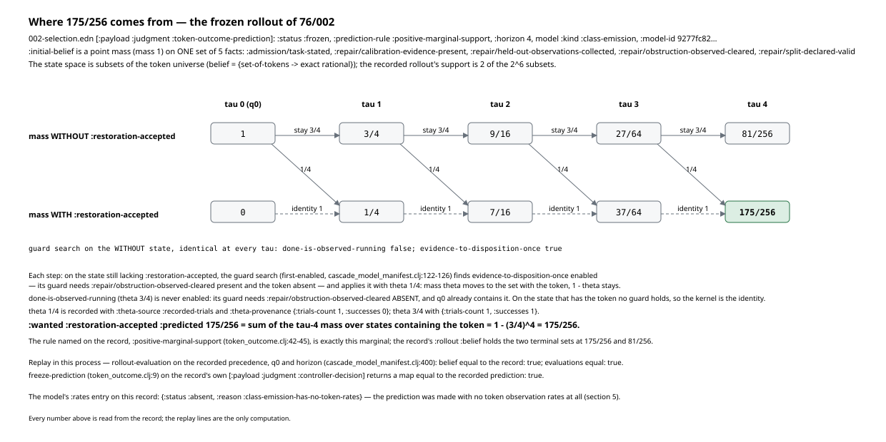
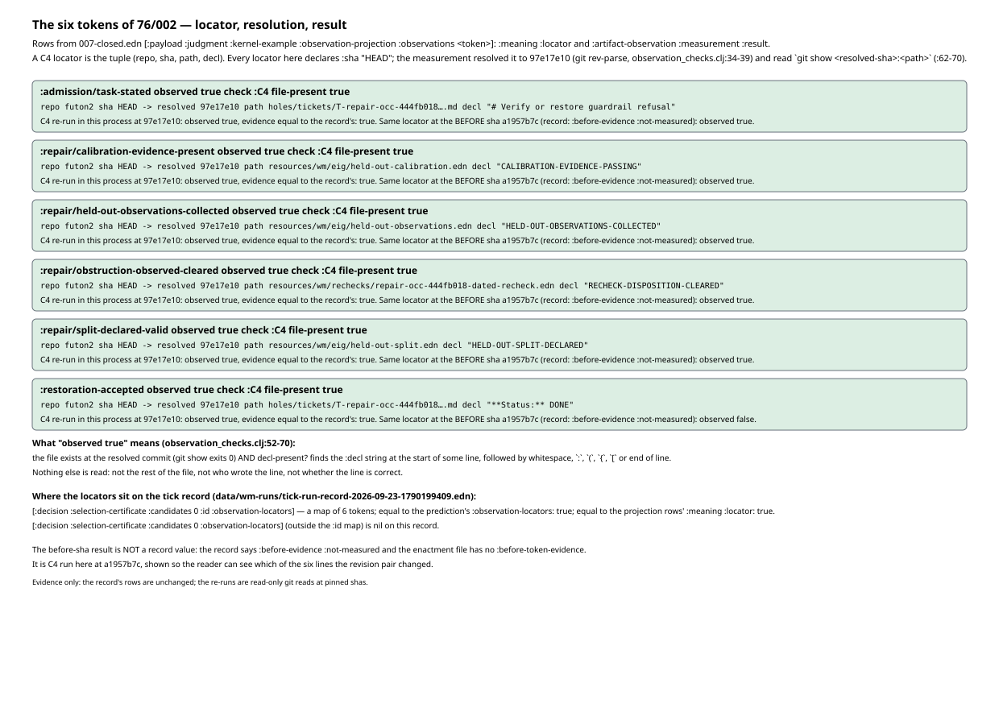
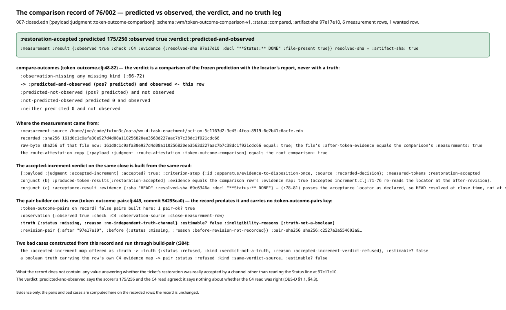
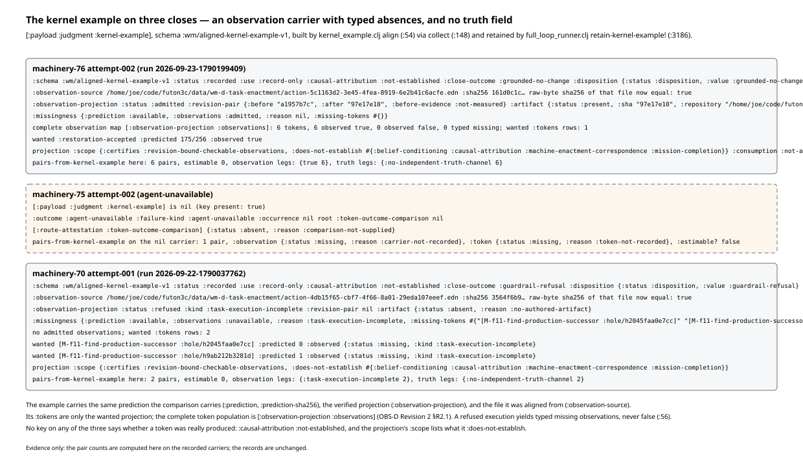
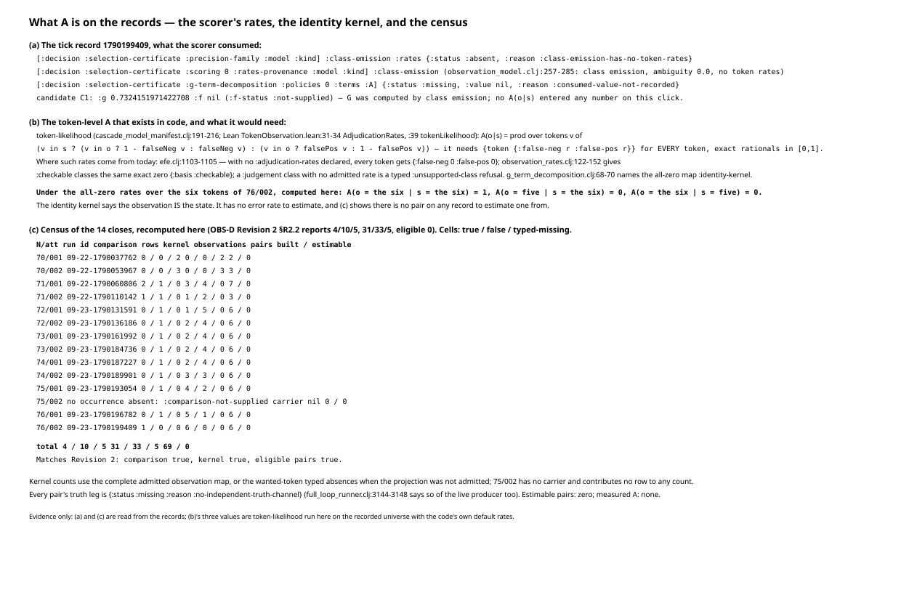
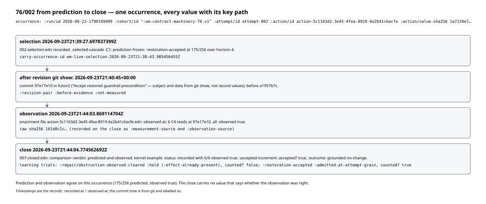

# Walkthrough 03: observation and the A model, as the records carry them

Same form as walkthroughs 01 and 02: every figure is generated from a record
by a script in this directory, every figure file name carries the record's
short sha256, and nothing is decided for the reader. Regenerate with

```
cd futon2 && clojure -M -i holes/labs/wm-contract/walkthroughs/generate_figures_03.clj \
            -e "(generate-figures-03/generate!)"
```

Records: machinery-76 attempt-002's selection checkpoint
(`data/wm-full-loop-machinery-76/wm-contract-machinery-76-v1/attempt-002/002-selection.edn`,
sha `a470442b`) and its close (`…/attempt-002/007-closed.edn`, sha
`ec6ad5c3`); machinery-75 attempt-002's close (sha `66ef54b1`);
machinery-70 attempt-001's close (sha `fb994fa2`); the tick record of the
same run as 76/002 (`data/wm-runs/tick-run-record-2026-09-23-1790199409.edn`,
sha `7b3c56df`, the two-candidate record of walkthrough 02); and, for the
census in section 5, all fourteen closes of machinery-70..76 (digest
`769cd825` over their fourteen sha256s). One file outside futon2 is read
because the close names it by path and sha:
`futon3c/data/wm-d-task-enactment/action-5c1163d2-3e45-4fea-8919-6e2b41c6acfe.edn`
(sha256 `161d0c1c…`, recomputed here and equal).

Subject: `freeze-prediction` and `compare-outcomes` in
`src/futon2/aif/token_outcome.clj`; `align` and `collect` in
`src/futon2/aif/kernel_example.clj`; `retain-token-outcome!`,
`retain-kernel-example!` and the close assembly in
`src/futon2/aif/full_loop_runner.clj`; `check-decl-in-file` in
`src/futon2/aif/observation_checks.clj`; the pair builder in
`src/futon2/aif/token_outcome_pair.clj` (commit `54295ca0`);
`token-likelihood` in `src/futon2/aif/cascade_model_manifest.clj`; and the
observation-model query in `src/futon2/aif/observation_model.clj`. Line
numbers are at futon2 `bd06a3c4`. `proof2/packets/OBS-D.md` (commit
`3277e9e6`, Revision 2 `508a410e`) and its review
`proof2/reviews/OBS-D-codex-23.md` are cited for what they establish; their
arguments are not repeated here.

Where a figure shows what the code computes on a record — the rollout
replay, a C4 read at a pinned sha, the pair builder on the recorded rows,
`token-likelihood` under the code's default rates — the generator calls that
code in its own fresh process on the rows the record already holds. No record
is written.

---

## 1. The prediction: where 175/256 comes from

At the selection checkpoint the runner freezes a prediction for every wanted
token of the selected target (`full_loop_runner.clj:4613-4614` calls
`token-outcome/freeze-prediction` on the controller decision). The frozen
value sits at `002-selection.edn [:payload :judgment
:token-outcome-prediction]`: `:schema :wm/token-outcome-prediction-v1`,
`:status :frozen`, `:prediction-rule :positive-marginal-support`, `:horizon
4`, `:model-id 9277fc82…`, one `:wanted` row — token
`[T-repair-occ-444fb018… :restoration-accepted]`, `:predicted 175/256`.

Three inputs make that number, all on the record:

- **The initial belief.** `:initial-belief` is `{S 1}`: a point mass on one
  SET of five facts — `:admission/task-stated`,
  `:repair/calibration-evidence-present`,
  `:repair/held-out-observations-collected`,
  `:repair/obstruction-observed-cleared`, `:repair/split-declared-valid`
  (all qualified by the ticket). `freeze-prediction` takes it from the
  precision family's model (`token_outcome.clj:16-17`: `{:keys [q0 horizon]}
  (:model family)`) and refuses unless every key is a set and the row is an
  exact normalised distribution (`:24-29`). The state space is therefore
  subsets of the token universe — a belief is a map from sets of qualified
  tokens to exact rationals — and this belief names exactly one subset.
- **The horizon.** `:horizon 4`, from the same model.
- **The cascade.** `:action :precedence` holds C1's two patterns with their
  effective thetas: `:apparatus/done-is-observed-running` (theta `3/4`,
  `:theta-source :recorded-trials`, `:theta-provenance {:trials-count 1
  :successes 1 …}`) and `:apparatus/evidence-to-disposition-once` (theta
  `1/4`, `{:trials-count 1 :successes 0 …}`).

The rollout (`model/rollout-evaluation`, `cascade_model_manifest.clj:400`,
called at `token_outcome.clj:31`) pushes the belief forward four steps. Each
step runs the first-enabled guard search on every state in the support
(`guard-holds?`, `:122-126`). On the five-fact set the first pattern is never
enabled — its guard requires `:repair/obstruction-observed-cleared` ABSENT,
and q0 already contains it — and the second is: its guard needs
`:repair/obstruction-observed-cleared` present and `:restoration-accepted`
absent. So at every tau the state still lacking the token sends mass theta =
1/4 to the six-fact set and keeps 3/4; the six-fact set has no enabled guard
and carries an identity kernel. The record's `:rollout :evaluations` show
exactly this at tau 1..4 (masses 1 → 3/4 → 9/16 → 27/64 → 81/256 without the
token; 0 → 1/4 → 7/16 → 37/64 → 175/256 with it), and `:rollout :belief` is
the two terminal sets at `175/256` and `81/256`.



`:predicted` is then the marginal the rule's name says
(`token_outcome.clj:39-46`): the sum of terminal mass over states containing
the token, `175/256 = 1 − (3/4)^4`. "Positive" is used later, not here:
`compare-outcomes` tests `(pos? predicted)` (`:74`), so any nonzero marginal
counts as a prediction that the token will appear. There is no threshold.

Replayed in the generator's process: `rollout-evaluation` on the recorded
precedence, q0 and horizon returns a belief and an evaluations vector equal
to the record's; `freeze-prediction` on the record's own `[:payload
:judgment :controller-decision]` returns a map equal to the recorded
prediction. One more field of the model deserves notice now and is taken up
in section 5: `:model :kind` is `:class-emission` and `:model :rates` is
`{:status :absent :reason :class-emission-has-no-token-rates}`. The
prediction was made by a model that has no token observation rates.

## 2. The observation: a C4 locator, and what "observed true" means

Every token the machine can observe carries a locator. On the tick record the
locators of C1 are at `[:decision :selection-certificate :candidates 0 :id
:observation-locators]` — inside the candidate's id map — a map from
qualified token to `{:class :C4 :repo "futon2" :sha "HEAD" :path … :decl …}`.
(The path `[:decision :selection-certificate :candidates 0
:observation-locators]`, outside the id map, is `nil` on this record.) The
same six-entry map is the prediction's `:observation-locators` on the
selection checkpoint, and it is what the enactment's projection rows carry
as `:meaning :locator` (both equalities checked). A C4 locator is the tuple
(repo, sha, path, decl); note that every one of these six declares `:sha
"HEAD"`.

C4 is `check-decl-in-file` (`observation_checks.clj:62-70`). It resolves the
declared reference once with `git rev-parse` (`:34-39`, giving
`:resolved-sha`), runs `git show <resolved-sha>:<path>`, and reports
`:observed` true exactly when that command succeeds AND `decl-present?`
(`:52-60`) finds the `:decl` string at the start of some line, followed by
whitespace, `:`, `(`, `{`, `[` or end of line. The evidence map is `{:repo
:sha :resolved-sha :path :decl :file-present}`. Nothing else is read: not the
rest of the file, not who wrote the line, not whether the line is right.



On 76/002 all six were read at the after-revision `97e17e10` and all six
report `:observed true` (the figure lists path, decl and resolved sha per
token). The reads live in the enactment file named above
(`:wm/d-task-enactment-v1`, `:observed-at 2026-09-23T21:44:03.869Z`,
`:after-token-evidence` with six rows, each carrying the `:declared-locator`
with `HEAD`, the `:after-locator` with the sha substituted, and the
`:result`). C4 re-run in the generator's process at `97e17e10` returns the
same six results with evidence maps equal to the record's.

One line in the figure is not a record value and is labelled so: the record's
`:revision-pair` is `{:before "a1957b7c…" :after "97e17e10…" :before-evidence
:not-measured}`, and the enactment file has no `:before-token-evidence`. The
generator runs the same six locators at `a1957b7c` so the reader can see
which lines the revision pair changed: five of the six declaration lines are
already present there; only `:restoration-accepted` is not (the ticket's line
3 reads `**Status:** OPEN` at `a1957b7c` and `**Status:** DONE` at
`97e17e10`, by `git show`). The record says the same thing about one of the
five by another route: its learning receipt holds the
`:repair/obstruction-observed-cleared` trial as `:status :held, :reason
:effect-already-present`. "Observed true at the after-revision" is a
statement about presence at a revision, not about production by this
occurrence; the projection's own `:scope` says `:does-not-establish
#{:causal-attribution …}`.

## 3. The comparison record: predicted vs observed, and no truth leg

At close, `retain-token-outcome!` (`full_loop_runner.clj:3131-3184`) re-reads
the enactment file by the path the D-task result names, refuses if its raw
sha256 differs from the recorded one (`:3135-3140`,
`:evidence-digest-mismatch`), takes `:after-token-evidence` as the
measurements, and calls `compare-outcomes` with the frozen prediction and the
close's artifact sha (`:3142`). The receipt is written to
`retained/token-outcome.edn` and placed on the close at `[:payload :judgment
:token-outcome-comparison]` (`:4135`), with a copy under
`:route-attestation` (equal to the root on 76/002).

`compare-outcomes` (`token_outcome.clj:48-82`) does, per wanted token: find
the measurement rows for that token; decide whether the observation is
missing — no row (`:measurement-unavailable`), more than one
(`:ambiguous-measurement`), a non-boolean `:observed` (the row's own
`:kind`), or an evidence `:resolved-sha` that is not the artifact sha
(`:artifact-revision-mismatch`) (`:66-72`); then assign one of five verdicts
(`:73-77`): `:observation-missing`, `:predicted-and-observed`,
`:predicted-not-observed`, `:not-predicted-observed`, `:neither`. On 76/002
the row is

```clojure
{:token [T-repair-occ-444fb018… :restoration-accepted]
 :predicted 175/256  :observed true  :verdict :predicted-and-observed
 :measurement {… :result {:observed true :check :C4
                          :evidence {:resolved-sha "97e17e10…" :decl "**Status:** DONE" :file-present true …}}}}
```

with `:status :compared`, `:artifact-sha "97e17e10…"` equal to the
evidence's `:resolved-sha`, `:measurement-source` naming the enactment file
and its sha, and six `:measurements` equal to the file's
`:after-token-evidence`.



What the record calls the outcome is a `:verdict`, and the verdict is an
agreement between two things the machine itself produced: the frozen
marginal and the locator's report. No field of the comparison holds a value
from any other channel. OBS-D §1.1 classifies this as prediction-vs-locator
agreement and §4.3 states the consequence; the figure shows the branch taken
and the four not taken.

The other verdict on the same close, `[:payload :judgment
:accepted-increment]` (`:accepted? true`, `:criterion-step
:apparatus/evidence-to-disposition-once`), is built from the same read.
Conjunct (b) (`accepted_increment.clj:71-76`) re-reads each produced token's
locator at the after-revision; its `:produced-token-results` for
`:restoration-accepted` carries an evidence map equal, key for key, to the
comparison row's. Conjunct (c) (`:78-81`) passes the target's acceptance
locator as declared, so its `:acceptance-result` shows `:sha "HEAD"` resolved
to `69c6346a` — the futon2 HEAD at close time (a commit three minutes after
`97e17e10`, whose ticket line also reads DONE), not the artifact sha. OBS-D
§1.2 and §5 give the reason neither value can stand in for a truth; this
record shows the identity of the reads concretely.

The pair builder (`token_outcome_pair.clj`, commit `54295ca0`) postdates this
record: the comparison has no `:token-outcome-pairs` key. Run here on the
recorded row, `pairs-from-comparison` (`:449`) yields one pair whose
observation leg is the boolean with its check and evidence and whose truth
leg is `{:status :missing :reason :no-independent-truth-channel}`, so
`:estimable? false` with `:ineligibility-reasons [:truth-not-a-boolean]`.
Two bad cases constructed from the same record and passed through
`build-pair` (`:384`): the `:accepted-increment` map offered as `:truth` comes
back `{:status :refused :kind :verdict-not-a-truth …}`; a boolean truth
carrying the row's own C4 evidence map refuses the whole pair with `:kind
:same-verdict-source`. Both are the falsifiers OBS-D names, caught by the
merged code rather than by convention.

## 4. The kernel example: revision pair, source file, missingness

Beside the comparison the runner retains a second carrier,
`retain-kernel-example!` (`full_loop_runner.clj:3186-3205`): it re-reads the
same enactment file with the same digest check, and calls
`kernel-example/collect` (`kernel_example.clj:148`), which runs the unchanged
D-task verification and then `align` (`:54`). `align` checks the joins —
occurrence identity, the prediction's action against the occurrence, the
projection's authority and scope, the artifact sha against the projection's
`:after`, the universe, each row's meaning and schedule digests, and that
each row's measurement is one of the file's `:after-token-evidence` rows
(`:84-113`, the membership check at `:108`) — and emits `:wm/aligned-kernel-example-v1` with `:use
:record-only` and `:causal-attribution :not-established` (`:118-119`). A
refused execution yields typed missing observations, never false (`:56`,
`:130-131`).



On **76/002** the example is `:status :recorded`; `:observation-source` is
the enactment file with `:sha256 161d0c1c…` (equal to the file's raw sha
now); `:artifact {:status :present :sha "97e17e10…"}`; the revision pair is
nested at `[:observation-projection :revision-pair]` — `{:before "a1957b7c…"
:after "97e17e10…" :before-evidence :not-measured}`; `:missingness
{:prediction :available :observations :admitted :reason nil :missing-tokens
#{}}`. Its `:tokens` is the wanted projection alone (one row, `175/256`
against `true`, with `:attestation {:status :absent :reason
:warrant-join-not-implemented}`); the complete population is
`[:observation-projection :observations]`, six rows, each with
`:artifact-observation {:temporal-scope :artifact-revision :artifact-sha …
:observed true :evidence-sha256 … :measurement …}`. The example's
`:prediction` is equal to the selection checkpoint's, and the comparison's
`:prediction` is equal to the example's.

On **75/002** the key is present and its value is `nil`, as are the root
comparison, the learning receipt and `:occurrence`; the judgment reads
`:outcome :agent-unavailable, :failure-kind :agent-unavailable`, and the
route-attestation comparison is the typed `{:status :absent :reason
:comparison-not-supplied}`. The attempt's `retained/` directory holds only
`route-attestation.edn`. Run on this carrier, `pairs-from-kernel-example`
yields one pair with `:observation {:status :missing :reason
:carrier-not-recorded}` and no token — Revision 2 §R2.1's
`:carrier-not-recorded`, produced by the code rather than by a census
convention.

On **70/001** the example is `:status :recorded` but the projection is
`{:status :refused :kind :task-execution-incomplete}`: `:missingness
{:observations :unavailable :reason :task-execution-incomplete
:missing-tokens #{… :hole/h2045faa0e7cc … :hole/h9ab212b3281d}}`, both
`:tokens` rows `:observed {:status :missing :kind
:task-execution-incomplete}` (predicted `0` and `1`), `:artifact {:status
:absent :reason :no-authored-artifact}`. The source file (`action-4db15f65…`,
sha `3564f6b9…`) is still on disk with that sha. The comparison on the same
close has `:artifact-sha nil`, `:measurements []`, and both rows
`:observation-missing` with `:reason :measurement-unavailable`.

Revision 2 §R2.1 counts the kernel example as an observation carrier, not a
truth. The records agree with that reading on their own terms: the rows are
the same C4 results the comparison's measurements hold (`align` requires it,
`:108`), the example says of itself `:use :record-only` and
`:causal-attribution :not-established`, and the projection's `:scope` reads
`:certifies :revision-bound-checkable-observations, :does-not-establish
#{:belief-conditioning :causal-attribution
:machine-enactment-correspondence :mission-completion}`. There is no truth
key on any of the three. The learning receipt retained alongside (`:wm/
learning-trial-receipt-v2`, two trials on 76/002: one held, one counted) is
built over these same verified observations and is refused from both legs by
the pair builder (`learning-trial-carrier?`, `token_outcome_pair.clj:142`);
§R2.1 item 2 states why.

## 5. What "A" is today

The observation model of the theory is `A(o|s)`, the probability of an
observation given a state. In Lean it is `tokenLikelihood`
(`DarkTower/WarMachine/TokenObservation.lean:39` at mathlib4 `889429e6bf`)
over `AdjudicationRates` (`:31-34`): per token, a false-negative and a
false-positive rate in [0,1]. The aligned Clojure is `token-likelihood`
(`cascade_model_manifest.clj:191-216`): the product over every token in the
rate map of `1 − falseNeg` / `falseNeg` when the token is in the state and
`falsePos` / `1 − falsePos` when it is not; it refuses with
`:invalid-adjudication-rate` for any token lacking an exact rate. Three
callers would consume it: `cascade_free_energy.clj:100` (the per-policy F —
which walkthrough 02 §1 showed is `:not-supplied` on every recorded click);
`efe.clj:1103-1105`, which, absent a declared `:adjudication-rates` map,
gives every token `{:false-neg 0 :false-pos 0}`; and the token branch of the
observation-model query (`observation_model.clj:148-156` builds the row
through `m/observation-distribution`, and `:301-313` conditions a belief by
weighting each state's mass with the row's probability of the observed
event, `p` the total and `F = −ln p`).



**What the scorer consumed on 1790199409.** None of that. The tick record's
`[:decision :selection-certificate :precision-family :model]` is `:kind
:class-emission` with `:rates {:status :absent :reason
:class-emission-has-no-token-rates}`; `[:scoring 0 :rates-provenance :model
:kind]` is `:class-emission`; and the class-emission branch of the query
(`observation_model.clj:257-294`) scores from a class preference with
`:ambiguity 0.0` and, on `:condition`, returns the belief unchanged with `:f
{:value 0.0 :status :not-supplied :reason
:class-model-unconditioned-at-selection}`. The record's own decomposition
says so: `[:decision :selection-certificate :g-term-decomposition :policies 0
:terms :A]` is `{:status :missing :value nil :reason
:consumed-value-not-recorded}`. G on this click (0.7324 for C1) came from
class emission; no `A(o|s)` entered any number.

**The A that exists when it is consumed.** Where rates are consumed at all
they are the code's default: the all-zero map, which
`g_term_decomposition.clj:68-70` labels `:identity-kernel`, and which
`observation_rates.clj:122-152` assigns by declaration to every `:checkable`
class (`{:false-neg 0 :false-pos 0 :basis :checkable}`; a `:judgement` class
with no admitted rate is the typed `:unsupported-class` refusal). Computed
here on the six-token universe of 76/002 with those rates:
`A(o = the six | s = the six) = 1`, `A(o = five | s = the six) = 0`,
`A(o = the six | s = five) = 0`. The identity kernel says the observation IS
the state — a declaration that C4 reads are exact, with no error rate to
estimate.

**What a measured A would need.** OBS-D §4.1 and Revision 2 §R2.3 specify the
pair: for one occurrence and one token, a boolean observation with its check
class and revision-pinned evidence, and a boolean truth from a channel
independent of that locator, both pinned to the same after-revision; only
boolean/boolean pairs enter a rate, with the typed absences counted in
`:counts`. That carrier now exists (`token_outcome_pair.clj`, `54295ca0`) and
is wired at the close seam (`full_loop_runner.clj:3150-3155`), and the wiring
says of itself, at `:3144-3148`: "No independent truth channel exists at this
seam today, so every pair's truth leg is the typed absence
:no-independent-truth-channel … and no pair is estimable."

**The census.** The generator re-reads the fourteen closes of machinery-70..76
and counts, per close, the comparison rows and the kernel example's complete
observation map as true / false / typed-missing, then builds the kernel pairs
and counts the estimable ones. The totals are `4 / 10 / 5` comparison rows,
`31 / 33 / 5` kernel observations, 69 pairs built, **0 estimable** — equal,
row by row, to Revision 2 §R2.2's table (13 kernel examples, 64 boolean
observations, one carrier-level absence). Every truth leg is
`:no-independent-truth-channel`. So the sentence the records support is the
one OBS-D §2 and Revision 2 §R2.2 wrote: there is no measured A on any
record; where an A is consumed, it is the declared identity kernel.

## 6. A narrative case: 76/002 from prediction to close

One reader's walk through the occurrence, every value with its key path.

At `2026-09-23T21:38:43.905Z` the live selection of tick 1790199409 chose C1
(walkthrough 02 §5: the verify route, decided by G alone). At
`21:39:27.697Z` the selection checkpoint was recorded
(`002-selection.edn :recorded-at`), with the prediction frozen at
`[:payload :judgment :token-outcome-prediction]`: from a belief that already
contained `:repair/obstruction-observed-cleared`, four applications of
`:apparatus/evidence-to-disposition-once` at theta 1/4 put `175/256` on
`:restoration-accepted`. The model that produced it had no token rates.

The occurrence is `{:run/id "2026-09-23-1790199409" :cohort/id
":wm-contract-machinery-76-v1" :attempt/id "attempt-002" :transition/id
"transition-8de59450…" :action/id "action-5c1163d2…" :action/value-sha256
"1a7220e7…"}` (the cohort id is a string with a leading colon on the
occurrence and a keyword at the file's top level). The author's commit
`97e17e10` landed in futon2 at `21:40:45Z` (subject "Accept restored
guardrail precondition" — from `git show`, not a record value); the
pre-dispatch head was `a1957b7c`.

At `21:44:03.869Z` (`:observed-at` in the enactment file) the six C4
locators were read at `97e17e10`: six times `:observed true`, with
`:resolved-sha 97e17e10…` and `:file-present true` in every evidence map. The
file's `:revision-pair` records `:before-evidence :not-measured`.

At `21:44:04.774Z` the close was written (`007-closed.edn :recorded-at`,
`:closed-at`). Its comparison found the one wanted row, checked the evidence
sha against the artifact sha, and wrote `:verdict :predicted-and-observed`.
Its kernel example aligned the projection — six of six observed true,
`:missingness` all clear — and recorded `:causal-attribution
:not-established`. Its accepted-increment predicate answered `:accepted?
true` from the same locator read. Its learning receipt held the
`:repair/obstruction-observed-cleared` trial (`:effect-already-present`) and
counted the `:restoration-accepted` one. The close's `:outcome` is
`:grounded-no-change`.



What the record says: prediction 175/256; observation true; verdict agree.
What the record does not say: whether the observation was right. The Status
line was read once, by one checker, at one revision, and every downstream
value on the close — comparison verdict, kernel row, accepted-increment,
learning trial — is that one read carried forward. A second, independent
answer to "was the restoration really accepted?" is the truth leg the pair
carrier is built to hold, and on this record, as on the other thirteen, it
is typed absent.

---

## Verification

What was checked, in a fresh process against the records and the code at
futon2 `bd06a3c4`:

- **Prediction (76/002 selection).** Extracted `[:payload :judgment
  :token-outcome-prediction]`: `:status`, `:prediction-rule`, `:horizon`,
  `:initial-belief` (one five-element set at mass 1), `:wanted`,
  `:observation-locators` (six, all `:sha "HEAD"`), `:model :kind` and
  `:rates`, `:rollout :belief` and all four `:evaluations` (guard verdicts,
  applied pattern, kernel masses, outgoing belief per tau). Re-ran
  `rollout-evaluation` on the recorded precedence, q0 and horizon: belief and
  evaluations equal to the record. Re-ran `freeze-prediction` on the recorded
  `:controller-decision`: equal to the recorded prediction. `1 − (3/4)^4 =
  175/256` as exact rationals.
- **Locators and C4.** On the tick record, `[:decision :selection-certificate
  :candidates 0 :id :observation-locators]` equals the prediction's
  `:observation-locators` and the projection rows' `:meaning :locator`;
  `[… :candidates 0 :observation-locators]` is nil. Re-ran
  `check-decl-in-file` for all six locators at `97e17e10`: results and
  evidence maps equal to the record's. Ran the same at `a1957b7c` (labelled in
  the figure as not a record value): five true, `:restoration-accepted`
  false; ticket line 3 at each sha by `git show`.
- **Enactment file.** Raw sha256 of
  `futon3c/data/wm-d-task-enactment/action-5c1163d2….edn` equals the
  `:sha256` recorded at `:measurement-source` and `:observation-source`; its
  `:after-token-evidence` equals the comparison's `:measurements`;
  `:observed-at`, `:revision-pair`, absence of `:before-token-evidence`.
  Same sha check for 70/001's source file.
- **Comparison (76/002).** `:status`, `:artifact-sha`, the token row,
  `:verdict`; evidence `:resolved-sha` = `:artifact-sha`; root comparison =
  route-attestation copy; no `:token-outcome-pairs` key. `accepted-increment`:
  `:accepted?`, `:criterion-step`, conjunct (b) evidence equal to the
  comparison row's evidence map, conjunct (c) `:sha "HEAD"` resolved to
  `69c6346a` (dated by `git show`). Ran `pairs-from-comparison` on the row and
  `build-pair` with the two bad cases; all outputs pass `pair-ok?`.
- **Kernel example (76/002, 75/002, 70/001).** `:status`, `:use`,
  `:causal-attribution`, `:observation-source`, `:artifact`, `:missingness`,
  `:tokens`, `[:observation-projection :status/:kind/:revision-pair/:scope
  /:consumption]`, the six observation rows (locator, `:observed`, evidence);
  75/002's nil carriers and typed-absent route comparison; 70/001's refused
  projection and typed-missing rows; `retained/` listings. Example
  `:prediction` = selection prediction = comparison `:prediction` on 76/002.
  Ran `pairs-from-kernel-example` on all three carriers.
- **A.** Tick record: `:precision-family :model :kind/:rates`, `:scoring 0
  :rates-provenance :model :kind`, `:g-term-decomposition :policies 0 :terms
  :A`, candidate `:g/:f/:f-status`. Ran `token-likelihood` with all-zero
  rates over the six-token universe for the three state/observation pairs in
  the figure. Census: read all 14 closes, counted comparison rows and kernel
  observations, built kernel pairs; totals `4/10/5`, `31/33/5`, 69 built, 0
  estimable — equal to Revision 2 §R2.2 row by row.
- **Code.** Line numbers re-read at `bd06a3c4` (none of the cited files
  changed between `bd06a3c4` and `cd937480`, the HEAD this walkthrough lands
  on): `token_outcome.clj` 9 (`freeze-prediction`), 16-17, 24-29, 31, 39-46,
  48 (`compare-outcomes`), 66-72, 73-77; `kernel_example.clj` 54, 56, 84-113,
  108, 118-119, 125, 128-135, 136-142, 148; `full_loop_runner.clj` 3131-3184,
  3135-3140, 3142, 3144-3155, 3186-3205, 4135, 4141, 4613-4614;
  `observation_checks.clj` 34-39, 52-60, 62-70; `accepted_increment.clj`
  71-76, 78-81; `token_outcome_pair.clj` 142, 384, 449, 487, 519;
  `cascade_model_manifest.clj` 122-126, 191-216, 400; `observation_model.clj`
  148-156, 257-294, 301-313; `efe.clj` 1103-1105; `cascade_free_energy.clj`
  100; `g_term_decomposition.clj` 68-70; `observation_rates.clj` 122-152;
  `TokenObservation.lean` 31-34, 39 at mathlib4 `889429e6bf`.
- **Figures.** Generator run twice; the six SVGs are byte-identical between
  runs. `clj-kondo --lint` clean (0 errors, 0 warnings); `check-parens.el`
  batch OK.

Where the sources differ from, or add to, what OBS-D and its Revision 2 state:

1. The dispatch's key path for the locators, `[:decision
   :selection-certificate :candidates i :observation-locators]`, is nil on the
   tick record; the map sits one level down, inside the candidate's `:id`.
2. OBS-D §1.2 describes conjunct (b) of the accepted-increment predicate as
   re-reading at the after-revision, which holds. It does not mention that
   conjunct (c) reads the acceptance locator as declared: on 76/002 that leg
   resolved `HEAD` to `69c6346a`, a later commit than the artifact sha.
3. OBS-D §2 quotes the 76/002 evidence map with a `:path` key, and Revision 2
   gives the enactment file's sha and the six-true count: all reproduced.
   Revision 2 §R2.2's fourteen-row table: reproduced exactly.
4. The comparison on 76/002 carries no `:token-outcome-pairs`; the carrier
   (`54295ca0`) is newer than the record. This is not claimed otherwise by
   either document; it is stated here so a reader does not look for it.
5. OBS-D §1.5 (the held-out calibration snapshot) was not examined here.
