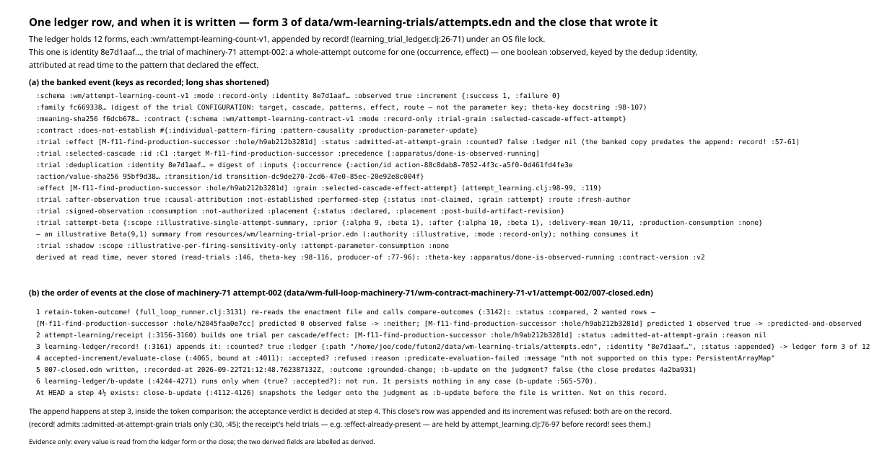
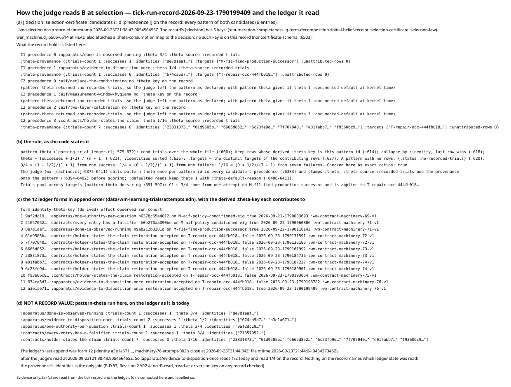
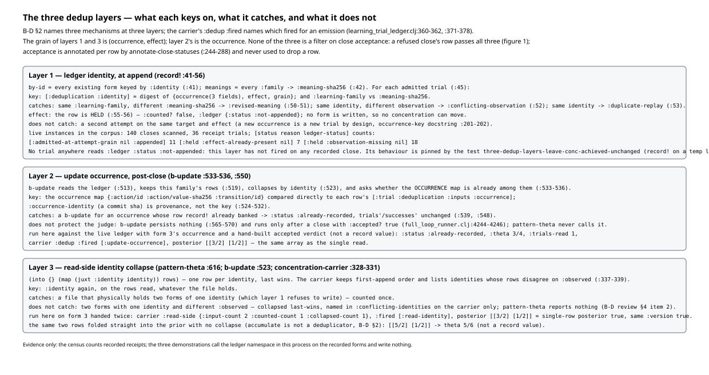
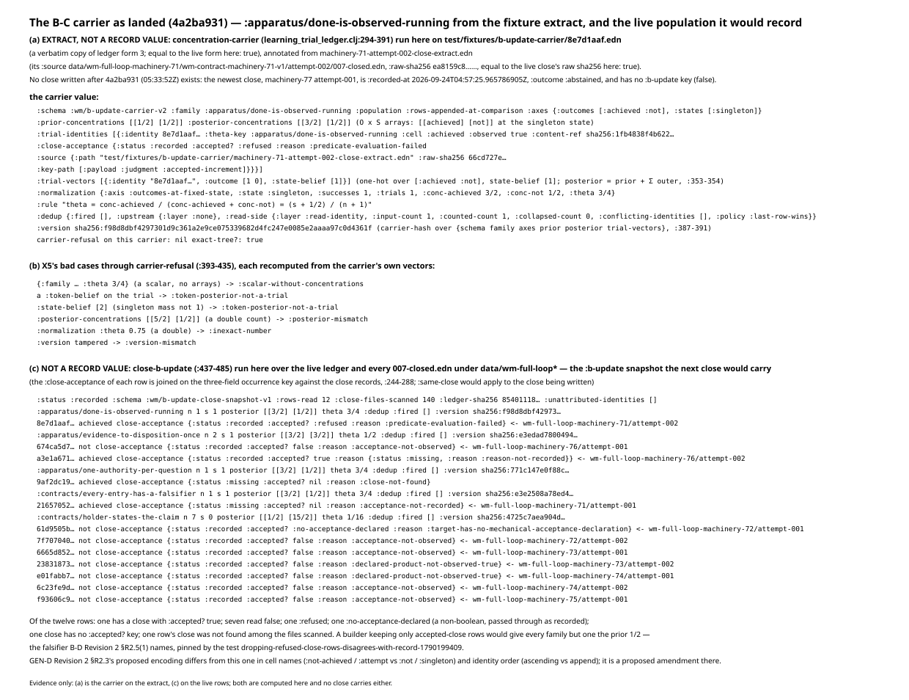
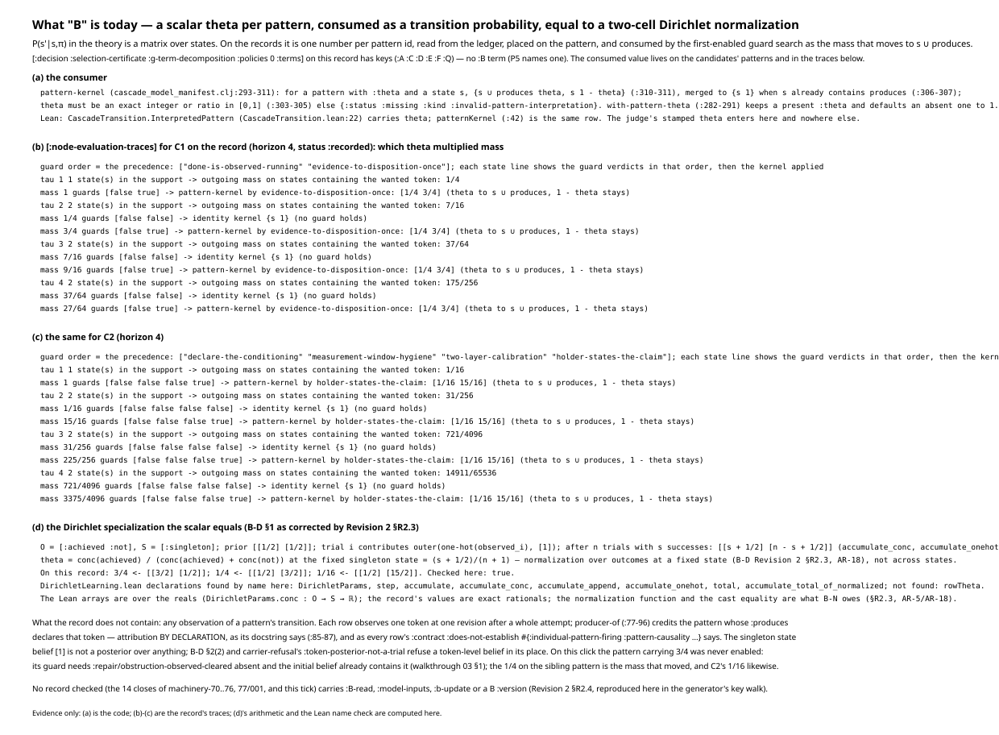
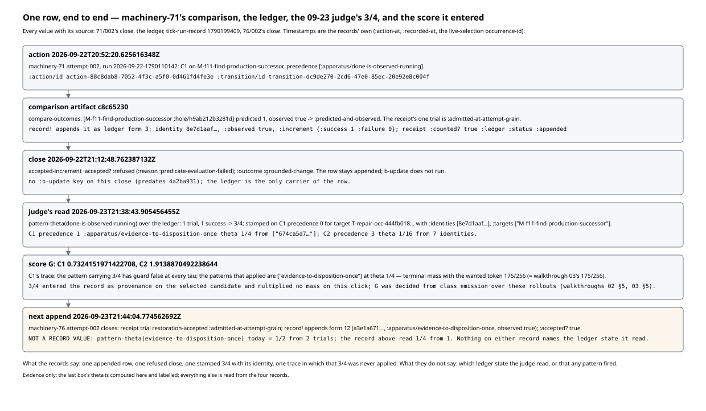

# Walkthrough 04: learning and the B model, as the records carry them

Same form as walkthroughs 01-03: every figure is generated from a record by
a script in this directory, every figure file name carries the record's
short raw sha256, and nothing is decided for the reader. Regenerate with

```
cd futon2 && clojure -M -i holes/labs/wm-contract/walkthroughs/generate_figures_04.clj \
            -e "(generate-figures-04/generate!)"
```

Records: the learning-trial ledger `data/wm-learning-trials/attempts.edn`
(twelve forms, raw sha `85401118…` — the sha the B-D review §3 cites);
machinery-71 attempt-002's close
(`data/wm-full-loop-machinery-71/wm-contract-machinery-71-v1/attempt-002/007-closed.edn`,
sha `ea8159c8`); machinery-76 attempt-002's close (sha `ec6ad5c3`, the close
of walkthrough 03); the tick record of the same run
(`data/wm-runs/tick-run-record-2026-09-23-1790199409.edn`, sha `7b3c56df`);
and, because no close written after commit `4a2ba931` exists yet, the two
B-C test fixtures under `test/fixtures/b-update-carrier/` — `8e7d1aaf.edn`
(sha `00830ccf`, a verbatim copy of ledger form 3; equal to the live form,
checked) and `machinery-71-attempt-002-close-extract.edn` (sha `66cd727e`,
which names the close's raw sha `ea8159c8…`; equal to the file now,
checked). Fixture values are cited as extracts. Two censuses read every
`007-closed.edn` under `data/wm-full-loop*` (140 files); the newest of them,
machinery-77 attempt-001, is used only to show that it predates `4a2ba931`.

Subject: `record!`, `read-trials`, `producer-of`, `theta-key`, `b-update`,
`pattern-theta`, and the B-C functions `concentration-carrier`,
`annotate-close-statuses`, `close-b-update`, `carrier-refusal`, `exact-tree?`
in `src/futon2/aif/learning_trial_ledger.clj`; `receipt` in
`src/futon2/aif/attempt_learning.clj`; the `record!` call inside
`retain-token-outcome!` and the `close-b-update` / `b-update` /
`b-update-retained` block at the close in `src/futon2/aif/full_loop_runner.clj`;
the judge's theta consumption in `scripts/futon2/report/war_machine.clj`;
`with-pattern-theta` and `pattern-kernel` in
`src/futon2/aif/cascade_model_manifest.clj`; and
`mathlib4/DarkTower/WarMachine/DirichletLearning.lean`. Line numbers are at
futon2 `0845a05e` (the HEAD this walkthrough lands on; none of the cited
files changed after `4a2ba931`). The Lean file is unchanged since mathlib4
`3d0c60db49` and is byte-identical at `77fdbda5` (B-D Revision 2's pin) and
at HEAD `41a3691f4b`. `proof2/packets/B-D.md` with its Revision 2 (`722aaeea`),
its review `proof2/reviews/B-D-codex-20.md`, `proof2/packets/GEN-D.md`
Revision 2 §R2.3, and register rows AR-17 and AR-18 in
`PROOF-2-THEOREM-draft-2026-09-24.md` are cited for what they establish;
their arguments are not repeated here.

Where a figure shows what the code computes on a record — the judge's read
on today's ledger, the carrier on the fixture extract and on the live
population, `b-update` and the identity collapse on recorded rows, the X5
refusals — the generator calls `futon2.aif.learning-trial-ledger` in its own
fresh process on the rows the records already hold, and the figure says so.
`record!` is never called. No record is written.

---

## 1. One ledger row, and when it is written

The ledger is one file of EDN forms, each `:wm/attempt-learning-count-v1`,
appended by `record!` (`learning_trial_ledger.clj:26-71`) under an OS file
lock (`:35-36`). Form 3 is identity `8e7d1aaf…`, the trial of machinery-71
attempt-002. What the form holds:

- **The outcome.** `:observed true` and `:increment {:success 1 :failure 0}`
  (`:59-60`). One boolean per form: the C4 read of one token at one
  revision, after a whole attempt.
- **The keys.** `:identity` is the dedup identity, the digest of
  `{:occurrence {:action/id :action/value-sha256 :transition/id} :effect
  :grain}` (`attempt_learning.clj:98-99`, `:119`) — so the grain is
  (occurrence, effect). `:family` is a different digest, of the whole trial
  configuration (target, cascade, patterns, effect, route: `:100-101`,
  `:120`); `record!` uses it only to detect `:revised-meaning` (`:50-51`),
  and `theta-key`'s docstring (`:101-107`) says why it cannot be a parameter
  key. The parameter key, `:theta-key`, is not stored: `read-trials` derives
  it on every read (`:146`) by `producer-of` (`:77-96`) — the one pattern in
  the recorded precedence whose `:produces` declares the effect; none or
  several gives a typed status, not a guess. For form 3 that is
  `:apparatus/done-is-observed-running`.
- **The contract.** Every one of the twelve forms carries `:contract
  {:schema :wm/attempt-learning-contract-v1 :mode :record-only …
  :does-not-establish #{:individual-pattern-firing :pattern-causality
  :production-parameter-update}}`. `attempt-learning/receipt` takes the v1
  resource as the default contract (`attempt_learning.clj:50`, `:80`); the
  v2 resource (`:mode :production-consumption`) exists (`:15-19`) but is not
  what these rows were written under. `read-trials`' docstring says the v1
  `:consumption :not-authorized` field "is a write-time record, not a live
  veto" (`:126-128`), and the judge reads the rows.
- **The banked trial.** `:trial` is the receipt row as it was *before* the
  append: `:counted? false` and no `:ledger` key (the event is built at
  `:57-61` from the pre-append row; `:counted? true` and `:ledger {:status
  :appended}` go onto the receipt the close carries, `:68-69`). The trial
  also carries an illustrative `:attempt-beta` — Beta(9,1) → Beta(10,1),
  delivery-mean `10/11`, `:production-consumption :none` — from
  `resources/wm/learning-trial-prior.edn` (`:authority :illustrative`), and a
  `:shadow` rollout at theta `9/10` with `:attempt-parameter-consumption
  :none`. Two priors sit on one row; only the Jeffreys 1/2 of section 2 is
  consumed by anything.



When it is written is the point B-D Revision 2 §R2.1 and AR-17 correct.
`retain-token-outcome!` (`full_loop_runner.clj:3131`) re-reads the enactment
file, calls `compare-outcomes` (`:3142`), builds the learning receipt
(`:3156-3160`) and calls `learning-ledger/record!` (`:3161`) — all inside
the token comparison. The accepted-increment predicate is evaluated later
(`accepted-increment/evaluate-close` at `:4065`, bound at `:4011`), and
`b-update` later still, only when that verdict is `{:accepted? true}`
(`:4244-4246`). On 71/002 the record shows the consequence: the comparison
is `:compared` with `[M-f11-… :hole/h9ab212b3281d]` predicted `1`, observed
`true`, `:predicted-and-observed`; the receipt's one trial is
`:admitted-at-attempt-grain`, `:counted? true`, `:ledger {:status :appended
:identity "8e7d1aaf…"}`; and `[:payload :judgment :accepted-increment]` is
`{:accepted? :refused :reason :predicate-evaluation-failed :message "nth not
supported on this type: PersistentArrayMap"}`. The row was appended; the
increment was refused; both are on the close, recorded at
`2026-09-22T21:12:48Z`, which has no `:b-update` key (it predates
`4a2ba931`).

`record!` admits only `:admitted-at-attempt-grain` trials (`:30`, `:45`).
The held trials a close's receipt shows — 76/002's
`:repair/obstruction-observed-cleared` at `:held :effect-already-present`,
for instance — are held by `attempt_learning.clj:76-97` before `record!`
sees them; a census of every close (figure 3) finds 36 receipt trials: 11
appended, 7 held `:effect-already-present`, 18 held `:observation-missing`,
and none held by `record!` itself.

## 2. How the judge reads B at selection

On the tick record, C1's precedence is at `[:decision :selection-certificate
:candidates 0 :id :precedence]`. Precedence 0,
`:apparatus/done-is-observed-running`, carries `:theta 3/4`, `:theta-source
:recorded-trials`, `:theta-provenance {:trials-count 1 :successes 1
:identities ["8e7d1aaf…"] :targets ["M-f11-find-production-successor"]
:unattributed-rows 0}` — the one identity of section 1, from an attempt on
a different target. Precedence 1, `:apparatus/evidence-to-disposition-once`,
carries `1/4` from `{1, 0, ["674ca5d7…"], ["T-repair-occ-444fb018…"]}`.
C2's last pattern, `:contracts/holder-states-the-claim`, carries `1/16` from
seven identities, all failures, all on the same target; C2's first three
patterns have no `:theta` key at all (no trials, so the judge left them as
declared; `with-pattern-theta` gives them `1` `:documented-default` at kernel
time, `cascade_model_manifest.clj:289-291`).



The rule is `pattern-theta` (`learning_trial_ledger.clj:579-632`):
`read-trials` over the whole file (`:606`); keep the rows whose derived
`:theta-key` is this pattern id (`:614`); collapse by `:identity`, last row
wins (`:616`); `theta = (successes + 1/2)/(n + 1)` (`:621`); `:identities`
sorted (`:626`) — which is why the record's seven identities are in
alphabetical rather than append order; `:targets` the distinct targets of
the rows (`:627`). `3/4 = (1 + 1/2)/2`, `1/4 = (0 + 1/2)/2`, `1/16 = (0 +
1/2)/8`, checked as exact ratios. The judge (`war_machine.clj:6375-6411`)
calls it once per pattern id in every candidate's precedence (`:6383`) and
stamps the value and provenance onto the pattern (`:6394-6402`) before
scoring; a `:defaulted` read keeps theta `1` with `:theta-default-reason`
(`:6408-6411`). The docstring (`:591-597`) records the pooling as an
assumption: trials pool across targets, and `:targets` is carried so a
reader can see it.

Figure 2(c) lists the twelve forms in append order with their derived keys:
five families — one row each for `:apparatus/one-authority-per-question`
and `:contracts/every-entry-has-a-falsifier` (both on
M-aif-policy-conditioned-eig, both observed true, both from 2026-09-21/22),
one for `:apparatus/done-is-observed-running`, seven for
`:contracts/holder-states-the-claim` (machinery-72..75, all false), and two
for `:apparatus/evidence-to-disposition-once` (76/001 false, 76/002 true).

Figure 2(d) is not a record value: `pattern-theta` run in the generator's
process on the ledger as it is today. Four families read as on the record;
`:apparatus/evidence-to-disposition-once` reads `1/2` from two trials, where
the record read `1/4` from one. The twelfth form (`a3e1a671…`) was appended
by 76/002's close at `2026-09-23T21:44:04Z` — the ledger's mtime — and the
judge's read was at `21:38:43.905Z` (this click's live-selection
occurrence-id, `[:decision :selection-certificate :token-belief-stage
:occurrence-id]`). Nothing on the record names which ledger state was read;
the provenance's `:identities` is the only join, which is B-D §3's
observation and B-R's gap. One more absence, bounded to this record: the
record's `[:decision]` has five keys (`:enumeration-completeness`,
`:g-term-decomposition`, `:initial-belief-receipt`, `:selection-certificate`,
`:selection-law`); the `:theta-consumption` map that `war_machine.clj:6505-6514`
attaches to the decision at HEAD is not among them, nor is
`:certificate-schema` (`:6503`).

## 3. The three dedup layers

B-D §2 names three mechanisms; the B-C carrier's `:dedup :fired` names which
of them fired for an emission (`learning_trial_ledger.clj:360-362`,
`:371-378`). Each keys on something different and none is a filter on
acceptance.



- **Ledger identity, at append** (`record!` `:41-56`). Every existing form
  is indexed by `:identity` and every `:family` by its `:meaning-sha256`
  (`:41-42`). An admitted trial whose family already has a different
  meaning is held `:revised-meaning` (`:50-51`); one whose identity exists
  with a different observation, `:conflicting-observation` (`:52`); one
  whose identity exists at all, `:duplicate-replay` (`:53`). A held row gets
  `:counted? false` and `:ledger {:status :not-appended}` (`:55-56`) and no
  form is written, so no concentration can move. It does not catch a new
  occurrence on the same target and effect — that is a new trial by design
  (`occurrence-key`, `:201-202`). In the corpus this layer has never fired:
  of the 36 receipt trials on the 140 closes, no `:ledger :status` reads
  `:not-appended`. Its behaviour is pinned by the test
  `three-dedup-layers-leave-conc-achieved-unchanged`, which replays form 3
  through `record!` on a temporary ledger and reads back one form, the
  receipt `:held :duplicate-replay`, and the snapshot's `:dedup :fired
  [:ledger-identity]`.
- **Update occurrence, post-close** (`b-update` `:533-536`, `:550`). The
  occurrence map is compared directly to each row's `[:trial :deduplication
  :inputs :occurrence]`; `:occurrence-identity`, a commit sha, is provenance
  and not the key (`:524-532`). An occurrence already banked gives `:status
  :already-recorded` and leaves `trials'`/`successes'` alone (`:539`,
  `:548`). It protects nothing the judge reads: `b-update` persists nothing
  (`:565-570`) and runs only after a close with `:accepted? true`
  (`full_loop_runner.clj:4244-4246`). Run here against the live ledger with
  form 3's occurrence and a hand-built accepted verdict: `:already-recorded`,
  `:theta 3/4`, carrier `:dedup :fired [:update-occurrence]`, posterior
  `[[3/2] [1/2]]`.
- **Read-side identity collapse** (`pattern-theta` `:616`, `b-update`
  `:523`, `concentration-carrier` `:328-331`). `(into {} (map (juxt
  :identity identity)) rows)`: one row per identity, last wins. It catches a
  file that physically holds two forms of one identity (which layer 1
  refuses to write). It does not reject two forms with one identity and
  different `:observed`: the carrier lists them in
  `:conflicting-identities` (`:337-339`); `pattern-theta` says nothing
  (B-D review §4 item 2). Run here on form 3 handed twice: `:read-side
  {:input-count 2 :counted-count 1 :collapsed-count 1}`, `:fired
  [:read-identity]`, posterior and `:version` equal to the single-row
  carrier's. The same two rows folded into the prior with no collapse give
  `[[5/2] [1/2]]` and `5/6` — `accumulate` is not a deduplicator (B-D §2's
  note), which is why the layers exist.

The grain of layers 1 and 3 is (occurrence, effect); layer 2's is the
occurrence. A refused close's row passes all three (section 1); acceptance is
annotated per row by `annotate-close-statuses` (`:244-288`) and never used
to drop one.

## 4. The B-C carrier as landed

`concentration-carrier` (`learning_trial_ledger.clj:294-391`) builds, for one
family over the rows `read-trials` returned, a `:wm/b-update-carrier-v2`.
`close-b-update` (`:437-485`) builds one per family over every attributable
row, annotated with its close's acceptance, and the runner places the
snapshot on the closed judgment as `:b-update` (`full_loop_runner.clj:4112-4126`,
`:4138`) and, with the post-close learner's disposition, in
`retained/b-update.edn` (`:4279-4297`). No close written since `4a2ba931`
(05:33:52Z) exists: the newest, machinery-77 attempt-001, is `:recorded-at
2026-09-24T04:57:25Z`, `:outcome :abstained`, and has no `:b-update` key. So
figure 4(a) is the carrier computed here on the fixture extract of form 3,
annotated from the fixture extract of 71/002's close — labelled an extract,
not a record value.



What it contains for `:apparatus/done-is-observed-running`:

- `:axes {:outcomes [:achieved :not] :states [:singleton]}` and
  `:population :rows-appended-at-comparison` (`:175-177`, `:365`).
- `:prior-concentrations [[1/2] [1/2]]` (`:179-182`, the Jeffreys prior as
  an O×S array) and `:posterior-concentrations [[3/2] [1/2]]`.
- `:trial-identities`: one entry, `{:identity "8e7d1aaf…" :theta-key
  :apparatus/done-is-observed-running :cell :achieved :observed true
  :content-ref "sha256:…" :close-acceptance {:status :recorded :accepted?
  :refused :reason :predicate-evaluation-failed :source {:path … :raw-sha256
  … :key-path [:payload :judgment :accepted-increment]}}}` — the refused
  close's verdict, as a field on the trial (`:340-348`; the join at
  `:244-288` is on the three-field occurrence key, never target/attempt).
- `:trial-vectors [{:identity … :outcome [1 0] :state-belief [1]}]`
  (`:349-352`), so `posterior = prior + Σ outer(outcome, state-belief)`
  (`:353-354`) is checkable from the carrier alone.
- `:normalization {:axis :outcomes-at-fixed-state :state :singleton
  :successes 1 :trials 1 :conc-achieved 3/2 :conc-not 1/2 :theta 3/4 :rule
  "theta = conc-achieved / (conc-achieved + conc-not) = (s + 1/2) / (n + 1)"}`
  (`:379-386`).
- `:dedup {:fired [] :upstream {:layer :none} :read-side {… :input-count 1
  :counted-count 1 :collapsed-count 0 :conflicting-identities [] :policy
  :last-row-wins}}`.
- `:version "sha256:…"`, `carrier-hash` over `{schema family axes prior
  posterior trial-vectors}` (`:387-391`) — the arrays and ordered vectors,
  not the close-provenance paths.

`carrier-refusal` (`:393-435`) on it returns `nil`; `exact-tree?`
(`:184-191`) is true. Figure 4(b) passes X5's bad cases through the same
function: a bare `{:family … :theta 3/4}` is `:scalar-without-concentrations`;
a `:token-belief` on the trial, or a `:state-belief [2]`, is
`:token-posterior-not-a-trial`; a posterior of `[[5/2] [1/2]]` is
`:posterior-mismatch` (recomputed from the vectors, not trusted); `0.75` is
`:inexact-number`; a tampered `:version` is `:version-mismatch`.

Figure 4(c) is also not a record value: `close-b-update` run here over the
live ledger and all 140 closes — the snapshot the next close would carry.
Five families, twelve rows, `:unattributed-identities []`. Every row has its
close's acceptance attached, and the twelve read: one `:accepted? true`
(76/002), seven `false`, one `:refused` (71/002), one `:no-acceptance-declared`
(a non-boolean, on 72/001, passed through as recorded), one close with no
`:accepted?` key (71/001, `:acceptance-not-recorded`), and one row
(`9af2dc19…`) whose close is not among the files scanned
(`:close-not-found`). A builder keeping only accepted-close rows would give
every family but `:apparatus/evidence-to-disposition-once` the prior `1/2`,
disagreeing with the record's `3/4`: that is B-D Revision 2 §R2.5(1), and the
test `dropping-refused-close-rows-disagrees-with-record-1790199409` pins it
from the tick extract (`:raw-sha256 7b3c56df…`, equal to the file now).

Where the landed carrier and the sibling packets differ: GEN-D Revision 2
§R2.3 proposes cells `[:achieved :not-achieved]`, a state `[:attempt]`, and
`:trial-identities` in ascending identity order; the code emits `:not`,
`:singleton`, and append order. GEN-D labels its encoding a proposed
amendment, and B-D Revision 2 §R2.2 describes the landed one.

## 5. What "B" is today

The transition model of the theory is `P(s'|s,π)`, a matrix over states. On
the records it is one exact rational per pattern id, placed on the pattern
by the judge and consumed at exactly one site: `pattern-kernel`
(`cascade_model_manifest.clj:293-311`). For a pattern with `:theta` and a
state `s`, the kernel row is `{s ∪ produces  theta,  s  1 − theta}`
(`:310-311`), merged to `{s 1}` when `s` already contains `produces`
(`:306-307`); a theta that is not an exact number in [0,1] refuses
(`:303-305`). `with-pattern-theta` (`:282-291`) keeps a present `:theta` and
defaults an absent one to `1`. In Lean this is `CascadeTransition.patternKernel`
(`CascadeTransition.lean:42`) over `InterpretedPattern.theta` (`:22`).



**Which theta multiplied mass on this click.** The record's
`[:node-evaluation-traces]` for C1 (figure 5(b)) show, at every tau, the
guard of `:apparatus/done-is-observed-running` false and the guard of
`:apparatus/evidence-to-disposition-once` true on the state lacking the
wanted token; the kernel applied is `[1/4 3/4]`, and the outgoing mass on
states containing `:restoration-accepted` runs `1/4, 7/16, 37/64, 175/256` —
walkthrough 03 §1's rollout, from the scoring side. The `3/4` stamped on
precedence 0 was never applied: its guard needs
`:repair/obstruction-observed-cleared` absent, and the initial belief
already contains it. C2's trace (5(c)) applies `:contracts/holder-states-the-claim`
at `[1/16 15/16]`, reaching `14911/65536`. The record's
`[:g-term-decomposition :policies 0 :terms]` has keys `:A :C :D :E :F :Q` —
no `:B` term (P5 names one); the consumed value lives on the candidates'
patterns and in these traces.

**The Dirichlet specialization the scalar equals** (B-D §1, corrected by
Revision 2 §R2.3 and AR-18). Take `O = [:achieved :not]`, `S = [:singleton]`,
prior `[[1/2] [1/2]]`, and one one-hot tick per trial: after `n` trials with
`s` successes the array is `[[s + 1/2] [n − s + 1/2]]` — `accumulate_conc`
and `accumulate_onehot` in `DirichletLearning.lean`, `accumulate_append` for
the chaining — and `theta = conc(achieved)/(conc(achieved) + conc(not))` at
the fixed singleton state is `(s + 1/2)/(n + 1)`. This is normalization over
outcomes at a fixed state; normalization across states of a row would be
identically `1` for one state (the review's §6 point, AR-18). On the record:
`3/4 ← [[3/2] [1/2]]`, `1/4 ← [[1/2] [3/2]]`, `1/16 ← [[1/2] [15/2]]`. The
Lean file declares `DirichletParams`, `step`, `accumulate`, `accumulate_conc`,
`accumulate_append`, `accumulate_onehot`, `total` and
`accumulate_total_of_normalized`; it declares no `rowTheta` (grepped by
name here). Its arrays are over the reals (`conc : O → S → ℝ`); the record's
values are exact rationals; the normalization function and the cast equality
are what B-N owes (§R2.3, AR-5/AR-18).

**What no record contains.** An observation of a pattern's transition. Each
row observes one token at one revision after a whole attempt, and
`producer-of` credits the pattern whose `:produces` declares that token:
attribution *by declaration*, as its docstring says (`:85-87`) and as every
row's `:contract :does-not-establish` says. The singleton `:state-belief
[1]` is not a posterior over anything, and `carrier-refusal`'s
`:token-posterior-not-a-trial` refuses a token-level belief offered in its
place (B-D §2(2), §5). No record checked — the fourteen closes of
machinery-70..76, 77/001, and this tick — carries `:B-read`, `:model-inputs`,
`:b-update` or a B `:version` (Revision 2 §R2.4, reproduced here).

## 6. A narrative case: one row, comparison to score

One reader's walk, every value with its source.

At `2026-09-22T20:52:20Z` (`:action-at` on 71/002's occurrence) machinery-71
attempt-002 enacted C1 on `M-f11-find-production-successor`: one pattern,
`:apparatus/done-is-observed-running`, declaring `:hole/h9ab212b3281d`. At
artifact `c8c65230` the comparison found that token predicted `1`, observed
`true`: `:predicted-and-observed`. The receipt's one trial was admitted, and
`record!` appended it as ledger form 3 — identity `8e7d1aaf…`, `:observed
true`, `:increment {:success 1 :failure 0}`.

At `21:12:48Z` the close was written. Its accepted-increment predicate
answered `:refused` (`:predicate-evaluation-failed`); its `:outcome` is
`:grounded-change`. The row stayed appended; `b-update` did not run; the
close has no `:b-update` key. The ledger is the only carrier of the row.

At `2026-09-23T21:38:43.905Z` the live selection of tick 1790199409 read the
ledger. `pattern-theta` found one trial for
`:apparatus/done-is-observed-running`, one success, and returned `3/4`; the
judge stamped it on C1's precedence 0 for target `T-repair-occ-444fb018…`
with `:identities ["8e7d1aaf…"]` and `:targets
["M-f11-find-production-successor"]` — a value learned on one target and
applied to another, with the provenance saying so. Precedence 1 took `1/4`
from `674ca5d7…` (76/001, a failure on this target); C2's last pattern took
`1/16` from seven.



Then the score. C1's trace shows the pattern carrying `3/4` with guard false
at every tau; the pattern that applied was the sibling at `1/4`, and the
terminal mass on the wanted token is `175/256`. G was `0.7324` for C1 and
`1.9139` for C2, computed by class emission over these rollouts (walkthroughs
02 §5, 03 §5). So on this click the `3/4` entered the record as provenance on
the selected candidate and multiplied no mass; the `1/4` and the `1/16` are
the numbers that did.

At `21:44:04Z` the same run's close (76/002) appended form 12 —
`a3e1a671…`, `:apparatus/evidence-to-disposition-once`, observed `true`,
`:accepted? true`. Not a record value: `pattern-theta` for that family today
returns `1/2` from two trials, where the record read `1/4` from one.

What the records say: one appended row, one refused close, one stamped `3/4`
with its identity, one trace in which that `3/4` was never applied. What
they do not say: which ledger state the judge read, or that any pattern
fired.

---

## Verification

What was checked, in a fresh process against the records and the code at
futon2 `0845a05e`:

- **Ledger.** Raw sha256 `854011186efca…` (equal to the B-D review §3
  figure); 12 forms, all `:wm/attempt-learning-count-v1`, all `:mode
  :record-only`, all `:contract :schema :wm/attempt-learning-contract-v1`;
  `read-trials` labels all 12 `:contract-version :v2` (see item 1 below).
  Per form: `:identity`, `:family`, `:observed`, `:increment`, derived
  `:theta-key`, `[:trial :effect]`, `[:trial :occurrence :run/id
  :cohort/id]`, `[:trial :deduplication :inputs]`, `[:trial :counted?]`
  (false on every banked copy), absence of `[:trial :ledger]`,
  `[:trial :attempt-beta]`, `[:trial :shadow :scope]`, `[:trial
  :signed-observation :consumption]`. Append order vs. `pattern-theta`'s
  sorted `:identities`. File mtime `2026-09-23T21:44:04Z`.
- **Closes.** 71/002 (`ea8159c8…`): `:recorded-at`, `:outcome`,
  `:occurrence` (`:action-at`, the three-field key), comparison `:status`,
  `:artifact-sha`, both token rows with verdicts, the receipt trial's
  `:status :counted? :ledger`, `:accepted-increment` (`:accepted? :reason
  :message`), absence of `:b-update`. 76/002 (`ec6ad5c3…`): `:recorded-at`,
  both receipt trials (one held `:effect-already-present`, one appended as
  `a3e1a671…`), `:accepted? true`, absence of `:b-update`. 77/001:
  `:recorded-at 2026-09-24T04:57:25Z` (before `4a2ba931`, 05:33:52Z),
  `:outcome :abstained`, no occurrence, no `:b-update`.
- **Tick record** (`7b3c56df…`). Every precedence entry of both candidates:
  `:theta`, `:theta-source`, `:theta-provenance` (`:trials-count :successes
  :identities :targets :unattributed-rows`) or the absence of `:theta`;
  `[:decision]` key set (five keys, no `:theta-consumption`, no
  `:certificate-schema`); `[:selection-certificate :token-belief-stage
  :occurrence-id]` (this click's timestamp; the `:prospective-prior`'s is the
  predecessor's, `20:55:48Z`); `[:node-evaluation-traces]` for C1 and C2 —
  per tau the states, masses, guard verdicts, kernel kinds, kernel masses,
  outgoing belief; `[:g-term-decomposition :policies 0 :terms]` keys;
  candidates' `:g`. `1 − (3/4)^4 = 175/256` and `1 − (15/16)^4 =
  14911/65536` against the traces' terminal masses.
- **Fixtures.** `8e7d1aaf.edn` equals ledger form 3 as read by `read-trials`.
  The close extract's `:raw-sha256` equals 71/002's raw sha now; the tick
  extract's equals the tick's. The extract's `:accepted-increment` and
  receipt-trial fields equal the live close's.
- **Code run on the records** (labelled in the figures as not record
  values). `pattern-theta` for all five families on today's ledger
  (`3/4, 1/2, 3/4, 3/4, 1/16`; `evidence-to-disposition-once` 2 trials).
  `concentration-carrier` on the fixture rows: every field listed in section
  4; `carrier-refusal nil`; `exact-tree? true`; the six X5 refusals.
  `concentration-carrier` on form 3 twice: `:collapsed-count 1`, `:fired
  [:read-identity]`, posterior and `:version` unchanged; the un-collapsed
  fold gives `[[5/2] [1/2]]`. `b-update` on the live root with form 3's
  occurrence: `:already-recorded`, `3/4`, `:fired [:update-occurrence]`.
  `close-b-update` on the live root: `:recorded`, 12 rows, 140 files
  scanned, the per-row `:close-acceptance` values of section 4, every
  family's carrier passing `carrier-refusal`. Receipt census over the 140
  closes: 13 with receipts, 36 trials, `[status reason ledger-status]`
  counts `11 / 7 / 18`, no `:not-appended`. `(s + 1/2)/(n + 1)` for
  `(1,1) (0,1) (0,7)` as exact ratios.
- **Lean.** `DirichletLearning.lean` byte-identical at `77fdbda5` and HEAD
  `41a3691f4b` (`git diff`); declarations found by name: `DirichletParams`,
  `step`, `accumulate`, `accumulate_conc`, `accumulate_append`,
  `accumulate_onehot`, `total`, `accumulate_total_of_normalized`; `rowTheta`
  not found. `CascadeTransition.lean` `InterpretedPattern` at `:22`,
  `patternKernel` at `:42`.
- **Code.** Line numbers re-read at `0845a05e`: `learning_trial_ledger.clj`
  26-71 (30, 35-36, 41-42, 45, 49-53, 55-56, 57-61, 63-65, 68-69), 77-96
  (85-87), 98-116 (101-107), 118-154 (126-128, 146, 152), 173-182, 184-191,
  193-198, 200-205, 244-288, 294-391 (328-331, 337-339, 340-348, 349-352,
  353-354, 360-362, 365, 371-378, 379-386, 387-391), 393-435, 437-485,
  487-577 (506-512, 513, 519, 523, 524-532, 533-536, 539, 548, 549-550,
  559-562, 565-570), 579-632 (591-597, 606, 613-614, 616, 620-621,
  626-627); `attempt_learning.clj` 15-19, 44-128 (50, 76-97, 98-101, 103,
  111-118, 119-120); `full_loop_runner.clj` 3131, 3142, 3156-3162,
  3970-3978, 4011, 4065, 4112-4126, 4138, 4244-4271, 4279-4297;
  `war_machine.clj` 6375-6411 (6383, 6394-6402, 6408-6411), 6503,
  6505-6514; `cascade_model_manifest.clj` 282-291, 293-311 (303-305,
  306-307, 310-311); `resources/wm/learning-trial-prior.edn`;
  `resources/wm/attempt-learning-contract.edn` (`:mode :record-only`) and
  `-v2.edn` (`:mode :production-consumption`). Last change of each cited
  file is at or before `4a2ba931`.
- **Figures.** Generator run twice; the six SVGs are byte-identical between
  runs. `clj-kondo --lint` 0 errors, 0 warnings; `check-parens.el` batch OK.

Where the sources differ from, or add to, B-D Revision 2 and the `4a2ba931`
commit message:

1. `read-trials` (`:152`) labels a row `:v1` when `[:trial :consumption]` is
   present; the rows carry `:consumption :not-authorized` under `[:trial
   :signed-observation]` instead, so all twelve read `:contract-version
   :v2` although every `:contract :schema` is v1 `:record-only`. Nothing in
   `src/` or `scripts/` consumes `:contract-version` (grepped), so no value
   depends on the label; the docstring's description (`:126-128`, `:150-151`)
   does not match the rows.
2. Every row was written under the v1 contract: `attempt-learning/receipt`
   defaults to `declared-contract` (v1) at `:50` and requires equality with
   it at `:80`. B-D §2 quotes the v1 `:does-not-establish` set correctly but
   does not say that the v2 "live contract" of `declared-contract-v2`'s
   docstring (`:15-19`) is not the one on any row.
3. The tick record's `:g-term-decomposition` `:terms` has no `:B` key. P5
   names `:g-term-decomposition … :terms :B`; Revision 2 §R2.4's absence
   list (`:B-read`, `:read-at`, `:b-update`, a B `:version`) does not
   include it.
4. On 1790199409 the stamped `3/4` never entered a kernel: its pattern's
   guard is false at every tau of C1's trace. B-D §3 states the stamped
   values (`3/4` and `1/4`) and is correct; it does not say which of them
   the rollout applied.
5. The ledger moved after the judge's read: form 12 was appended at
   `21:44:04Z` by the same run's close, and `pattern-theta` for
   `:apparatus/evidence-to-disposition-once` now returns `1/2`, not the
   record's `1/4`. This is the live instance of the B-R gap B-D §3 names;
   neither document gives it.
6. The commit message describes each trial's `:close-acceptance` as the
   close's `:accepted?/:reason` "or typed absence when none or several are
   found". On the live population one close's `:accepted?` is the keyword
   `:no-acceptance-declared` and one close has no `:accepted?` key at all;
   the code passes the first through as recorded (`close-status`,
   `:233-242`) and types the second `:acceptance-not-recorded`. Both shapes
   are on the live table; the message names neither.
7. The `:source :path` of a `:close-acceptance` built from
   `default-close-roots` contains the ledger root's `..` segment
   (`data/wm-learning-trials/../wm-full-loop-machinery-71/…`, `:218`). A
   cosmetic detail of a value no close has yet recorded; stated so a reader
   of the first real snapshot does not look for a bug.
8. GEN-D Revision 2 §R2.3's proposed encoding (cells `:not-achieved` /
   `:attempt`, ascending identity order) differs from the landed carrier
   (`:not` / `:singleton`, append order). Revision 2 §R2.2 of B-D describes
   the landed one and calls GEN-D's a proposed amendment; the difference is
   stated here so the two are not read as the same schema.
9. B-D Revision 2 §R2.1 cites `full_loop_runner.clj:3149` and AR-17 cites
   `:3150` for the `record!` call, both at `93531d41`; at `0845a05e` it is
   `:3161`. Line drift only.
10. The rows also carry an illustrative Beta(9,1) `:attempt-beta` and a
    `:shadow` rollout at `9/10`, both marked unconsumed on the row. B-D does
    not mention them; they are noted in section 1 so the two priors on one
    row are not confused.
