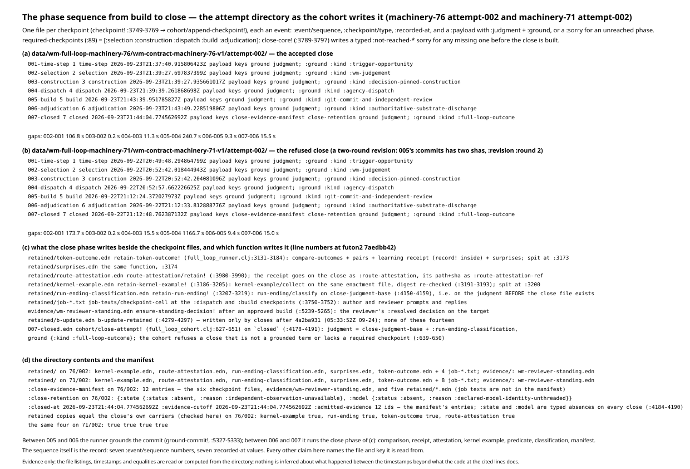
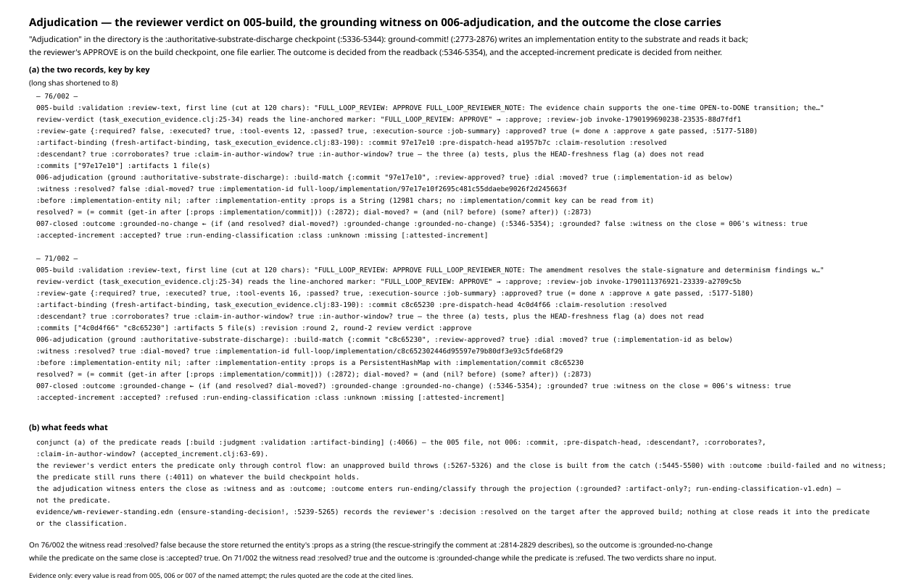
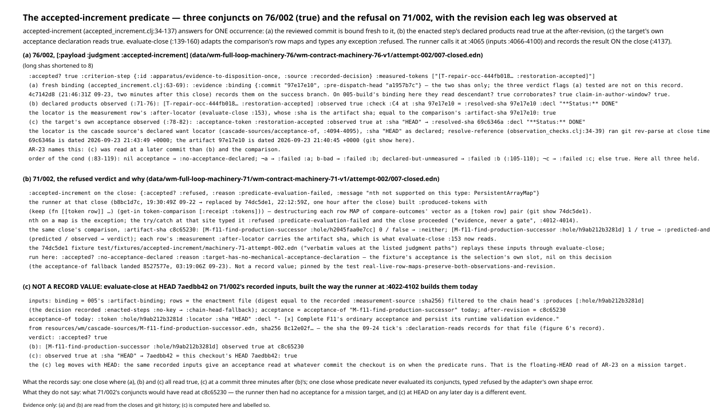
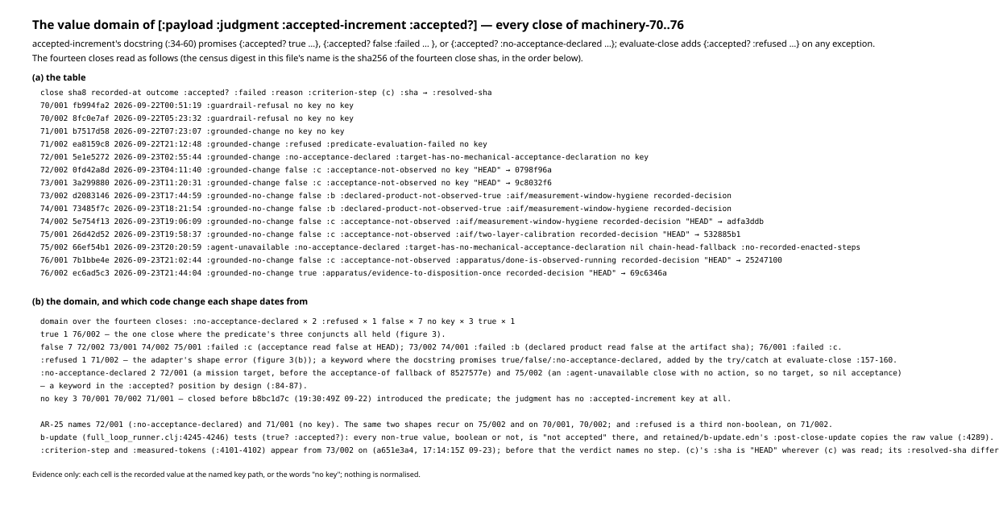
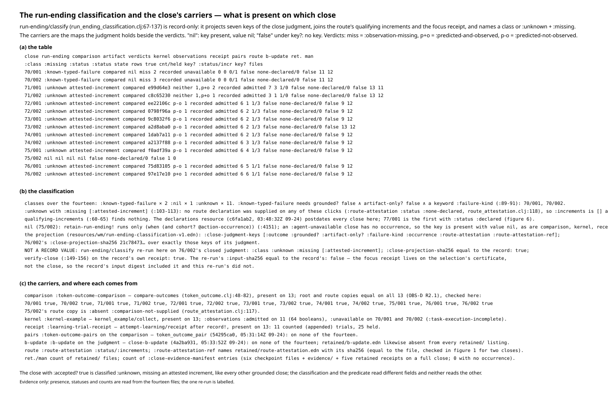
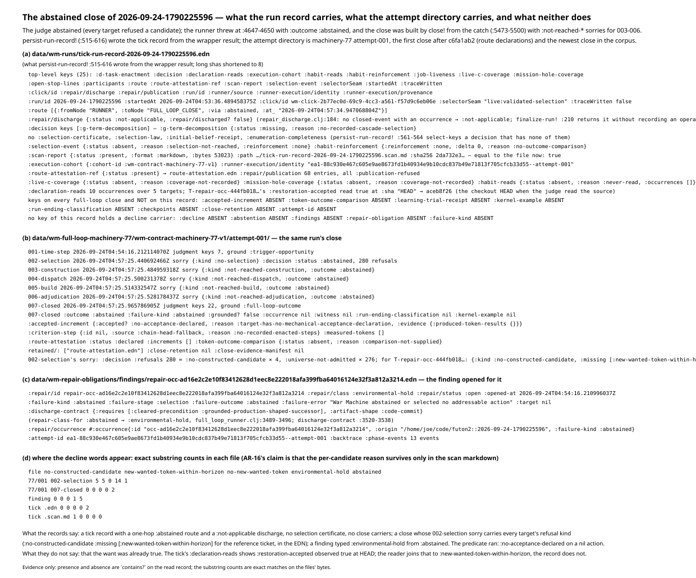
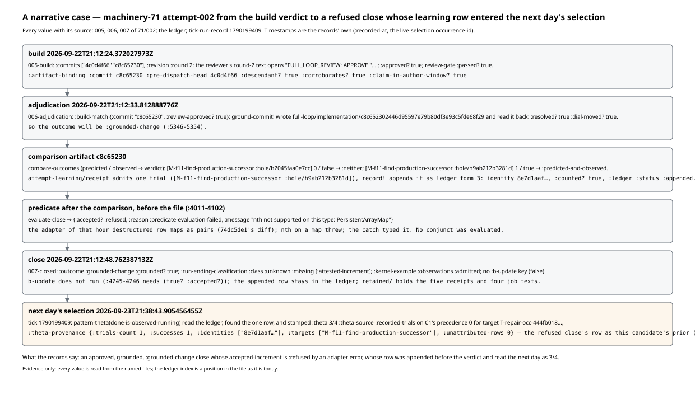

# Walkthrough 05: close and adjudication, as the records carry them

Same form as walkthroughs 01-04: every figure is generated from a record by
a script in this directory, every figure file name carries the record's
short raw sha256, and nothing is decided for the reader. Regenerate with

```
cd futon2 && clojure -M -i holes/labs/wm-contract/walkthroughs/generate_figures_05.clj \
            -e "(generate-figures-05/generate!)"
```

Records: the fourteen attempt directories
`data/wm-full-loop-machinery-N/wm-contract-machinery-N-v1/attempt-00k/`
for N in 70..76 — each with `001-time-step.edn` … `006-adjudication.edn`,
`007-closed.edn`, `retained/` and (on twelve of them) `evidence/`. The
two closes read in full are machinery-76 attempt-002 (`007-closed.edn` raw
sha `ec6ad5c3…`, its `005-build.edn` `0f5d4c41…`, its `006-adjudication.edn`
`99ea42a6…`) and machinery-71 attempt-002 (`ea8159c8…`, `006-adjudication.edn`
`62e0e316…`). The two census figures carry `769cd825`, the sha256 of the
fourteen close shas concatenated in directory order (the same digest
walkthrough 03's census carries: the fourteen files are unchanged). For the
abstained close: `data/wm-runs/tick-run-record-2026-09-24-1790225596.edn`
(sha `2726a170…`), the same run's attempt directory machinery-77 attempt-001
(`007-closed.edn` sha `e3c51f9b…`), its scan markdown (sha `2da732e3…`,
equal to the `:sha256` the tick record names), and the finding
`data/wm-repair-obligations/findings/repair-occ-ad16e2c2….edn` (sha
`eeb61566…`). For the narrative: `data/wm-runs/tick-run-record-2026-09-23-1790199409.edn`
(sha `7b3c56df…`, the tick of walkthroughs 03 and 04) and the ledger
`data/wm-learning-trials/attempts.edn` (twelve forms, as in 04). One test
fixture, `test/fixtures/accepted-increment/machinery-71-attempt-002.edn`
(commit `74dc5de1`), is cited as an extract of 71/002.

Subject: the close phase of `src/futon2/aif/full_loop_runner.clj` —
`checkpoint!`, `close-core!` and `close!`, `retain-token-outcome!`,
`retain-kernel-example!`, `retain-run-ending!`, `failure-close-evidence!`,
the `accepted-increment-result` binding and the close assembly through
`cohort/close-attempt!`, the `b-update-result` gate, `repair-class-for`,
`discharge-contract`, `ground-commit!`, `persist-run-record!`, and the
abstention throw; `src/futon2/aif/accepted_increment.clj` entire;
`src/futon2/aif/run_ending_classification.clj` entire with
`resources/wm/run-ending-classification-v1.edn`; `compare-outcomes` in
`src/futon2/aif/token_outcome.clj`; `review-verdict`, `fresh-artifact-binding`
and `review-execution-gate` in `src/futon2/aif/task_execution_evidence.clj`;
`acceptance-of` in `src/futon2/aif/cascade_sources.clj`; `close-attempt!` in
`src/futon2/aif/full_loop_cohort.clj`; `build-receipt` in
`src/futon2/aif/route_attestation.clj`; `finalize-run!` in
`src/futon2/aif/repair_discharge.clj`; `resolve-reference` and
`check-decl-in-file` in `src/futon2/aif/observation_checks.clj`. Line
numbers are at futon2 `7aedbb42`, the HEAD this walkthrough is generated
on; the last change to `full_loop_runner.clj` and `accepted_increment.clj`
before it is `4a2ba931`, and to `run_ending_classification.clj` is
`49481139`. Register rows AR-1, AR-16, AR-17, AR-23 and AR-25 in
`PROOF-2-THEOREM-draft-2026-09-24.md`, and `proof2/packets/OBS-D.md`
Revision 2 (§R2.1, §R2.2), are cited for what they establish; their
arguments are not repeated here.

Where a figure shows what the code computes on a record — `evaluate-close`
at today's HEAD on 71/002's recorded inputs, `run-ending/classify` and
`verify-close` re-run on 76/002's closed judgment — the generator calls the
namespace in its own fresh process on values the records already hold, and
the figure says so. No runner function that writes is called; no record is
written.

---

## 1. The phase sequence from build to close

An attempt directory holds one file per checkpoint. `checkpoint!`
(`full_loop_runner.clj:3749-3769`) hands each cell to
`cohort/append-checkpoint!`, which writes an event with `:event/sequence`,
`:checkpoint/type`, `:recorded-at` and a `:payload` holding a `:judgment`
and a `:ground` — or a `:sorry`, when the phase was not reached.
`required-checkpoints` (`:89`) is `[:selection :construction :dispatch
:build :adjudication]`, and `close-core!` (`:3789-3797`) writes a typed
`:not-reached-*` sorry for any of them still missing before it builds the
close. On 76/002 the seven files are recorded at `21:37:40.9Z`,
`21:39:27.7Z`, `21:39:27.9Z`, `21:39:39.3Z`, `21:43:39.9Z`, `21:43:49.2Z`
and `21:44:04.8Z`; the last three gaps are 240.7 s (the author and reviewer
jobs), 9.3 s (grounding) and 15.5 s (the close phase). On 71/002 the same
gaps are 1166.7 s, 9.4 s and 15.0 s; its `005-build.edn` carries two
commits and `:revision :round 2`.



What the close phase writes beside the checkpoint files, and which function
writes it:

- `retained/token-outcome.edn` and `retained/surprises.edn` —
  `retain-token-outcome!` (`:3131-3184`): the comparison, the pair carrier,
  the learning receipt (with `record!` inside, walkthrough 04 §1) and the
  surprise records, spit at `:3173-3174`.
- `retained/route-attestation.edn` — `route-attestation/retain!`
  (`:3980-3990`); the receipt goes on the close as `:route-attestation` and
  its path and sha as `:route-attestation-ref`.
- `retained/kernel-example.edn` — `retain-kernel-example!` (`:3186-3205`)
  on the same enactment file, whose digest is re-checked (`:3191-3193`).
- `retained/run-ending-classification.edn` — `retain-run-ending!`
  (`:3207-3219`), which runs `run-ending/classify` on `close-judgment-base`
  (`:4150-4159`): on the judgment as assembled, before the close file exists.
- `retained/job-*.txt` — the author and reviewer prompts and replies, placed
  by `job-texts/checkpoint-cell` at the `:dispatch` and `:build`
  checkpoints (`:3750-3752`): four files on 76/002, eight on 71/002.
- `evidence/wm-reviewer-standing.edn` — `ensure-standing-decision!` after an
  approved build (`:5239-5265`): the reviewer's `:decision :resolved` on the
  target, `:decided-by "wm-reviewer"`.
- `007-closed.edn` — `cohort/close-attempt!` (`full_loop_cohort.clj:627-651`)
  on `closed` (`:4178-4191`): the judgment is `close-judgment-base` plus
  `:run-ending-classification`, the ground `{:kind :full-loop-outcome}`,
  and the payload also carries `:close-retention` and
  `:close-evidence-manifest`. The cohort refuses a close that is not a
  grounded term or lacks a required checkpoint (`:639-650`).

On 76/002 the manifest has 12 entries — the six checkpoint files,
`evidence/wm-reviewer-standing.edn`, and the five retained `.edn` receipts;
job texts are not in it. `:close-retention` carries `:state {:status
:absent :reason :independent-observation-unavailable}` and `:model {:status
:absent :reason :declared-model-identity-unthreaded}` (`:4184-4190`) on
every full close. The four retained receipts equal the close's own copies,
key for key, on both 76/002 and 71/002 (checked). No `retained/b-update.edn`
exists in any of the fourteen directories: `b-update-retained`
(`:4279-4297`) landed with `4a2ba931` at 05:33:52Z on 09-24, after the
newest of them.

## 2. Adjudication: the reviewer verdict, the grounding witness, the outcome

"Adjudication" in the directory is the sixth checkpoint, ground
`:authoritative-substrate-discharge` (`:5336-5344`). It is not where the
reviewer's verdict is recorded. The verdict is on the fifth file:
`[:payload :judgment :validation :review-text]` of `005-build.edn` is the
reviewer job's text, and `review-verdict`
(`task_execution_evidence.clj:25-34`) reads the line-anchored marker
`FULL_LOOP_REVIEW: APPROVE|REQUEST_CHANGES|REJECT` from it. `:approved?`
(`:5177-5180`) is `done ∧ :approve ∧ review-gate passed`, where the gate
(`:245-261`) demands tool events from the reviewer when code files changed:
76/002's gate is `:required? false` (one markdown artifact), 71/002's
`:required? true :tool-events 16`. Beside the verdict sits
`:artifact-binding` from `fresh-artifact-binding` (`:83-190`): the reviewed
`:commit`, the `:pre-dispatch-head`, and the flags `:descendant?`,
`:corroborates?`, `:claim-in-author-window?`, `:in-author-window?`, all
`true` on both closes.



The sixth file is what `ground-commit!` (`:2773-2876`) returned: it writes
an implementation entity and a discharge entity to the substrate and reads
the implementation back, and the witness is `:resolved? (= commit (get-in
after [:props :implementation/commit]))` (`:2872`) and `:dial-moved? (and
(nil? before) (some? after))` (`:2873`). The outcome follows at
`:5346-5354`: `:grounded-change` when both are true, `:grounded-no-change`
otherwise. On 71/002 the readback's `:props` is a map with
`:implementation/commit c8c65230…`, so `:resolved? true` and the outcome is
`:grounded-change`. On 76/002 the readback's `:props` is a 12,981-character
string — the store's rescue-stringify the comment at `:2814-2829`
describes, which no `:implementation/commit` key can be read from — so
`:resolved? false`, `:dial-moved? true`, and the outcome is
`:grounded-no-change`. The close copies the witness verbatim (`:witness` on
007 equals 006's, checked).

What feeds what. The accepted-increment predicate reads conjunct (a) from
`[:build :judgment :validation :artifact-binding]` (`:4066`) — the fifth
file, not the sixth. The reviewer's verdict reaches the predicate only
through control flow: an unapproved build throws (`:5267-5326`), the close
is built from the catch (`:5445-5500`) with `:outcome :build-failed` and no
witness, and the predicate still runs there (`:4011`) on whatever the build
checkpoint holds. The witness reaches the close as `:witness` and, through
`:outcome`, as the `:grounded?` and `:artifact-only?` of the classification's
projection (section 5) — never the predicate. `evidence/wm-reviewer-standing.edn`
is read by nothing at close. So on 76/002 the outcome is
`:grounded-no-change` and the predicate is `:accepted? true`; on 71/002 the
outcome is `:grounded-change` and the predicate is `:refused`. The two
verdicts share no input.

## 3. The accepted-increment predicate

`accepted-increment` (`accepted_increment.clj:34-137`) answers, for one
occurrence, three conjuncts: (a) the binding is a map with string
`:commit` and `:pre-dispatch-head` and `:descendant?`, `:corroborates?`,
`:claim-in-author-window?` all `true` (`:63-69`); (b) every produced
token's locator reads `:observed true` at the after-revision (`:71-76`); (c)
the target's acceptance locator reads `:observed true` (`:78-82`). The
`cond` (`:83-119`) answers in order: nil acceptance →
`:no-acceptance-declared`; ¬a → `:failed :a`; a failed token → `:failed :b`;
declared-but-unmeasured → `:failed :b` (`:105-110`); ¬c → `:failed :c`; else
`true`. `evaluate-close` (`:139-160`) maps the comparison's row maps to
`{token after-locator}` (`:153`) and types any exception `{:accepted?
:refused :reason :predicate-evaluation-failed :message …}` (`:157-160`).
The runner binds the result at `:4011`, calls `evaluate-close` at `:4065`
with the 005 binding, the enactment file's rows filtered to the enacted
step's declared products (`:4022-4064`), the acceptance from the decision's
slot or else `cascade-sources/acceptance-of` (`:4092-4095`), and the
artifact sha as `:after-revision` (`:4096`); it adds `:criterion-step` and
`:measured-tokens` (`:4101-4102`) and records the whole map on the close
(`:4137`). "Evidence, never a gate" (`:4012-4014`): no value of it stops
the close.



**76/002, `:accepted? true`.** `:criterion-step {:id
:apparatus/evidence-to-disposition-once :source :recorded-decision}`,
`:measured-tokens` one token, `:restoration-accepted`. Conjunct (a)'s
evidence is `{:commit "97e17e10…" :pre-dispatch-head "a1957b7c…"}` — the
two shas only. The three flags (a) tested are not on this record: commit
`4c7142d8` (21:46:31Z on 09-23, two minutes after this close) added them
to the success branch, its message saying the accepted close had been "the
one place (a)'s verdict flags could not be checked from the record". On
005's binding they read `true`, `true`, `true`. Conjunct (b)'s one row
reads `:observed true :check :C4` at `:sha 97e17e10… = :resolved-sha
97e17e10…`, `:decl "**Status:** DONE"` — the measurement row's own
`:after-locator`, whose sha is the artifact sha, equal to the comparison's
`:artifact-sha` (checked; walkthrough 03 §3 showed this evidence map equals
the comparison row's). Conjunct (c) reads the cascade source's declared
want locator as declared, `:sha "HEAD"`, and `resolve-reference`
(`observation_checks.clj:34-39`) resolved it by `git rev-parse` at close
time to `69c6346a…`: a commit dated `21:43:49Z`, the same second as
`006-adjudication`'s `:recorded-at`, three minutes after the artifact
`97e17e10…` (`21:40:45Z`); it changed one file, the ticket of finding
`repair-occ-b8bf5476…`, an id that also appears in this close's
`:delivery-qa-ref` evidence ids. The record does not say what made that
commit. AR-23 names the shape: (c) was read at a later commit than (b) and
the comparison, and the same close joins the two reads under one verdict.

**71/002, `:accepted? :refused`.** The close carries `{:accepted? :refused
:reason :predicate-evaluation-failed :message "nth not supported on this
type: PersistentArrayMap"}` and nothing else — no `:evidence`, no
`:criterion-step`. The runner in force at that close (`b8bc1d7c`,
19:30:49Z on 09-22) built `:produced-tokens` with `(keep (fn [[token row]]
…) (get-in token-comparison [:receipt :tokens]))`, destructuring each row
map of `compare-outcomes`' vector as a `[token row]` pair; `nth` on a map
is the exception, and the `try/catch` at that site typed it. Commit
`74dc5de1` (22:12:59Z, one hour after the close) replaced the call with
`evaluate-close` and added the fixture
`test/fixtures/accepted-increment/machinery-71-attempt-002.edn`,
"verbatim values at the listed judgment paths", which the test
`real-live-row-maps-preserve-both-observations-and-revision` replays. Run
here, that replay returns `:no-acceptance-declared` — the fixture's
acceptance is the decision's own slot, nil on this record, because the
`acceptance-of` fallback landed later (`8527577e`, 03:19:06Z on 09-23). So
no conjunct of 71/002 was ever evaluated by the runner, and the comparison
on the same close reads `[M-f11… :hole/h9ab212b3281d]` predicted `1`,
observed `true` at `c8c65230`.

**Not a record value — figure 3(c).** `evaluate-close` at HEAD `7aedbb42`
on 71/002's recorded inputs, built the way `:4022-4102` builds them today:
005's binding; the enactment file (digest equal to the recorded
`:measurement-source :sha256`) filtered to the chain head's `:produces`
`[:hole/h9ab212b3281d]` (the decision recorded no `:enacted-steps`, so
`enacted-step-pattern` at `:1916-1942` would fall back to the head);
`acceptance-of "M-f11-find-production-successor"` today, which declares
`:hole/h9ab212b3281d` with `:sha "HEAD"` from a source file whose sha256
`8c12e02f…` is the one the 09-24 tick's `:declaration-reads` records;
after-revision `c8c65230`. The verdict is `:accepted? true`: (b) observed
true at `c8c65230`, (c) observed true at `HEAD → 7aedbb42`, this checkout's
HEAD. The (c) leg moves with HEAD: the same recorded inputs give an
acceptance read at whatever commit the checkout is on when the predicate
runs. That is AR-23's floating read, on a mission target.

What "accepted" means on the one record that says it: the two shas of a
binding, one C4 line read true at the artifact sha, and the ticket's
`**Status:** DONE` line read true at a HEAD three minutes newer — on a close
whose outcome is `:grounded-no-change` and whose classification is
`:unknown` (section 5). Whether `b-update` then ran (`:4244-4271`, gated on
`(true? :accepted?)` since `5320dc6f`) is not on the close: its result
lives in the runner's in-memory result map, and `b-update` persists nothing
(walkthrough 04 §3).

## 4. The value domain of `:accepted?`

The docstring (`:34-60`) promises `true`, `false` with `:failed`, or
`:no-acceptance-declared`; `evaluate-close` adds `:refused`. Across the
fourteen closes, `[:payload :judgment :accepted-increment :accepted?]`
reads:

| value | closes | what produced it |
|---|---|---|
| `true` | 1 — 76/002 | the three conjuncts (section 3) |
| `false` | 7 — 72/002, 73/001, 74/002, 75/001, 76/001 (`:failed :c`); 73/002, 74/001 (`:failed :b`) | (c) read `false` at HEAD (`:resolved-sha` `0798f96a`, `9c8032f6`, `adfa3ddb`, `532885b1`, `25247100`); (b) read `false` at the artifact sha (`a2d8aba0`, `1dab7a11`) |
| `:refused` | 1 — 71/002 | the adapter's shape error (section 3) |
| `:no-acceptance-declared` | 2 — 72/001, 75/002 | a mission target before `8527577e`; an `:agent-unavailable` close with no action, hence no target, hence nil acceptance (`:84-87`) |
| no key | 3 — 70/001, 70/002, 71/001 | closed before `b8bc1d7c` (19:30:49Z on 09-22) introduced the predicate; the judgment has no `:accepted-increment` key |



AR-25 names 72/001 (`:no-acceptance-declared`) and 71/001 (no key). The
same two shapes recur on 75/002 and on 70/001, 70/002; `:refused` is a
third non-boolean, on 71/002. Every consumer the runner has treats the
field by `(true? …)`: the `b-update` gate (`:4245-4246`), and
`retained/b-update.edn`'s `:post-close-update`, which copies the raw value
(`:4289`). `:criterion-step` and `:measured-tokens` appear on the seven
closes from 73/002 on (`a651e3a4`, 17:14:15Z on 09-23); before that the
verdict names no step. Wherever (c) was read, its `:sha` is `"HEAD"` and its
`:resolved-sha` differs per close.

## 5. The run-ending classification and the close's carriers

`run-ending/classify` (`run_ending_classification.clj:67-137`) is
record-only: it projects seven keys of the close judgment
(`:close-judgment-keys` in `resources/wm/run-ending-classification-v1.edn`:
`:outcome :grounded? :artifact-only? :failure-kind :occurrence
:route-attestation :route-attestation-ref`), joins the route attestation's
qualifying increments (`:60-65`: matched, `:kind :increment`, not
`:may-not`, attestation `:present`) and the focus receipt's facet rows,
and names a class (`:103-108`): a facet class when an increment and a facet
agree, `:known-typed-failure` when `:grounded?` and `:artifact-only?` are
`false` and `:failure-kind` is a keyword (`:89-91`), else `:unknown` with
`:missing` (`:109-113`). It refuses, typed, on identity mismatch, self
reference, duplicate attestations, an increment beside a typed failure, or
disagreeing facets (`:54`, `:74`, `:92-93`, `:101`, `:139-147`).



On the fourteen closes: `:known-typed-failure` on 70/001 and 70/002
(`:guardrail-refusal`); `:unknown` with `:missing [:attested-increment]` on
the other eleven that have one; `nil` on 75/002. The eleven are `:unknown`
because no route declaration was supplied on any of these clicks — every
`:route-attestation` reads `:status :none-declared`
(`route_attestation.clj:116`), so `:increments` is `[]` and there is
nothing to qualify. The declarations resource and its wiring
(`c6fa1ab2`, 03:48:32Z on 09-24) postdate every close here; 77/001 is the
first close with `:status :declared` (section 6), and its `:increments` is
still `[]`. 75/002's `nil` is the `(when (and cohort? @action-occurrence)
…)` at `:4151`: an `:agent-unavailable` close has no occurrence, so
`retain-run-ending!` does not run and the key is present with value `nil`,
as are `:token-outcome-comparison`, `:kernel-example` and
`:learning-trial-receipt` on that close. So the one close with `:accepted?
true` is classified exactly as every other grounded close: the
classification reads `:outcome`, `:grounded?` and the route; the predicate
reads the binding and two locators; neither reads the other.

Not a record value: `classify` re-run here on 76/002's closed judgment
returns `:class :unknown :missing [:attested-increment]` with a
`:close-projection-sha256` equal to the record's, and `verify-close`
(`:149-156`) on the record's own receipt returns `true`; the re-run's
`:input-sha256` differs from the record's, because the focus receipt the
runner passed lives on the selection certificate and this re-run did not
pass it.

The carriers, by close (figure 5(a)):

- `:token-outcome-comparison` (`compare-outcomes`, `token_outcome.clj:48-82`)
  on 13; the root copy and the `:route-attestation` copy are equal on all
  13 (checked), and 75/002's route copy is `{:status :absent :reason
  :comparison-not-supplied}` (`route_attestation.clj:119`) — OBS-D R2.1's
  statement, reproduced.
- `:kernel-example` on 13: `:observations :admitted` on 11 with 64
  boolean observation rows, 31 true; `:unavailable
  (:task-execution-incomplete)` on 70/001 and 70/002 — R2.2's 64 and 31.
- `:learning-trial-receipt` on 13: 11 counted trials, 25 held — R2.2's
  11 / 25.
- `:token-outcome-pairs` (`54295ca0`, 05:31:14Z on 09-24) on none;
  `:b-update` (`4a2ba931`, 05:33:52Z) on none. The pair carrier and the
  concentration carrier are newer than every close in this population.
- `:route-attestation-ref` names `retained/route-attestation.edn` with its
  sha256 on all 14.
- `retained/` holds 9 files where one author job and one reviewer job ran
  (five receipts, four job texts); 13 where a second round ran (71/001,
  71/002, 73/002: `:revision :round 2`, eight job texts); 11 on the two
  guardrail refusals (six job texts); 1 on 75/002 (`route-attestation.edn`
  alone). The manifest has 12 entries on a full close, 11 on 71/001 (no
  `evidence/` directory), 0 on 75/002.

## 6. The abstained close of 2026-09-24-1790225596

The judge abstained: 280 per-target refusals on the selection sorry, 276
`:universe-not-admitted` and 4 `:no-constructed-candidate`. The runner
threw at `:4647-4650` with `:outcome :abstained`; `close!` built the close
from the catch (`:5445-5500`) with `:not-reached-*` sorries for 003-006; and
`persist-run-record!` (`:515-616`) wrote the tick record from the wrapper
result. Three files carry the ending.



**The tick record** has 25 top-level keys. `:route` is one hop, `RUNNER →
FULL_LOOP_CLOSE :via :abstained`, at `04:57:34.9Z`. `:repair/discharge` is
`{:status :not-applicable :repair/discharged? false}` — `finalize-run!`'s
answer when there is no closed event with an occurrence
(`repair_discharge.clj:184`), returned at `:210` without recording a
discharge operation. `:decision` has one key, `:g-term-decomposition
{:status :missing :reason :no-recorded-cascade-selection}`; the
`select-keys` at `:561-564` found no `:selection-certificate`,
`:selection-law`, `:initial-belief-receipt` or `:enumeration-completeness`
on this decision. `:selection-event` is `{:status :absent :reason
:selection-not-reached}`, `:habit-reinforcement` is `:none` with `:reason
:no-outcome-comparison`, `:live-c-coverage` and `:mission-hole-coverage` are
`:coverage-not-recorded`, `:habit-reads` is `:never-read`. `:scan-report`
names the markdown beside it with a sha256 equal to the file now.
`:declaration-reads` holds ten source reads over five targets; for
`T-repair-occ-444fb018…` it records `:restoration-accepted` observed `true`
at `:sha "HEAD"` resolved to `aceb8f26…`. `:repair/publication` lists 68
`:publication-refused` entries, all `:resolution-context-unavailable`. Not
on the record: `:accepted-increment`, `:token-outcome-comparison`,
`:learning-trial-receipt`, `:kernel-example`, `:run-ending-classification`,
`:checkpoints`, `:close-retention`, `:attempt-id` — and no key of any name
holding a decline (`:decline`, `:abstention`, `:findings`,
`:repair-obligation`, `:failure-kind` are all absent).

**The attempt directory**, machinery-77 attempt-001. `002-selection.edn`
carries `{:sorry {:kind :no-selection :decision {:status :abstained
:refusals […] …}}}`; for `T-repair-occ-444fb018…` the refusal is `{:kind
:no-constructed-candidate :missing [:new-wanted-token-within-horizon]}`, and
the same entry sits in the sorry's `:selection-certificate :ticket-queue`.
003-006 are `:not-reached-*` sorries. `007-closed.edn` has `:outcome
:abstained`, `:failure-kind :abstained`, `:occurrence nil`, `:witness nil`,
`:run-ending-classification nil`, `:kernel-example nil`, no
`:close-retention`, no manifest, and `retained/` holding
`route-attestation.edn` alone — with `:status :declared` (the first close
after `c6fa1ab2`) and `:increments []`. The predicate ran on this close
too: `:accepted-increment {:accepted? :no-acceptance-declared … :criterion-step
{:id nil :source :chain-head-fallback :reason :no-recorded-enacted-steps}
:measured-tokens []}` — `enacted-step-pattern` on a nil action, then
`acceptance-of nil`.

**The finding**, `repair-occ-ad16e2c2…`: `:repair/class :environmental-hold`,
`:repair/status :open`, `:failure-kind :abstained`, `:failure-stage
:selection`, `:target nil`, `:discharge-contract {:requires
[:cleared-precondition :grounded-production-shaped-successor]}` —
`repair-class-for` maps `:abstained` to `:environmental-hold`
(`:3489-3496`) and `discharge-contract` (`:3520-3538`) gives that class
those two requirements. Its `:repair/occurrence :origin` names this run.

Where the decline words appear, by exact substring count (figure 6(d)):
`no-constructed-candidate` 5 times in `002-selection.edn`, once in the scan
markdown (a table row naming four targets), 0 in the tick record, the
close, and the finding; `new-wanted-token-within-horizon` 5 times in
`002-selection.edn` and nowhere else; `no-new-wanted-token` — the string
AR-16 names, `war_machine.clj:6582`'s `:reason` — in none of the five files.
What the records say: the per-target refusal kind and its `:missing` vector
survive in EDN, in the cohort's selection sorry, not in the tick record.
What none of them says is why the token was missing — that the want was
already true. The tick's `:declaration-reads` shows `:restoration-accepted`
observed `true` at HEAD; joining that to `:new-wanted-token-within-horizon`
is the reader's step, and AR-16's.

## 7. A narrative case: 71/002 from build verdict to a refused close

One reader's walk, every value with its source.

At `2026-09-22T21:12:24.4Z`, 71/002's build checkpoint: two commits,
`4c0d4f66…` and `c8c65230…`, `:revision :round 2`; the round-2 review text
opens `FULL_LOOP_REVIEW: APPROVE`, the gate is `:required? true
:tool-events 16 :passed? true`, `:approved? true`; the binding is `:commit
c8c65230… :pre-dispatch-head 4c0d4f66…` with `:descendant?`,
`:corroborates?`, `:claim-in-author-window?` all `true`.

At `21:12:33.8Z`, the adjudication checkpoint: `ground-commit!` wrote
`full-loop/implementation/c8c65230…` and read it back as a map with the
commit, so `:resolved? true :dial-moved? true`.

Then, inside the close phase and before any verdict,
`retain-token-outcome!`: `[M-f11… :hole/h2045faa0e7cc]` predicted `0`,
observed `false`, `:neither`; `[M-f11… :hole/h9ab212b3281d]` predicted `1`,
observed `true`, `:predicted-and-observed`, at artifact `c8c65230`. The
receipt admitted one trial and `record!` appended it as ledger form 3,
identity `8e7d1aaf…`, `:counted? true`.

Then the predicate: `evaluate-close` → `:refused`, `"nth not supported on
this type: PersistentArrayMap"`. No conjunct evaluated.

At `21:12:48.8Z`, the close: `:outcome :grounded-change`, `:grounded? true`,
classification `:unknown` missing `[:attested-increment]`, kernel example
`:admitted` (three observations, one true), no `:b-update` key. `b-update`
did not run; the row stayed in the ledger.



At `2026-09-23T21:38:43.9Z`, the live selection of tick 1790199409 read the
ledger. `pattern-theta` found that one row for
`:apparatus/done-is-observed-running`, one success, and the judge stamped
`:theta 3/4 :theta-source :recorded-trials` on C1's precedence 0 for
`T-repair-occ-444fb018…`, with `:theta-provenance {:trials-count 1
:successes 1 :identities ["8e7d1aaf…"] :targets
["M-f11-find-production-successor"]}` — walkthrough 04 §6 follows that
number into the score. AR-17's instance, seen from the close side: the
row's admission (`record!` at `:3161`, inside the comparison) precedes the
verdict (`:4011`) by construction, and the verdict, whatever it reads, is
annotated onto the row later and never filters it.

What the records say: an approved, grounded, `:grounded-change` close whose
accepted-increment is `:refused` by an adapter error, whose learning row was
appended before the verdict and read the next day as `3/4`. What they do not
say: what 71/002's three conjuncts would have read at `c8c65230` — the
runner of that hour had no acceptance for a mission target, and a (c) read
at HEAD on any later day is a different event.

---

## Verification

What was checked, in a fresh process against the records and the code at
futon2 `7aedbb42`:

- **Fourteen closes.** Raw sha256 of each `007-closed.edn` (the census
  digest `769cd825` over them equals walkthrough 03's). Per close:
  `:recorded-at`, `[:payload :judgment]` key set, `:outcome`, `:grounded?`,
  `:failure-kind`; presence of `:accepted-increment` and its `:accepted?`,
  `:failed`, `:reason`, `:message`, `:criterion-step`, `:measured-tokens`,
  `[:evidence :binding]` keys, `[:evidence :acceptance-result :evidence
  :sha/:resolved-sha]`; `:run-ending-classification` presence, `:status`,
  `:class`, `:missing`, `:failure-kind`; `:token-outcome-comparison`
  presence, `:status`, `:artifact-sha`, verdict counts, absence of
  `:token-outcome-pairs`; `:kernel-example` presence, `:status`,
  `[:missingness :observations]`, observation-row count and true count;
  `:learning-trial-receipt` presence and counted/held counts; absence of
  `:b-update`; `:route-attestation :status`, `:increments` count, its
  `:token-outcome-comparison` equal to the root or `:absent`;
  `:route-attestation-ref`; `retained/` and `evidence/` listings; manifest
  entry count; `:close-retention` presence. Totals: `:accepted?` domain
  `{true 1, false 7, :refused 1, :no-acceptance-declared 2, no key 3}`;
  classes `{:known-typed-failure 2, :unknown 11, nil 1}`; 13 comparisons,
  13 root/route copies equal; 64 kernel observations, 31 true; 11 counted /
  25 held.
- **76/002 and 71/002 in full.** All seven files' `:event/sequence`,
  `:checkpoint/type`, `:recorded-at`, payload keys and ground kinds;
  inter-file gaps. 005: `:commits`, `:artifacts`, `:revision`, `:validation`
  (`:review-text` first line and the `FULL_LOOP_REVIEW:` marker,
  `:review-job`, `:review-gate`, `:approved?`, every `:artifact-binding`
  field). 006: `:build-match`, `:dial`, `:before`, `:after` (`:props` type,
  and `:implementation/commit` where a map), `:witness`. 007: `:witness`
  equal to 006's; the full `:accepted-increment` map; the full
  `:run-ending-classification` receipt and its `:close-projection` keys;
  `:kernel-example` `:status`, `:use`, `:causal-attribution`, `:artifact`,
  `:missingness`, `:observation-source`, projection `:status` and
  `:revision-pair`, observation rows; receipt trials; comparison rows and
  measurement `:after-locator`s; `:outcome-entity`, `:entity-state-at-close`,
  `:surprise-ids`, `:duration-ms`, `:resource-use`, `:job-texts` count;
  `:close-retention` fields and `:admitted-evidence` count;
  `:close-evidence-manifest` entries. The four retained receipts equal the
  close's copies on both. `evidence/wm-reviewer-standing.edn`: `:decision`,
  `:decided-by`, `:entity/id`. 71/002's `002-selection.edn`: no
  `:enacted-steps`, no `[:action :accepted-increment :acceptance]`.
- **Git.** `git show` dates for `69c6346a` (21:43:49Z, one file, the
  ticket of `repair-occ-b8bf5476…`), `97e17e10` (21:40:45Z), `c8c65230`
  (21:09:04Z on 09-22), `4c7142d8` (21:46:31Z), `74dc5de1` (22:12:59Z on
  09-22, with its diff of the runner call and the fixture), `b8bc1d7c`
  (19:30:49Z on 09-22), `8527577e` (03:19:06Z on 09-23), `a651e3a4`
  (17:14:15Z), `5320dc6f` (20:17:47Z on 09-22), `c6fa1ab2` (03:48:32Z on
  09-24), `54295ca0` (05:31:14Z), `4a2ba931` (05:33:52Z); `git log -S` for
  the `:criterion-step`, `b-update-result` and `(true? (:accepted? …))`
  sites; `git rev-parse HEAD` = `7aedbb42`.
- **Abstained run.** Tick record: top-level key set (25), `:route`,
  `:repair/discharge`, `:decision` keys and `:g-term-decomposition`,
  `:selection-event`, `:habit-reinforcement`, `:scan-report` (sha equal to
  the file), `:execution-cohort`, `:runner-execution/identity`,
  `:route-attestation-ref`, `:repair/publication` count and statuses,
  coverage and habit absences, `:declaration-reads` count and the
  `T-repair-occ-444fb018…` read; `contains?` for the eight close keys and
  five decline names. 77/001: all seven files' payloads (sorry kinds,
  refusal count and kinds, the reference ticket's refusal), the close's
  values listed in section 6, `retained/` listing. Finding: every field
  named in section 6 and the phase-event count. Substring counts of the
  five words in the five files.
- **Narrative.** Tick 1790199409's C1 precedence 0 `:id`, `:theta`,
  `:theta-source`, `:theta-provenance`, and the live-selection
  occurrence-id timestamp; the ledger's form count (12) and the index of
  identity `8e7d1aaf…`.
- **Code run on the records** (labelled in the figures as not record
  values). `evaluate-close` on the `74dc5de1` fixture's retained input:
  `:no-acceptance-declared`. `evaluate-close` at `7aedbb42` on 71/002's
  005 binding, the digest-checked enactment file's rows filtered to
  `:hole/h9ab212b3281d`, today's `acceptance-of` for the target (source
  sha `8c12e02f…` = the 09-24 tick's declaration read), after-revision
  `c8c65230`: `:accepted? true`, (b) at `c8c65230`, (c) at `7aedbb42`.
  `run-ending/classify` on 76/002's closed judgment: class, missing and
  `:close-projection-sha256` equal to the record, `:input-sha256` not;
  `verify-close` true.
- **Code.** Line numbers re-read at `7aedbb42`: `accepted_increment.clj`
  25-32, 34-137 (63-69, 71-76, 78-82, 83-119, 84-87, 89-95, 96-103,
  105-110, 112-117, 119-137), 139-160 (153, 157-160);
  `run_ending_classification.clj` 17-26, 28-32, 44-58 (54), 60-65, 67-137
  (72-74, 89-91, 92-93, 101, 103-108, 109-113, 115-137), 139-147, 149-156;
  `token_outcome.clj` 48-82; `full_loop_runner.clj` 89, 351, 437, 515-616
  (546, 561-566), 1916-1942, 2773-2876 (2812-2814, 2814-2829, 2872-2873),
  2877, 3131-3184 (3134-3140, 3168, 3172-3174), 3186-3205 (3191-3193,
  3200), 3207-3219, 3221-3262, 3489-3513, 3520-3538, 3749-3769, 3789-3797,
  3955-4345 (3968-3978, 3980-3990, 3991-3999, 4011-4102, 4012-4014,
  4022-4064, 4065, 4066, 4092-4096, 4100-4102, 4112-4126, 4127-4149, 4137,
  4150-4159, 4161-4176, 4178-4191, 4184-4190, 4220-4226, 4244-4271,
  4245-4246, 4279-4297, 4289, 4298-4325, 4329), 4350-4463, 4647-4650,
  5177-5180, 5210-5237, 5239-5265, 5267-5326, 5327-5333, 5336-5344,
  5346-5354, 5445-5500; `full_loop_cohort.clj` 20, 627-651 (635-650);
  `task_execution_evidence.clj` 25-34, 83-190 (175, 181-182), 245-261;
  `route_attestation.clj` 84-124 (116, 119), 125-132;
  `observation_checks.clj` 25-26, 34-39, 62-70; `repair_discharge.clj` 184,
  196-217 (210); `cascade_sources.clj` 234-254; `scan_report.clj` 18-43;
  `war_machine.clj` 6582, 6612-6618; `resources/wm/run-ending-classification-v1.edn`;
  `resources/wm/route-attestation-v1.edn`.
- **Figures.** Generator run twice at `7aedbb42`; the seven SVGs are
  byte-identical between runs. Figure 3(c) names the checkout HEAD by
  construction, so a regeneration on a later HEAD changes that one line and
  its `:resolved-sha`. `clj-kondo --lint` 0 errors, 0 warnings, 0 infos;
  `check-parens.el` batch OK.

Where the sources differ from, or add to, the register rows and OBS-D
Revision 2:

1. AR-16 states that `no-constructed-candidate` and its per-candidate
   reason (`:no-new-wanted-token`, `war_machine.clj:6582`) "survive only in
   the generated scan markdown". On this run the cohort's
   `002-selection.edn` carries, in EDN, `{:kind :no-constructed-candidate
   :missing [:new-wanted-token-within-horizon]}` for each of the four
   targets, twice over (the sorry's `:refusals` and its `:ticket-queue`);
   the scan markdown carries `no-constructed-candidate` once and the
   literal `no-new-wanted-token` never; the tick record carries neither.
   `war_machine.clj:6612-6618` translates the `:no-new-wanted-token` reason
   into `:missing-evidence [:new-wanted-token-within-horizon]` on a
   `:decline` map, which is the form the EDN carries. AR-16's point about
   the *tick record* holds; the decline is not absent from EDN, it is on a
   different file under the translated name, and the string the row names
   is on none of them.
2. AR-25 names 72/001 and 71/001. The same shapes recur: `:no-acceptance-declared`
   on 75/002 (and on 77/001, outside the fourteen), no key on 70/001 and
   70/002, and a third non-boolean, `:refused`, on 71/002.
3. AR-23's floating-HEAD read is on ticket targets in its instance. At
   `7aedbb42`, `acceptance-of` on the mission target
   `M-f11-find-production-successor` also declares `:sha "HEAD"`, and figure
   3(c) shows the same read on 71/002's recorded inputs. The row's line
   citation `accepted_increment.clj:78-81` is `78-82` at HEAD (the file is
   unchanged since `4c7142d8`).
4. Commit `4c7142d8`'s message says 76/002 "records :accepted? true,
   :failed nil" and "all six declared tokens observe true through their own
   locators". The record has no `:failed` key (absent, not nil); the
   predicate's `:measured-tokens` names one token, `:restoration-accepted`,
   and its `:produced-token-results` has one row — the six true reads are
   the kernel example's observation rows, not the predicate's.
5. On 76/002 the adjudication witness reads `:resolved? false` and the
   outcome `:grounded-no-change` while the predicate reads `:accepted?
   true`. Neither AR-1 nor OBS-D §1.2 says otherwise; neither says it. The
   close is the only record of an accepted increment and it is not a
   grounded-change close.
6. OBS-D §1.3 cites `run_ending_classification.clj:104-132` and `:22-26`
   for the receipt and the projection keys; at HEAD those are `:115-137`
   and the resource file (the projection keys are no longer in the source).
   §R2.1's statements about 75/002 and the 13 equal copies, and §R2.2's
   64 / 31 kernel booleans and 11 / 25 trials, are reproduced.
7. The 09-24 tick's `:repair/publication` carries 68 refused publications
   and the `:route-attestation-ref` of a close whose route status is
   `:declared` with no increments. Neither is named by a register row; they
   are listed here so a reader does not take the first `:declared` route
   for an attested one.
