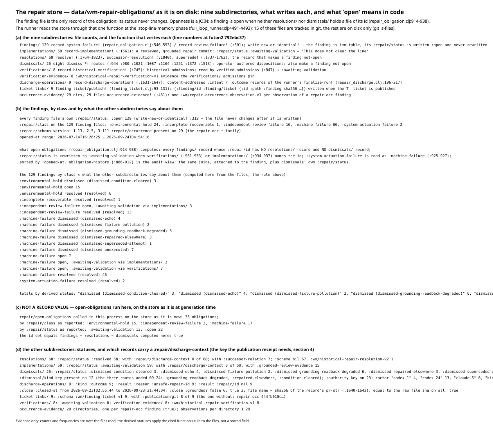
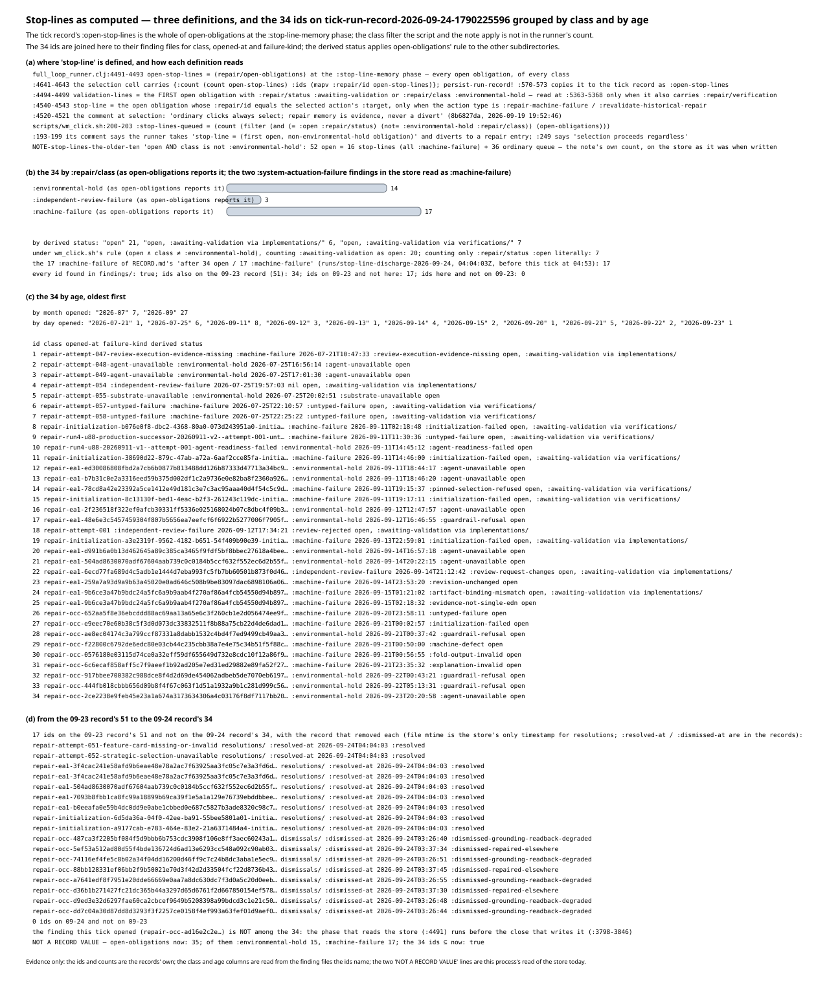
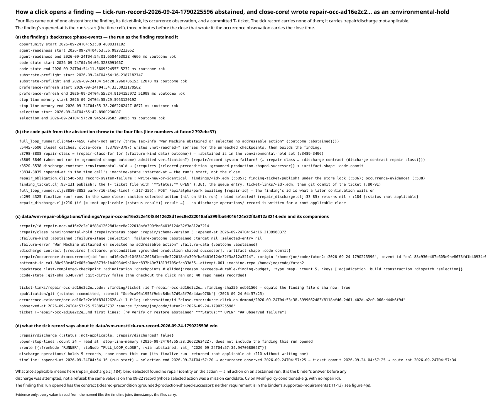
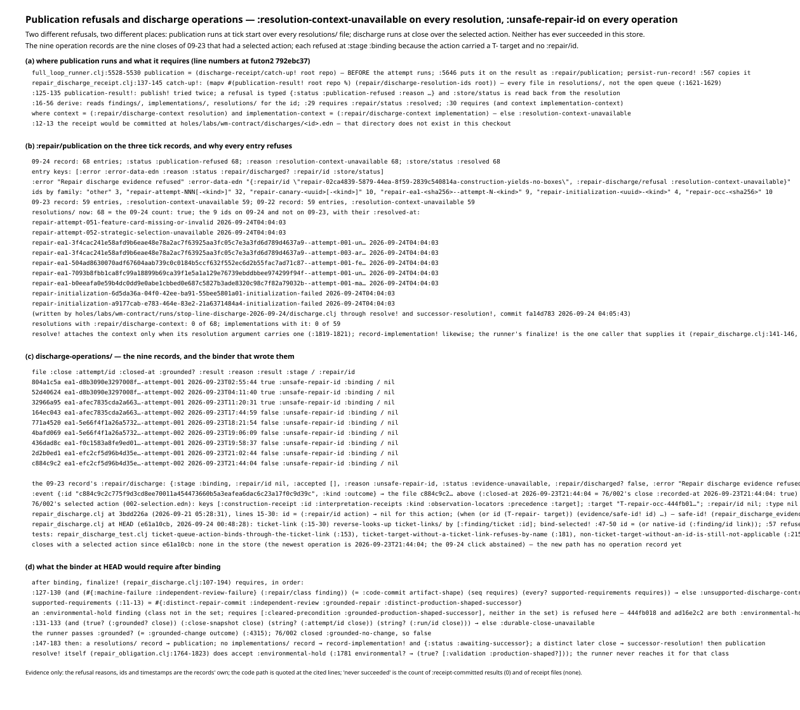
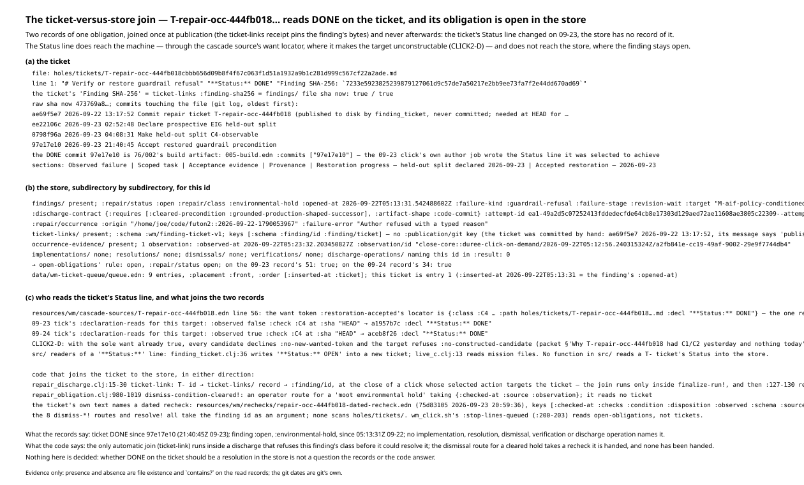
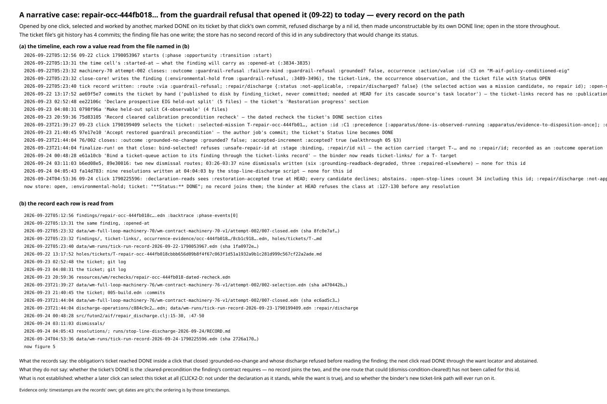

# Walkthrough 06: discharge — how a repair obligation is opened, held, and closed

Same form as walkthroughs 01-05: every figure is generated from a record by
a script in this directory, every figure file name carries the record's
short raw sha256, and nothing is decided for the reader. Regenerate with

```
cd futon2 && clojure -M -i holes/labs/wm-contract/walkthroughs/generate_figures_06.clj \
            -e "(generate-figures-06/generate!)"
```

Records: the repair store `data/wm-repair-obligations/` entire (the store
figures carry `ccf64e78`, a digest over every store file's sha256 at
generation time); the three tick run records of 09-22 (`1790053967`, sha
`1fa0972e`), 09-23 (`1790199409`, sha `7b3c56df`) and 09-24 (`1790225596`,
sha `2726a170`); the finding the 09-24 click opened
(`findings/repair-occ-ad16e2c2….edn`, sha `eeb61566`); the reference
obligation `repair-occ-444fb018…` — its finding (sha `7233e592`), its
ticket (sha `473769a8`), its ticket-link (sha `552778c8`); one discharge
operation (`c884c9c2…`, sha `c884c9c2`); machinery-70 attempt-002's close
(sha `8fc0e7af`), machinery-76 attempt-002's selection (sha `a470442b`)
and close (sha `ec6ad5c3`).

Subject: the repair store and discharge. Sources read: the store's nine
subdirectories (counted and classified below);
`src/futon2/aif/repair_obligation.clj` (`open-obligations`,
`obligation-history`, `record-system-failure!`, `record-implementation!`,
`resolve!`, `supersede!`, the eight `dismiss-*!` routes);
`src/futon2/aif/repair_discharge.clj` (the discharge binder and its
`:unsafe-repair-id` refusal);
`src/futon2/aif/repair_discharge_receipt.clj` (publication);
`src/futon2/aif/full_loop_runner.clj` (the `:stop-line-memory` phase, the
abstention throw, `close-core!`'s finding write, `finalize-run!`);
`src/futon2/aif/finding_ticket.clj`; `scripts/wm_click.sh`'s stop-line
rule. Line numbers are at futon2 `792ebc37`, the HEAD this walkthrough is
generated on. Register row AR-16 in
`PROOF-2-THEOREM-draft-2026-09-24.md` and `proof2/packets/CLICK2-D.md` are
cited for what they establish; `NOTE-stop-lines-the-older-ten-2026-09-24.md`
is cited as a description of the confusion, not as authority.

Where a figure shows what the code computes on the store today —
`repair/open-obligations` called in the generator's own fresh process —
the figure labels that line NOT A RECORD VALUE. Everything else is read
from the files.

---

## 1. The store's anatomy: nine subdirectories, and what "open" means

`data/wm-repair-obligations/` is the whole of the machine's repair memory.
The one thing to hold onto: **the finding file is the only record of the
obligation, and it never changes.** `write-new-or-identical!`
(`repair_obligation.clj:312`) writes it once with `:repair/status :open`,
and no function rewrites it. Openness is not a field; it is a **join** —
a finding is open when neither `resolutions/` nor `dismissals/` holds a
file of its id (`open-obligations`, `:914-938`). Every other subdirectory
is something said *about* a finding.



The census at generation time: **129 findings** (`:machine-failure` 86,
`:environmental-hold` 24, `:independent-review-failure` 16,
`:system-actuation-failure` 2, `:incomplete-recoverable` 1), 59
implementations ("a reviewed, grounded repair commit; this does not clear
the line"), 68 resolutions, 26 dismissals, 8 verifications, 9 discharge
operations, 9 ticket-links, 29 occurrence observations. Applying
`open-obligations`' rule file by file: 68 resolved, 26 dismissed, **35
open** (22 plainly open, 13 rewritten `:awaiting-validation` because an
implementation or verification names the id).

## 2. Stop-lines as computed: three definitions, and the 34 ids on the 09-24 record

"Stop-line" is three different sets depending on who reads the store, and
the records let us watch all three not agree:

1. **The tick record's `:open-stop-lines`** is the whole of
   `open-obligations` at the `:stop-line-memory` phase
   (`full_loop_runner.clj:4491-4493`), copied to the record with just a
   count and the ids. No class filter. The 09-24 record carries
   `{:count 34 :ids […]}`; the 09-23 record carries 51; the 09-22 record
   44.
2. **`wm_click.sh:200-203`'s `:stop-lines-queued`** filters further: open
   AND class ≠ `:environmental-hold`. Its comment says the runner diverts
   to the first such obligation; the runner's own comment at `:4520-4521`
   says "ordinary clicks always select; repair memory is evidence, never
   a divert."
3. **The runner's `stop-line`** (`:4540-4543`) is narrower still: the one
   open obligation whose id equals the selected action's target, and only
   for repair action types.



The 34 ids on the 09-24 record, joined to their finding files: 17
`:machine-failure`, 14 `:environmental-hold`, 3 `:independent-review-failure`.
By age they run from `repair-attempt-047` (July) to findings of 09-23. The
figure also reconciles the 51 → 34 move: 17 ids left the record between
the two ticks, each with its resolution or dismissal named (nine
resolutions written at 04:04:03Z on 09-24 by the stop-line-discharge
script, plus dismissals from 03:26-03:37), and one finding — the one this
very click opened — is **not** among its own 34, because the phase that
reads the store runs before the close that writes the finding.

The note (`NOTE-stop-lines-the-older-ten`) counted 52 open = 16 stop-lines
+ 36 ordinary queue under `wm_click.sh`'s rule, on the store as it was
when written. The same rule on the 09-24 record's 34 yields 20 (or 7
counting only literal `:open`); the difference is the resolutions and
dismissals written between. This is the confusion the note describes:
which set "stop-line" means depends on which of the three definitions you
read.

## 3. How a click opens a finding: the 09-24 abstention

The 09-24 click abstained: the candidate admission produced nothing
(`full_loop_runner.clj:4647-4650` throws `:outcome :abstained`). Why it
abstained is CLICK2-D's subject and AR-16's register row: the reference
ticket's sole want, `:restoration-accepted`, was already observed true at
HEAD — marked DONE by the 09-23 click's own commit — so every candidate
declined `:no-new-wanted-token` and the target refused
`:no-constructed-candidate`. What concerns this walkthrough is what the
close then *wrote*:



`close-core!` (`:3789-3797`) writes not-reached sorries for the unreached
checkpoints, classifies the outcome — `:abstained` is in the
`:environmental-hold` set (`:3489-3496`) — and calls
`record-system-failure!` (`:3809-3846`). Four records land:

- `findings/repair-occ-ad16e2c2….edn`: `:repair/class :environmental-hold`,
  `:repair/status :open`, `:failure-kind :abstained`, `:opened-at` the
  run's start time, and a `:discharge-contract` of
  `{:requires [:cleared-precondition :grounded-production-shaped-successor]
  :artifact-shape :code-commit}` (`:3520-3538`) — the shape a discharge of
  this obligation would have to take;
- a `ticket-links/` receipt (`finding-ticket/publish!`);
- an `occurrence-evidence/` observation;
- and the tick record's `:repair/discharge` reads
  `{:status :not-applicable, :repair/discharged? false}` — there was no
  selected action, so there was nothing to discharge. `:not-applicable`
  is the honest reading of "discharge did not arise", distinct from a
  refusal.

## 4. The publication refusals and the discharge operations: two refusals, two places, zero successes

Publication runs at tick start (`:5528-5530`) over **every** `resolutions/`
file, not the open queue, and its receipt would be committed at
`holes/labs/wm-contract/discharges/<id>.edn` — a directory that does not
exist in this checkout. On all three tick records every entry is
`:publication-refused` with `:reason :resolution-context-unavailable`: the
derive step (`repair_discharge_receipt.clj:16-56`) requires the
resolution *and* the implementation each to carry a
`:repair/discharge-context`, and **0 of 68 resolutions and 0 of 59
implementations have one**. The one caller that supplies the context is
the runner's own `finalize-run!` (`repair_discharge.clj:141-146,
153-155, 176-181`) — which brings us to the second refusal.



`discharge-operations/` holds nine content-addressed records — the nine
09-23 closes that had a selected action. **All nine refuse
`:unsafe-repair-id` at `:stage :binding`, `:repair/id nil`**: the selected
action carried a `T-…` ticket target and no `:repair/id`, and the binder
refuses a nil id (that refusal is the point of a binder — a discharge
that cannot name its obligation would be a resolution of nothing). Commit
`e61a10cb` (09-24 00:48) taught the binder to reverse-lookup a `T-` target
through `ticket-links/`; the figure shows why that still would not have
discharged the reference finding — the close path then refuses
`:environmental-hold` at `:127-130`, the class whose contract requires an
outside repair, not a click's.

So: publication has never succeeded (no contexts), and discharge has
never succeeded (no repair id on the action, then the class refusal).
Both are typed and recorded, not silent.

## 5. The ticket-versus-store join: DONE on the ticket, open in the store

`T-repair-occ-444fb018…` is the reference obligation of this whole series,
and its two records disagree:

- **The ticket** (`holes/tickets/T-repair-occ-444fb018….md`) reads
  `**Status:** DONE`, written by commit `97e17e10` (09-23 21:40:45Z) —
  which is *the 09-23 click's own build artifact* (`76/002`'s
  `005-build.edn :commits ["97e17e10"]`). The click wrote the Status line
  it was selected to achieve.
- **The store's finding** for the same id reads `:repair/status :open`,
  `:repair/class :environmental-hold`, opened 09-22 05:13:31Z, with **no**
  implementation, resolution, dismissal, verification or discharge
  operation naming it.



Who reads the ticket's Status line? Exactly one consumer: the cascade
source's want locator (`resources/wm/cascade-sources/T-repair-occ-444fb018.edn`
line 56), where `:restoration-accepted`'s C4 check observes
`**Status:** DONE`. The 09-23 tick read it false, the 09-24 tick read it
true — and that true read is what made the target unconstructable and the
click abstain (CLICK2-D). **No function in `src/` reads a `T-` ticket's
Status into the store.** The joins that exist: `ticket-links/` (written at
publication, pins the finding's bytes), the discharge binder's new
reverse-lookup (runs only inside `finalize-run!`, and refuses this class),
and `dismiss-condition-cleared!` (`repair_obligation.clj:980-1019`), an
operator route for a "moot environmental hold" that takes a recheck it is
handed — the ticket names a dated recheck
(`resources/wm/rechecks/repair-occ-444fb018-dated-recheck.edn`), and no
`dismissals/` record cites it.

Whether DONE on the ticket should be a resolution in the store is not a
question the records or the code answer.

## 6. A narrative case: repair-occ-444fb018 from guardrail refusal to today

One obligation, every record on its path named:



- **09-22 05:12:56Z** — a click starts; at 05:23:32 machinery-70
  attempt-002 closes `:guardrail-refusal`, and `close-core!` writes the
  finding (`:environmental-hold`), the ticket-link, the occurrence
  observation, and the ticket file with `**Status:** OPEN`. The tick
  record carries `:repair/discharge :not-applicable` and `:open-stop-lines
  :count 44`.
- **09-22 13:17** — `ae69f5e7` commits the ticket by hand ("published to
  disk by finding_ticket, never committed; needed at HEAD for its cascade
  source's task locator").
- **09-23** — three commits build the restoration: `ee22106c` declares
  the held-out split, `0798f96a` makes it C4-observable, `75d83105`
  records the cleared-precondition recheck. At 21:39:27 the 09-23 click
  selects the ticket (cascade `:C1`); at 21:40:45 its author job commits
  `97e17e10` and the Status line becomes DONE. At 21:44:04 the close runs
  `finalize-run!` — and the binder refuses `:unsafe-repair-id`, `:repair/id
  nil`, recorded as discharge operation `c884c9c2`.
- **09-24** — `e61a10cb` teaches the binder the ticket-link lookup; nine
  dismissals and nine resolutions are written for *other* ids; at
  04:53:36 the 09-24 click reads DONE through the want locator, every
  candidate declines, and it abstains — opening the `ad16e2c2` finding of
  section 3, while `444fb018` stays exactly as it was: open in the store,
  DONE on the ticket, unconstructable under its own declaration.

What the records do not say: whether the ticket's DONE is the
`:cleared-precondition` the finding's discharge contract requires — no
record joins the two, and the one route that could close the finding on
that basis (`dismiss-condition-cleared!`) has not been called for this id.

## Verification

What was checked, in a fresh process against the records and the code at
futon2 `792ebc37`:

- **The store, file by file.** Every `.edn` under the nine
  subdirectories read and hashed (digest `ccf64e78` on the figure names);
  129 findings by class, schema version and opened-at; each subdirectory's
  writer confirmed against `repair_obligation.clj` /
  `repair_discharge.clj` / `finding_ticket.clj` line numbers;
  `open-obligations`' join re-derived from the files independently and
  then run once as itself (labelled NOT A RECORD VALUE wherever it
  appears): 35 open today, the 09-24 record's 34 ids a subset of them.
- **The three tick records.** `:open-stop-lines` counts 44/51/34 and
  every id; the 34 ids joined to their finding files for class, opened-at,
  failure-kind and derived status; the 51→34 transition explained id by id
  with the resolution or dismissal record that removed each;
  `:repair/discharge` and every `:repair/publication` entry (68/59/59
  refusals, one reason on all).
- **The ad16 finding and the 444 chain.** All four records of the
  abstention write; the 444 finding, ticket, ticket-link, occurrence
  observation, cascade source, recheck and queue entry; the nine
  discharge-operation records and the closes they name; git dates
  confirmed by `git log` on the ticket and code files.
- **Generator.** Run three times; the six SVGs byte-identical each time
  (`sha256sum -c` OK); clj-kondo 0 errors 0 warnings; check-parens OK.
- **Contradictions with the cited documents.**
  - *The stop-line note* — none. Its 52 = 16 + 36 split was of the store
    when written; the figures show the same rule yields different numbers
    as resolutions and dismissals land, and make the same point the note
    does: "stop-line" names three different sets.
  - *CLICK2-D* — none. The abstention's cause (sole want true via the
    09-23 click's own commit; every candidate declines) is exactly what
    the ticket's declaration reads on the 09-24 record show, and the
    `ad16e2c2` finding is the record of it.
  - *AR-16* — none. The typed decline it asks for is indeed absent from
    the abstained tick record (`no-constructed-candidate` survives in the
    cohort's selection event and the scan markdown, not the run record),
    and this walkthrough's figures had to go to those other records for
    the reason, which is AR-16's point.
- One rendering defect found and fixed during verification: Clojure
  ratios leaked into two bar charts' SVG attributes (`width="4200/17"`),
  rendering as full-width bars with missing counts. Fixed in the generator
  (`(double n)`); the corrected figure is what is committed.
