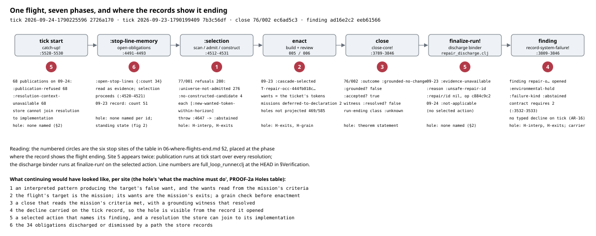
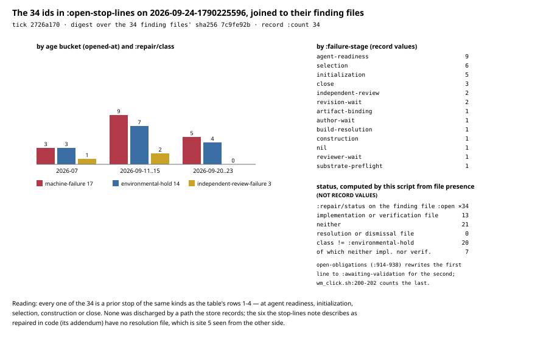
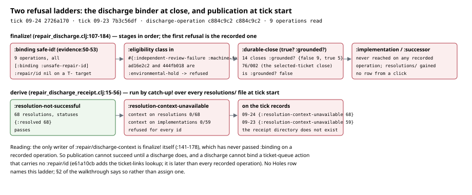

# Walkthrough 06: where flights end today

Same form as walkthroughs 01-05: every figure is generated from a record by
a script in this directory, every figure file name carries the record's
short raw sha256, and nothing is decided for the reader. Regenerate with

```
cd futon2 && clojure -M -i holes/labs/wm-contract/walkthroughs/generate_figures_06_where_flights_end.clj \
            -e "(generate-figures-06-where-flights-end/generate!)"
```

Records: `data/wm-runs/tick-run-record-2026-09-24-1790225596.edn` (sha
`2726a170…`) with its cohort machinery-77 attempt-001's `002-selection.edn`
(`e13c82b6…`) and `007-closed.edn` (`e3c51f9b…`);
`data/wm-runs/tick-run-record-2026-09-23-1790199409.edn` (`7b3c56df…`) with
machinery-76 attempt-002's `002-selection.edn` (`a470442b…`) and
`007-closed.edn` (`ec6ad5c3…`); the finding
`data/wm-repair-obligations/findings/repair-occ-ad16e2c2….edn` (`eeb61566…`);
the discharge operation `discharge-operations/c884c9c2….edn` and its eight
siblings; the 34 finding files the 09-24 record names in
`:open-stop-lines` (figure 2 carries `7c9fe92b`, the sha256 of their 34
sha256s concatenated in record order) and the presence of a
`resolutions/`, `dismissals/`, `implementations/` or `verifications/` file
for each; the fourteen closes of machinery-70..76 (read here only for
`:grounded?`, `:accepted?` and the run-ending class; walkthrough 05 §4-§5
gives the census); the 68 `resolutions/` and 59 `implementations/` files,
read for one key.

Subject: not a phase but the theorem. `PROOF-2a-THEOREM-draft-2026-09-24.md`
states that a flight of the War Machine on a mission completes it, and that
"a typed absence, an open clause or a stop is a HOLE in the proof, not an
outcome it permits". A flight is the clicks on one mission ending in
closure — "it may be one click or several"; its wants are the mission's
completion criteria; "a sequence that ends short is a counterexample to
the theorem"; a missing input the machine could compute "is computed
within the flight, not returned as a refusal", and a refusal "is
admissible only where no warranted pattern applies, and then it is a
hole"; "later clicks continue the chosen mission; they do not re-select
among all targets". So this walkthrough takes each place the records show
a flight ending and names the hole in PROOF-2a's Holes table it is
evidence for, using that file's appendix (the AR-to-hole mapping) so the
names agree. Code read:
`src/futon2/aif/full_loop_runner.clj` — the `:stop-line-memory` phase
(`:4491-4499`), the ordinary-selection comment (`:4520-4521`), `stop-line`
(`:4540-4543`), the `:open-stop-lines` copy onto the selection judgment
(`:4641-4643`), the abstention throw (`:4647-4650`), the selection phase (`:4512-4531`), the `finalize-run!` call (`:4299`), `repair-class-for`
(`:3489-3513`), `discharge-contract` (`:3520-3538`), `close-core!`'s finding
write (`:3789-3846`), `catch-up!` at tick start (`:5528-5530`) and
`:repair/publication` on the result (`:5646`);
`src/futon2/aif/repair_discharge.clj` — `bind-selected!` (`:33-85`),
`finalize!` (`:107-184`), `finalize-run!` (`:196-217`);
`repair_discharge_evidence.clj` `safe-id!` (`:50-53`);
`repair_discharge_receipt.clj` `derive` (`:15-56`) and `catch-up!`
(`:137-147`); `repair_obligation.clj` `open-obligations` (`:914-938`);
`scripts/wm_click.sh:193-202, 239-244`. Line numbers are at futon2
`51fd3144`, the HEAD this walkthrough is generated on (none of the cited
code or record files changed between `0438116b`, where they were first
read, and it). Walkthrough 05 §4-§6
and `06-discharge.md` §2-§5 are cited for what they count; register rows
AR-16, AR-27, AR-28 in `PROOF-2-THEOREM-draft-2026-09-24.md` and
`proof2/packets/CLICK2-D.md` for what they establish;
`NOTE-stop-lines-the-older-ten-2026-09-24.md` as a description of the
confusion, not as authority.

---

## 1. One flight, seven phases, and where the records show it ending

Two clicks supply every stop site: the 09-23 click, which reached
selection and closed, and the 09-24 click, which abstained. Placed along
the runner's phase order, the six sites of the table below sit at tick
start, at `:stop-line-memory`, inside `:selection`, at enactment, at close,
at `finalize-run!`, and at the finding the close writes.



## 2. The stop sites, and the hole each is evidence for

| # | stop site | record that shows it | what the machine did instead of continuing | hole |
|---|---|---|---|---|
| 1 | scan admits a target; construction yields no candidate | 77/001 `002-selection.edn`: 280 refusals, 276 `:universe-not-admitted`, 4 `:no-constructed-candidate` each `:missing [:new-wanted-token-within-horizon]` — `M-f11-find-production-successor`, `M-aif-policy-conditioned-eig`, `M-wm-08-external-f2`, `T-repair-occ-444fb018…`. CLICK2-D Part 2: for the two missions no world change constructs; the absent want is produced by no declared pattern, or no declared candidate cites the pattern that produces it. | Threw at `:4647-4650` with `:outcome :abstained`; `close!` built the close from the catch with `:not-reached-*` sorries; the tick's `:selection-event` is `{:status :absent :reason :selection-not-reached}`. | **H-interp** (no interpreted pattern produces the false want), **H-exits** (the wants were a ticket's tokens) — the appendix's CLICK2-D row. |
| 2 | selection reached, but the enacted change is one instance's wants, not the mission's criteria | Tick 09-23 `:selection-event` `:cascade-selected`, target `T-repair-occ-444fb018…`; 76/002's `:selected-action` is `:C1`, precedence producing `:repair/obstruction-observed-cleared` then `:restoration-accepted`; the enactment `97e17e10` changes one file, the ticket's Status line. The same tick's `:mission-hole-coverage`: 585 holes retained, 116 projected (all `:unchecked-task`), 469 not — `"no check can witness closure: the item carries no checkbox to flip"` — and both mission targets `:targets-deferred-to-declaration`. | Selected, built, reviewed and closed at ticket grain; no mission criterion was read at click time; the next click found the ticket's one want true and stopped at row 1. | **H-exits**, **H-grain**. |
| 3 | close accepted but ungrounded, or unclassified | 76/002 `007-closed.edn`: `:accepted? true`, `:outcome :grounded-no-change`, `:grounded? false`, witness `:resolved? false`, `:run-ending-classification {:class :unknown :missing [:attested-increment]}`. Across the fourteen: class `:unknown` 11, `:known-typed-failure` 2, nil 1; `:grounded?` true 5, false 9. | Recorded the close and the route hop `:via :grounded-no-change`; the `b-update` gate read `(true? :accepted?)` and ran (05 §4). | **The theorem statement** — completion, not an accepted-and-ungrounded close (the appendix's AR-27, AR-28 row). |
| 4 | a click opens an `:environmental-hold` finding and discharge is `:not-applicable` | Finding `ad16e2c2…`: `:repair/class :environmental-hold`, `:failure-kind :abstained`, `:failure-stage :selection`, `:target nil`, `:discharge-contract {:requires [:cleared-precondition :grounded-production-shaped-successor]}`, `:occurrence/origin` this run. Tick 09-24 `:repair/discharge {:status :not-applicable :repair/discharged? false}`. | `repair-class-for` maps `:abstained` to `:environmental-hold` (`:3489-3496`); `close-core!` wrote the finding, its ticket-link and an occurrence (06-discharge §3); `finalize!` returned `:not-applicable` (`repair_discharge.clj:184`) and `finalize-run!` passed it through without recording an operation (`:210`) — no selected action to bind. The tick record carries none of the decline words (05 §6). | The stop is row 1's (**H-interp**, **H-exits**); AR-16 is the carrier that hole needs (appendix (c)). |
| 5 | publication refused; the binder refuses a nil repair id | Tick 09-24 `:repair/publication`: 68 entries, all `:publication-refused` with `:reason :resolution-context-unavailable` (09-23: 59, same reason). 0 of 68 resolutions and 0 of 59 implementations carry `:repair/discharge-context`. All nine `discharge-operations/` records: `{:stage :binding :reason :unsafe-repair-id :repair/id nil}`; the 09-23 tick's `:repair/discharge` is the ninth (`c884c9c2`, close at 21:44:04Z). | `catch-up!` ran at tick start over every resolution and recorded each refusal; `finalize!` refused at `:binding` because a ticket-queue action carries no `:repair/id` (`safe-id!`, `:50-53`), and past that would refuse `:environmental-hold` at `:eligibility` (`:126-130`) and 76/002's `:grounded? false` at `:durable-close` (`:131-133`). The click continued. | **None named in the Holes table.** Nearest reading: on a `T-repair-` target the finding's `:discharge-contract :requires` is the completion criterion and the click's wants were the ticket's tokens — H-exits read on a repair target. Stated here, not assigned. |
| 6 | the 34 open stop-lines a flight starts from | Tick 09-24 `:open-stop-lines {:count 34 :ids […]}`. Joined to their findings: `:machine-failure` 17, `:environmental-hold` 14, `:independent-review-failure` 3; opened 2026-07 (7), 2026-09-11..15 (18), 2026-09-20..23 (9); by stage `:agent-readiness` 9, `:selection` 6, `:initialization` 5, `:close` 3, `:revision-wait` 2, `:independent-review` 2, six others 1 each, one nil. 13 have an implementation or verification file; 0 a resolution or dismissal. | `:stop-line-memory` read `open-obligations` (`:4491-4493`), copied count and ids onto the selection judgment (`:4641-4643`), and selected regardless (`:4520-4521`); the finding of row 4 is not among its own 34 (06-discharge §2). | **None named per id.** Each is a prior stop of rows 1-4's kinds; as a standing state it is what figure 2 shows. |

What continuing would have looked like at each site — the hole's "what
the machine must do" column, read on this instance:

1. an interpreted pattern that produces the admitted target's false want,
   and the wants read from the mission's completion criteria rather than
   a ticket's tokens;
2. the flight's target is the mission and its wants are the mission's
   exits, with a grain check before enactment;
3. a close that reads the mission's criteria met, with a grounding witness
   that resolved;
4. the decline carried on the tick record, so the hole is visible from the
   record that opened it;
5. a selected action that names its finding, and a resolution the store
   can join to its implementation;
6. the 34 obligations discharged or dismissed by a path the store records.

## 3. The standing state: 34 open stop-lines



Three sets answer to "stop-line" (06-discharge §2): the record's
`:open-stop-lines` (all of `open-obligations`, 34 here), `wm_click.sh`'s
`:stop-lines-queued` (open and class not `:environmental-hold`, 20 of the
34, or 7 if only findings with no implementation or verification file
count), and the runner's `stop-line` (the one open obligation whose id is
the selected action's target, for repair action types only). The 09-24
record shows which of these gates a click: none. The click fired with 34
open, ran ordinary selection, and abstained on the construction path, not
on the backlog. `wm_click.sh:193-197` still says the runner takes "the
first open, non-environmental-hold obligation" as a repair entry; the same
script at `:239-244`, the runner at `:4520-4521`, and this record say
selection proceeds regardless.

The stop-lines note describes the older ten and, in its addendum, says six
of them were repaired in code within the hour they were opened
(`a38becc9`, `29fb2a83`, `d168d348`+`8f60f819`) with no store record. On
the 34: 0 resolution or dismissal files, 13 implementation or verification
files. What the note calls "the join" — the action carrying the finding
id, a resolution the store can read — is row 5 of the table seen from the
backlog's side.

## 4. The two refusal ladders



The nine discharge operations all stopped at the first rung; the two
later rungs would also have refused the recorded inputs (class, then
`:grounded?`). Publication's second rung refuses every id because the only
writer of `:repair/discharge-context` is `finalize!` itself
(`repair_discharge.clj:141-178`), which has not passed `:binding` on any
recorded operation. `e61a10cb` (09-24 00:48) adds a `ticket-links/`
reverse lookup to the binder; every recorded operation predates it, and
06-discharge §4 shows the class rung would still refuse the reference
finding.

## 5. A narrative case: two clicks, one ticket

- **09-23 21:38:43Z** — live selection picks `:C1` on
  `T-repair-occ-444fb018…` (row 2). **21:40:45Z** the author job commits
  `97e17e10`, one file, the ticket's Status line. **21:44:04Z** the close
  is `:grounded-no-change`, `:grounded? false`, `:accepted? true` (row 3);
  `finalize-run!` refuses `:unsafe-repair-id` on a nil id, operation
  `c884c9c2` (row 5); the tick records 59 publication refusals (row 5) and
  51 open stop-lines (row 6).
- **09-24 04:53:38Z** — the next click starts with the ticket's sole want
  reading true at HEAD (`:declaration-reads`, 05 §6). Every admitted
  target refuses `:no-constructed-candidate` (row 1); **04:57:34Z** the
  route hop is `:via :abstained`; the finding `ad16e2c2…` is on disk with
  `:opened-at 04:54:16Z`, the attempt's start (row 4); 68 publication
  refusals (row 5); 34 open stop-lines (row 6).

Under PROOF-2a the two clicks are not a flight of any mission: the first
ended at ticket grain with the ticket's want true and the mission's
criteria unread; the second did not continue the first's target but
re-selected among all targets (280 refusals over the universe, 4 admitted)
and ended inside `:selection` with nothing to construct — a refusal at a
site where the missing input is an interpretation, which the grain
section says is computed within the flight or is a hole. Rows 3-6 are
where the surrounding machinery ended on the same two runs.

## Verification

What was checked, in a fresh process against the records and the code at
futon2 `51fd3144` (line numbers first read at `0438116b`; `git diff
--name-only 0438116b..51fd3144` touches no cited code or record file):

- **Tick records.** 09-24: `:route` (one hop, `:via :abstained`),
  `:open-stop-lines` count and all 34 ids, `:repair/discharge`,
  `:repair/publication` count and every entry's `:status` and `:reason`,
  `:selection-event`, `:decision`, `:mission-hole-coverage`
  (`:coverage-not-recorded`). 09-23: `:route`, `:open-stop-lines` count
  (51), `:repair/discharge` (stage, reason, id, event id), 59 publication
  entries, `:selection-event`, `:mission-hole-coverage` (`:holes-retained`,
  `:holes-projected`, `:holes-not-projected`,
  `:targets-deferred-to-declaration`, `:reason-not-projected`).
- **Cohort files.** 77/001 `002-selection.edn`: sorry kind, 280 refusals
  by kind, the four `:no-constructed-candidate` targets and their
  `:missing`. 76/002 `002-selection.edn`: `:selected-action` `:id`,
  `:target`, `:precedence` ids and `:produces`, `:construction-receipt
  :kind`. 76/002 `007-closed.edn`: `:outcome`, `:grounded?`, `:accepted?`,
  witness `:resolved?`, run-ending `:class`. Fourteen closes: `:grounded?`
  {true 5, false 9}, `:accepted?` domain and class counts equal to 05 §4-§5.
- **Store.** The 34 finding files: `:repair/class`, `:failure-kind`,
  `:failure-stage`, `:opened-at`, `:repair/status` (`:open` on all 34);
  file presence in the four sibling directories (13 with an
  implementation or verification, 0 with a resolution or dismissal). Nine
  discharge operations: `:kind`, result `:stage`, `:reason`, `:repair/id`,
  close time. 68 resolutions (`:resolved` on all) and 59 implementations
  (`:awaiting-validation` on all): `:repair/discharge-context` present on
  none. Finding `ad16e2c2…`: every field in row 4 and
  `[:repair/occurrence :occurrence/origin]`.
- **Code.** Line numbers re-read at `0438116b` for every citation in the
  header; `git log -1` on `full_loop_runner.clj` (`4a2ba931`),
  `repair_discharge.clj` (`e61a10cb`), `repair_discharge_receipt.clj`
  (`3bdd226a`).
- **Figures.** Generator run twice at `51fd3144`; the three SVGs
  byte-identical between runs (`sha256sum -c`), generator stdout
  identical. `clj-kondo --lint` 0 errors, 0 warnings, 0 infos;
  `check-parens.el` batch OK. Rasters inspected for overflow after a
  first run showed column text crossing into neighbouring columns
  (fig 1) and a status block running off the canvas (fig 2); both fixed
  in the generator before the committed run.

Where the sources differ from, or add to, the cited documents:

1. *The stop-lines note*, addendum: "the closes are `:grounded? false`".
   Five of the fourteen closes read `:grounded? true`. The close the
   addendum reasons about — the one that selected the ticket, 76/002 — is
   `:grounded? false`, so its conclusion (no route to `resolutions/` even
   past binding) holds for that close; the general statement does not
   hold across the fourteen.
2. *The stop-lines note*, rule section: "no click should be fired while
   one stands". No code path implements that: `wm_click.sh:239-244`
   reports the queue and proceeds; the runner's `:4520-4521` selects
   regardless; the 09-24 record is a click fired with 34 open.
   `wm_click.sh:193-197`'s own comment (the runner takes the first open
   non-hold obligation as a repair entry) contradicts `:4540-4543`, which
   binds only the obligation matching a repair action's target.
3. *CLICK2-D* — none. Part 2's four targets and the single decline reason
   match 77/001's four `:no-constructed-candidate` refusals. Added: those
   four are the whole admitted universe; the other 276 refusals are
   `:universe-not-admitted`, so Part 2's "none of four" is "none of all".
4. *PROOF-2a Holes table* — none contradicted. Two additions: (a) rows 5
   and 6 of §2 map to no hole; the table's rows are things the machine
   must do to complete a mission, and neither the store's discharge and
   publication path nor the standing backlog is one of them; (b) H-exits'
   "where it showed" names M-futon-seams; the 09-23 record's
   `:mission-hole-coverage` (469 of 585 holes not projected, two missions
   deferred to declaration) is a second instance on the machinery clicks.
5. *Walkthrough 05 §6* says the finding's `:repair/occurrence :origin`
   names the run; the key is `:occurrence/origin` (namespaced) and its
   value is `"/home/joe/code/futon2::2026-09-24-1790225596"`. The claim
   holds; the key name in §6 is abbreviated.
